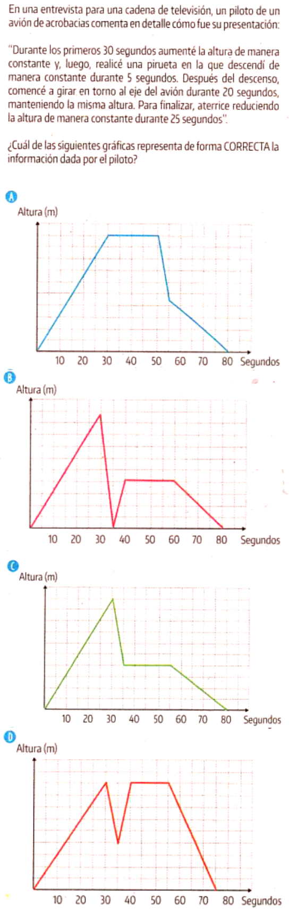

---
output:
  html_document: default
  word_document: default
  pdf_document: default
---
# ISBN: 978-958-5153-36-3-G11-2024-1 Pregunta 08
\

\
Primero, entendamos las acciones del piloto:

1. En los primeros 30 segundos, la altitud aumenta constantemente.

2. Luego, durante 5 segundos, desciende constantemente mientras realiza una pirueta.

3. A continuación, pasa 20 segundos girando alrededor del eje del avión sin cambiar la altitud.

4. Finalmente, aterriza disminuyendo la altitud constantemente durante 25 segundos.

Ahora, necesito emparejar estas acciones con los gráficos proporcionados.

Debo buscar un gráfico que muestre:

- Una pendiente recta hacia arriba durante los primeros 30 segundos.

- Una pendiente recta hacia abajo durante los siguientes 5 segundos.

- Una línea plana durante los siguientes 20 segundos.

- Otra pendiente recta hacia abajo durante los últimos 25 segundos.

Revisemos cada gráfico para ver cuál coincide con este patrón.

Tal vez algunos gráficos tengan curvas en lugar de líneas rectas, lo cual no sería correcto porque el problema dice que los cambios son constantes.

También debo asegurarme de que los intervalos de tiempo coincidan: 30 + 5 + 20 + 25 = 80 segundos en total.

Necesito explicar esto en términos simples.

Debo evitar usar términos matemáticos complicados y mantenerlo visual e intuitivo.

También debo señalar cualquier error común que puedan cometer, como confundir la dirección de la pendiente o contar mal los intervalos de tiempo.

En general, la clave es emparejar cada parte de la descripción del piloto con la parte correspondiente del gráfico.

La gráfica correcta que representa la información proporcionada por el piloto es 
la siguiente:

1. **Primera fase (0 a 30 segundos):** La altitud aumenta constantemente, lo que 
se representa con una línea recta ascendente.

2. **Segunda fase (30 a 35 segundos):** Durante una pirueta, la altitud disminuye 
constantemente, representada por una línea recta descendente.

3. **Tercera fase (35 a 55 segundos):** Mientras gira alrededor del eje del avión, 
la altitud se mantiene constante, lo que se muestra con una línea horizontal.

4. **Cuarta fase (55 a 80 segundos):** Al aterrizar, la altitud disminuye 
constantemente, representada por otra línea recta descendente.

La gráfica correcta debe tener estas cuatro fases sin solapamientos ni gaps, y 
las líneas deben ser rectas para reflejar las variaciones constantes de altitud.\ 

Por lo tanto, la Gráfica C es la correcta si se ajusta a esta descripción.

---------

# Análisis de la Pregunta según SABER 11 ICFES

## Nivel de Desempeño: 3 (Avanzado)
**Justificación:** Requiere análisis e interpretación de información presentada en diferentes formatos (texto y gráfica), además de la comprensión de conceptos de variación y comportamiento de funciones.

## Competencia: Interpretación y Representación 
**Justificación:** El estudiante debe interpretar información presentada textualmente y traducirla a una representación gráfica.

## Afirmación
El estudiante comprende y transforma la información cuantitativa y esquemática presentada en distintos formatos.

## Componente: Variacional
**Justificación:** Se analiza el cambio y variación de una magnitud (altura) respecto al tiempo.

## Aprendizajes
- Interpretación de gráficas cartesianas
- Comprensión de la variación
- Relación entre variables

## Evidencias
- Identifica características de gráficas cartesianas
- Relaciona diferentes representaciones de un mismo fenómeno

## Contenidos Matemáticos Curriculares
- Funciones
- Representación gráfica
- Pendientes y variación
- Lectura e interpretación de gráficas

## ¿Genérico o No Genérico?: No Genérico
**Justificación:** Evalúa competencias específicas de matemáticas en contexto de variación.

## Estándar Asociado
Analizo en representaciones gráficas cartesianas los comportamientos de cambio de funciones específicas.

## ¿Qué evalúa?
La capacidad de interpretar un texto que describe el movimiento de un avión y relacionarlo con su representación gráfica correcta, identificando variaciones de altura respecto al tiempo.

## Respuesta Correcta: C
La gráfica C representa correctamente todas las fases descritas en el texto:

1. Aumento constante de altura (0-30s)
2. Descenso constante (30-35s)
3. Altura constante (35-55s)
4. Descenso constante (55-80s)

## Justificación de la Respuesta Correcta
La gráfica C muestra correctamente:

- Una línea recta ascendente en los primeros 30 segundos
- Un descenso rápido entre 30-35 segundos
- Un segmento horizontal entre 35-55 segundos
- Una línea recta descendente final hasta los 80 segundos

## Análisis de los Distractores

### Opción A
**Por qué se equivocan:** La gráfica muestra un periodo muy largo de altura constante que no corresponde con la descripción.

### Opción B
**Por qué se equivocan:** La gráfica muestra un descenso hasta altura cero en la pirueta, lo cual no es consistente con la descripción.

### Opción D
**Por qué se equivocan:** Aunque similar a la correcta, las proporciones de tiempo no corresponden exactamente con lo descrito en el texto.