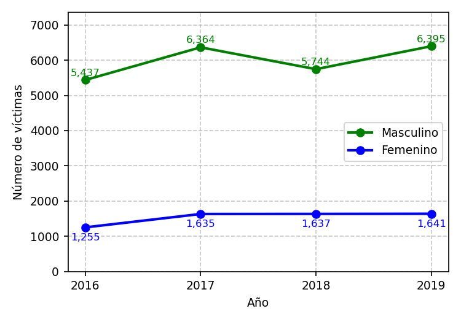

---
output:
  html_document: default
  word_document: default
  pdf_document: default
---
```{r setup, include=FALSE}
# Configuración para todos los formatos de salida
Sys.setlocale(category = "LC_NUMERIC", locale = "C")
options(OutDec = ".")

# Configurar el motor LaTeX globalmente
options(tikzLatex = "pdflatex")
options(tikzXelatex = FALSE)
options(tikzLatexPackages = c(
  "\\usepackage{tikz}",
  "\\usepackage{colortbl}"
))

library(exams)
library(reticulate)
library(digest)
library(testthat)

typ <- match_exams_device()
options(scipen = 999)
knitr::opts_chunk$set(
  warning = FALSE,
  message = FALSE,
  fig.showtext = FALSE,
  fig.cap = "",
  fig.keep = 'all',
  dev = c("png", "pdf"),
  dpi = 150
)

# Configuración para chunks de Python
knitr::knit_engines$set(python = function(options) {
  knitr::engine_output(options, options$code, '')
})

# Asegurar que Python esté correctamente configurado
use_python(Sys.which("python"), required = TRUE)
```

```{r DefinicionDeVariables, message=FALSE, warning=FALSE, results='asis'}
options(OutDec = ".")  # Asegurar punto decimal en este chunk

# Establecer semilla aleatoria
set.seed(sample(1:10000, 1))

# Aleatorizar ciudades para el contexto del problema
ciudades <- c("Lima", "Bogotá", "Ciudad de México", "Santiago", "Buenos Aires", 
              "Quito", "Caracas", "La Paz", "Asunción", "Montevideo", 
              "San José", "Panamá", "Managua", "Tegucigalpa", "San Salvador",
              "Santo Domingo", "Medellín", "Cali", "Barranquilla", "Cartagena")
ciudades_seleccionadas <- sample(ciudades, sample(3:5, 1))
ciudades_texto <- paste(ciudades_seleccionadas, collapse = ", ")

# Aleatorizar términos para el contexto del problema
terminos_estudio <- c("estudio", "análisis", "investigación", "informe", "reporte")
termino_estudio <- sample(terminos_estudio, 1)

terminos_accidentes <- c("accidentes de tránsito", "siniestros viales", "incidentes de tráfico", 
                         "colisiones vehiculares", "percances en carretera")
termino_accidente <- sample(terminos_accidentes, 1)

terminos_mortalidad <- c("mortalidad", "fallecimientos", "muertes", "víctimas fatales", "decesos")
termino_mortalidad <- sample(terminos_mortalidad, 1)

terminos_empresas <- c("empresa", "organización", "entidad", "institución", "compañía", "consultora")
termino_empresa <- sample(terminos_empresas, 1)

terminos_registro <- c("registro", "conteo", "recuento", "estadística", "cifra")
termino_registro <- sample(terminos_registro, 1)

# Aleatorizar años para el estudio (mantener 4 años consecutivos)
año_inicial <- sample(2000:2018, 1)
años <- año_inicial:(año_inicial + 3)
años_texto <- paste(min(años), "y", max(años))

# Generar datos de mortalidad total con tendencia realista
base_mortalidad <- sample(4000:8000, 1)
variacion_maxima <- round(base_mortalidad * 0.2)  # Variación máxima de 20%

# Generar tendencia aleatoria para mortalidad total
tendencias <- c("creciente", "decreciente", "pico", "valle", "ondulante")
tendencia <- sample(tendencias, 1)

mortalidad_total <- numeric(4)

if (tendencia == "creciente") {
  factor_incremento <- seq(1, 1.2, length.out = 4)
  mortalidad_total <- round(base_mortalidad * factor_incremento + rnorm(4, 0, variacion_maxima * 0.3))
} else if (tendencia == "decreciente") {
  factor_decremento <- seq(1.2, 1, length.out = 4)
  mortalidad_total <- round(base_mortalidad * factor_decremento + rnorm(4, 0, variacion_maxima * 0.3))
} else if (tendencia == "pico") {
  factores <- c(1, 1.1, 1.2, 1.05)
  mortalidad_total <- round(base_mortalidad * factores + rnorm(4, 0, variacion_maxima * 0.3))
} else if (tendencia == "valle") {
  factores <- c(1.15, 1.05, 1, 1.1)
  mortalidad_total <- round(base_mortalidad * factores + rnorm(4, 0, variacion_maxima * 0.3))
} else { # ondulante
  factores <- c(1, 1.15, 1.05, 1.2)
  mortalidad_total <- round(base_mortalidad * factores + rnorm(4, 0, variacion_maxima * 0.3))
}

# Asegurar que todos los valores sean positivos y tengan magnitud adecuada
mortalidad_total <- pmax(mortalidad_total, base_mortalidad * 0.9)
mortalidad_total <- pmin(mortalidad_total, base_mortalidad * 1.3)
mortalidad_total <- round(mortalidad_total)

# Generar datos para hombres (aproximadamente 75-85% del total - proporción realista)
proporcion_hombres <- runif(4, 0.75, 0.85)
mortalidad_hombres <- round(mortalidad_total * proporcion_hombres)

# Calcular datos para mujeres (el resto)
mortalidad_mujeres <- mortalidad_total - mortalidad_hombres

# Aleatorizar colores de las gráficas
colores_disponibles <- c("blue", "red", "green", "purple", "orange", "brown", "black", "magenta", "cyan")
color_hombres_correcto <- sample(colores_disponibles, 1)
colores_disponibles <- colores_disponibles[colores_disponibles != color_hombres_correcto]
color_mujeres_correcto <- sample(colores_disponibles, 1)

# Aleatorizar etiquetas de género
etiquetas_masculino <- c("Género Masculino")
etiqueta_masculino <- sample(etiquetas_masculino, 1)

etiquetas_femenino <- c("Género Femenino")
etiqueta_femenino <- sample(etiquetas_femenino, 1)

# Establecer la gráfica de líneas separadas A como la única correcta
opciones <- c("lineas_separadas_A", "lineas_separadas_B", "lineas_separadas_C", "lineas_separadas_D")
opcion_correcta <- "lineas_separadas_A"
indice_correcto <- 1  # Índice de "lineas_separadas_A" en el vector opciones

# Vector de solución para r-exams
solucion <- integer(4)
solucion[indice_correcto] <- 1
```

```{r generar_codigo_tikz}
options(OutDec = ".")  # Asegurar punto decimal en este chunk

# Aleatorizar colores de la tabla
color_fondo_tabla <- sample(c("orange", "blue", "green", "red", "yellow", "cyan"), 1)
intensidad_color <- sample(c(10, 15, 20, 25, 30), 1)
color_tabla <- paste0(color_fondo_tabla, "!", intensidad_color)

# Función para generar el código TikZ de la tabla
generar_tabla_tikz <- function(años, datos_hombres, color_tabla, etiqueta_masculino) {
  # Crear tabla con TikZ
  tabla_code <- c("\\begin{tikzpicture}",
    "\\node[inner sep=0pt] {",
    "  \\begin{tabular}{|c|c|}",
    "    \\hline",
    paste0("    \\rowcolor{", color_tabla, "}"),
    paste0("    \\textbf{Año} & \\textbf{Personas de ", tolower(etiqueta_masculino), "} \\\\"),
    paste0("    \\textbf{} & \\textbf{víctimas de ", sample(c("accidentalidad vial", "siniestros de tránsito", "incidentes de tráfico"), 1), "} \\\\"),
    "    \\hline")
  
  # Añadir filas con datos
  for (i in 1:length(años)) {
    tabla_code <- c(tabla_code, paste0("    ", años[i], " & ", format(datos_hombres[i], big.mark = ","), " \\\\"))
    tabla_code <- c(tabla_code, "    \\hline")
  }
  
  # Cerrar la tabla
  tabla_code <- c(tabla_code,
    "  \\end{tabular}",
    "};",
    "\\end{tikzpicture}")
  
  return(tabla_code)
}

# Generar código TikZ para la tabla
tabla_tikz <- generar_tabla_tikz(años, mortalidad_hombres, color_tabla, etiqueta_masculino)
```

```{r generar_graficas_python}
options(OutDec = ".")  # Asegurar punto decimal en este chunk

# Código Python para las gráficas
codigo_base_python <- "
import matplotlib.pyplot as plt
import numpy as np
import matplotlib
matplotlib.rcParams['font.size'] = 9

años = %s
mortalidad_hombres = %s
mortalidad_mujeres = %s
color_hombres = '%s'
color_mujeres = '%s'
etiqueta_masculino = '%s'
etiqueta_femenino = '%s'
"

# Reemplazar valores en el código Python
codigo_python_base <- sprintf(codigo_base_python, 
                            paste(años, collapse=", "), 
                            paste(mortalidad_hombres, collapse=", "), 
                            paste(mortalidad_mujeres, collapse=", "),
                            color_hombres_correcto,
                            color_mujeres_correcto,
                            etiqueta_masculino,
                            etiqueta_femenino)

# Aleatorizar colores para el gráfico total
color_total <- sample(c("red", "blue", "green", "purple", "orange"), 1)

# Código para graficar los totales - CORREGIDO
codigo_python_grafica_total <- paste0(codigo_python_base, "
# Configuración de la figura
plt.figure(figsize=(6, 3.5))

# Datos totales
mortalidad_total = [h + m for h, m in zip(mortalidad_hombres, mortalidad_mujeres)]

# Graficar los puntos y líneas - SINTAXIS CORREGIDA
plt.plot(años, mortalidad_total, marker='o', color='", color_total, "', linestyle='-', linewidth=2, markersize=8)

# Añadir etiquetas a cada punto
for x, y in zip(años, mortalidad_total):
    plt.text(x, y + max(mortalidad_total)*0.02, f'{y:,}', ha='center', va='bottom', fontweight='bold', color='", color_total, "')

# Configuración del gráfico
plt.grid(True, linestyle='--', alpha=0.7)
plt.xticks(años)
plt.ylim(min(mortalidad_total) * 0.8, max(mortalidad_total) * 1.1)
plt.xlabel('Año')
plt.ylabel('Número de víctimas')
plt.tight_layout()

# Guardar gráfica
plt.savefig('grafica_total.png', dpi=150)
plt.close()
")

# Código para las cuatro opciones de gráficas de líneas separadas - CORREGIDO

# Opción A: CORRECTA - Representa los datos originales correctamente
codigo_python_opcion1 <- paste0(codigo_python_base, "
plt.figure(figsize=(5, 3.5))

# Graficar líneas separadas para hombres y mujeres (datos correctos) - SINTAXIS CORREGIDA
plt.plot(años, mortalidad_hombres, marker='o', color=color_hombres, linestyle='-', label=etiqueta_masculino, linewidth=2)
plt.plot(años, mortalidad_mujeres, marker='o', color=color_mujeres, linestyle='-', label=etiqueta_femenino, linewidth=2)

# Añadir etiquetas a cada punto
offset_hombres = max(mortalidad_hombres)*0.01
offset_mujeres = max(mortalidad_mujeres)*0.1
for x, y in zip(años, mortalidad_hombres):
    plt.text(x, y + offset_hombres, f'{y:,}', ha='center', va='bottom', color=color_hombres, fontsize=8)
for x, y in zip(años, mortalidad_mujeres):
    plt.text(x, y - offset_mujeres, f'{y:,}', ha='center', va='top', color=color_mujeres, fontsize=8)

# Configuración del gráfico
plt.grid(True, linestyle='--', alpha=0.7)
plt.xticks(años)
plt.ylim(0, max(mortalidad_hombres) * 1.15)
plt.xlabel('Año')
plt.ylabel('Número de víctimas')
plt.legend()
plt.tight_layout()

# Guardar gráfica
plt.savefig('opcion1.png', dpi=150)
plt.close()
")

# Aleatorizar distractores para las otras opciones
# Opción B: INCORRECTA - Valores duplicados o modificados de forma significativa
distractor_b_factor <- runif(1, 1.8, 2.2)
codigo_python_opcion2 <- paste0(codigo_python_base, "
plt.figure(figsize=(5, 3.5))

# Crear datos incorrectos para esta opción
# Distractor: valores significativamente más altos
mortalidad_hombres_opcion2 = [int(h * ", distractor_b_factor, ") for h in mortalidad_hombres]
mortalidad_mujeres_opcion2 = mortalidad_mujeres  # Mantener estos valores correctos

# Aleatorizar colores diferentes
color_hombres_b = '", sample(colores_disponibles[colores_disponibles != color_hombres_correcto], 1), "'
color_mujeres_b = '", sample(colores_disponibles[colores_disponibles != color_mujeres_correcto], 1), "'

# Graficar líneas separadas con datos incorrectos - SINTAXIS CORREGIDA
plt.plot(años, mortalidad_hombres_opcion2, marker='o', color=color_hombres_b, linestyle='-', label=etiqueta_masculino, linewidth=2)
plt.plot(años, mortalidad_mujeres_opcion2, marker='o', color=color_mujeres_b, linestyle='-', label=etiqueta_femenino, linewidth=2)

# Añadir etiquetas a cada punto
offset_hombres = max(mortalidad_hombres_opcion2)*0.01
offset_mujeres = max(mortalidad_mujeres_opcion2)*0.1
for x, y in zip(años, mortalidad_hombres_opcion2):
    plt.text(x, y + offset_hombres, f'{y:,}', ha='center', va='bottom', color=color_hombres_b, fontsize=8)
for x, y in zip(años, mortalidad_mujeres_opcion2):
    plt.text(x, y - offset_mujeres, f'{y:,}', ha='center', va='top', color=color_mujeres_b, fontsize=8)

# Configuración del gráfico
plt.grid(True, linestyle='--', alpha=0.7)
plt.xticks(años)
plt.ylim(0, max(mortalidad_hombres_opcion2) * 1.15)
plt.xlabel('Año')
plt.ylabel('Número de víctimas')
plt.legend()
plt.tight_layout()

# Guardar gráfica
plt.savefig('opcion2.png', dpi=150)
plt.close()
")

# Opción C: INCORRECTA - Intercambia hombres y mujeres
codigo_python_opcion3 <- paste0(codigo_python_base, "
plt.figure(figsize=(5, 3.5))

# Intercambiar datos para esta opción (distractor)
mortalidad_hombres_opcion3 = mortalidad_mujeres  # Las líneas que deberían ser de mujeres
mortalidad_mujeres_opcion3 = mortalidad_hombres  # Las líneas que deberían ser de hombres

# Aleatorizar colores diferentes
color_hombres_c = '", sample(colores_disponibles[colores_disponibles != color_hombres_correcto], 1), "'
color_mujeres_c = '", sample(colores_disponibles[colores_disponibles != color_mujeres_correcto], 1), "'

# Graficar líneas separadas con etiquetas incorrectas - SINTAXIS CORREGIDA
plt.plot(años, mortalidad_hombres_opcion3, marker='o', color=color_hombres_c, linestyle='-', label=etiqueta_femenino, linewidth=2)
plt.plot(años, mortalidad_mujeres_opcion3, marker='o', color=color_mujeres_c, linestyle='-', label=etiqueta_masculino, linewidth=2)

# Añadir etiquetas a cada punto
offset_hombres = max(mortalidad_hombres_opcion3)*0.1
offset_mujeres = max(mortalidad_mujeres_opcion3)*0.02
for x, y in zip(años, mortalidad_hombres_opcion3):
    plt.text(x, y + offset_hombres, f'{y:,}', ha='center', va='bottom', color=color_hombres_c, fontsize=8)
for x, y in zip(años, mortalidad_mujeres_opcion3):
    plt.text(x, y - offset_mujeres, f'{y:,}', ha='center', va='top', color=color_mujeres_c, fontsize=8)

# Configuración del gráfico
plt.grid(True, linestyle='--', alpha=0.7)
plt.xticks(años)
plt.ylim(0, max(mortalidad_mujeres_opcion3) * 1.2)
plt.xlabel('Año')
plt.ylabel('Número de víctimas')
plt.legend()
plt.tight_layout()

# Guardar gráfica
plt.savefig('opcion3.png', dpi=150)
plt.close()
")

# Opción D: INCORRECTA - Años invertidos (tendencia temporal incorrecta)
# CORREGIDO - Eliminado el uso de .copy() que causaba el error
codigo_python_opcion4 <- paste0(codigo_python_base, "
plt.figure(figsize=(5, 3.5))

# Invertir el orden de los años para crear un distractor convincente
años_invertidos = list(reversed(años))
# Usar list() en lugar de .copy() para evitar el error con tuplas
mortalidad_hombres_opcion4 = list(mortalidad_hombres)
mortalidad_mujeres_opcion4 = list(mortalidad_mujeres)

# Aleatorizar colores diferentes
color_hombres_d = '", sample(colores_disponibles[colores_disponibles != color_hombres_correcto], 1), "'
color_mujeres_d = '", sample(colores_disponibles[colores_disponibles != color_mujeres_correcto], 1), "'

# Graficar líneas con años invertidos - SINTAXIS CORREGIDA
plt.plot(años, list(reversed(mortalidad_hombres_opcion4)), marker='o', color=color_hombres_d, linestyle='-', label=etiqueta_masculino, linewidth=2)
plt.plot(años, list(reversed(mortalidad_mujeres_opcion4)), marker='o', color=color_mujeres_d, linestyle='-', label=etiqueta_femenino, linewidth=2)

# Añadir etiquetas a cada punto
offset_hombres = max(mortalidad_hombres_opcion4)*0.01
offset_mujeres = max(mortalidad_mujeres_opcion4)*0.1
for x, y in zip(años, list(reversed(mortalidad_hombres_opcion4))):
    plt.text(x, y + offset_hombres, f'{y:,}', ha='center', va='bottom', color=color_hombres_d, fontsize=8)
for x, y in zip(años, list(reversed(mortalidad_mujeres_opcion4))):
    plt.text(x, y - offset_mujeres, f'{y:,}', ha='center', va='top', color=color_mujeres_d, fontsize=8)

# Configuración del gráfico
plt.grid(True, linestyle='--', alpha=0.7)
plt.xticks(años)
plt.ylim(0, max(mortalidad_hombres_opcion4) * 1.15)
plt.xlabel('Año')
plt.ylabel('Número de víctimas')
plt.legend()
plt.tight_layout()

# Guardar gráfica
plt.savefig('opcion4.png', dpi=150)
plt.close()
")

# Ejecutar los códigos de Python para generar las gráficas
py_run_string(codigo_python_grafica_total)
py_run_string(codigo_python_opcion1)
py_run_string(codigo_python_opcion2)
py_run_string(codigo_python_opcion3)
py_run_string(codigo_python_opcion4)
```

Question
========

Una `r termino_empresa` dedicada a tratar los datos del tránsito en varias de las ciudades del continente americano (`r ciudades_texto`), ha realizado un `r termino_estudio` donde se muestran los(as) `r termino_registro`s de `r termino_mortalidad` por `r termino_accidente` entre los años `r años[1]` y `r años[4]`.

```{r grafica_total, echo=FALSE, results='asis', fig.align='center'}
# Usando método alternativo para incluir imágenes
cat("")
```

Se necesita clasificar estos datos por género masculino y femenino. La tabla muestra el número de víctimas de género masculino por año.

```{r tabla_tikz, echo=FALSE, results='asis'}
include_tikz(tabla_tikz, 
             name = "tabla_datos", 
             markup = "markdown",
             format = typ,
             packages = c("tikz", "colortbl"),
             width = "8cm")
```

¿Cuál es la gráfica que muestra los resultados de `r termino_mortalidad` por `r termino_accidente` diferenciados por género?

Answerlist
----------

```{r options, echo=FALSE, results='asis'}
# Mostrar las opciones de gráficas usando método alternativo
cat("-\n")
cat("\n\n")
cat("-\n")
cat("\n\n")
cat("-\n")
cat("\n\n")
cat("-\n")
cat("\n\n")
```

Solution
========

La respuesta correcta es la gráfica que representa de manera precisa los datos de `r termino_mortalidad` por género:

```{r solucion_grafica, echo=FALSE, results='asis', fig.align='center'}
# Incluir la imagen de la opción correcta (opción 1) en la sección de solución
cat("")
```

- Número total de víctimas por año: `r paste(format(mortalidad_total, big.mark=","), collapse=", ")`
- Víctimas de género `r tolower(etiqueta_masculino)` por año: `r paste(format(mortalidad_hombres, big.mark=","), collapse=", ")`
- Víctimas de género `r tolower(etiqueta_femenino)` por año: `r paste(format(mortalidad_mujeres, big.mark=","), collapse=", ")`

La gráfica correcta debe mostrar claramente la diferencia entre la mortalidad masculina y femenina para cada año del estudio. En este caso, los datos muestran que hay aproximadamente `r round(mean(mortalidad_hombres/mortalidad_mujeres))` veces más víctimas masculinas que femeninas en los `r termino_accidente`.

Answerlist
----------
- `r if(solucion[1] == 1) "Verdadero" else "Falso"`
- `r if(solucion[2] == 1) "Verdadero" else "Falso"`
- `r if(solucion[3] == 1) "Verdadero" else "Falso"`
- `r if(solucion[4] == 1) "Verdadero" else "Falso"`

Meta-information
================
exname: `r paste0(termino_mortalidad, "_", gsub(" ", "_", termino_accidente), "_genero")`
extype: schoice
exsolution: `r paste(as.integer(solucion), collapse="")`
exshuffle: TRUE
exsection: Interpretación de gráficas
