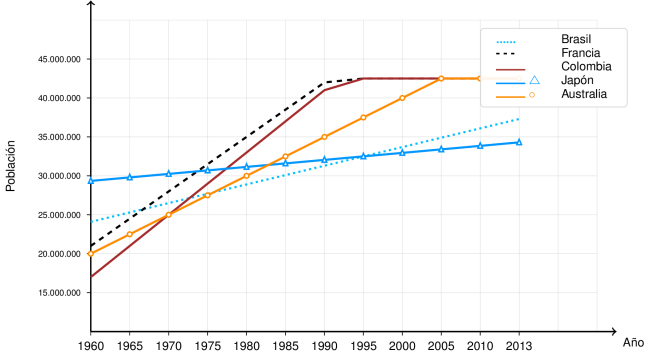

---
output:
  html_document: default
  word_document: default
  pdf_document:
    keep_tex: true
    extra_dependencies: ["graphicx", "float", "booktabs", "array", "xcolor"]
# Metadatos ICFES
icfes:
  competencia: interpretacion_representacion
  nivel_dificultad: 2
  contenido:
    categoria: estadistica
    tipo: generico
  contexto: comunitario
  eje_axial: eje3
  componente: aleatorio
---

{width=14cm}

Question
========

La gráfica muestra información de las poblaciones de 5 países desde 1960 hasta 2013.

Los datos representan la evolución demográfica de diferentes naciones a lo largo de más de cinco décadas, mostrando distintas tendencias de crecimiento poblacional.

Aproximadamente, ¿en qué año las poblaciones del País 2 y del País 5 fueron iguales?

Answerlist
----------
- 1996.
- 2002.
- 1960.
- 1975.

Solution
========

Para resolver este problema, debemos identificar el punto donde las líneas del País 2 (línea discontinua negra) y del País 5 (línea continua naranja con círculos) se intersectan en la gráfica.

**Análisis visual de las tendencias:**

- **País 2**: Inicia con una población menor pero presenta un crecimiento más acelerado
- **País 5**: Comienza con una población mayor pero su crecimiento es más moderado

**Identificación del punto de intersección:**

Observando cuidadosamente la gráfica, podemos ver que las dos líneas se cruzan aproximadamente en el año **1996**, donde ambas poblaciones alcanzan un valor similar de aproximadamente 35-37 millones de habitantes.

**Verificación:**
- Antes de 1996: País 5 > País 2
- Después de 1996: País 2 > País 5

Answerlist
----------
- **Verdadero**. El año 1996 corresponde al punto de intersección visual entre las líneas del País 2 y País 5.
- **Falso**. 2002 - confusión con otro cruce.
- **Falso**. 1960 - inicio del período analizado.
- **Falso**. 1975 - punto medio del período.

Meta-information
================
exname: Intersección Poblaciones Países Gráfica Líneas
extype: schoice
exsolution: 1000
exshuffle: TRUE
exsection: Estadística/Interpretación de Gráficas
