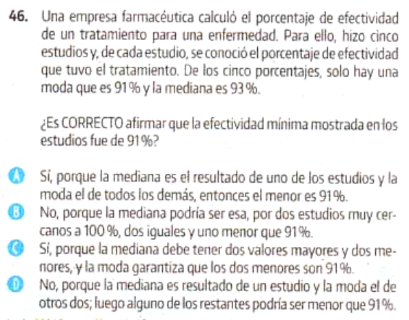

---
output:
  html_document: default
  pdf_document: default
  word_document: default
---

# ISBN: 978-958-5153-36-3-G11-2024-1 Pregunta 46

### Análisis de la pregunta
Una empresa farmacéutica calculó el porcentaje de efectividad de un tratamiento para una enfermedad. Para ello, hizo cinco estudios y, de cada estudio, se conoció el porcentaje de efectividad que tuvo el tratamiento. De los cinco porcentajes, solo hay una moda que es 91% y la mediana es 93%.

### Pregunta:
¿Es CORRECTO afirmar que la efectividad mínima mostrada en los estudios fue de 91%?

### Opciones de respuesta y análisis
A) Sí, porque la mediana es el resultado de uno de los estudios y la moda el de todos los demás, entonces el menor es 91%.
B) No, porque la mediana podría ser esa, por dos estudios muy cercanos a 100% y dos iguales y uno menor que 91%.
C) Sí, porque la mediana debe tener dos valores mayores y dos menores, y la moda garantiza que los menores son 91%.
D) No, porque la mediana es resultado de un estudio y la moda el de otros dos; luego alguno de los restantes podría ser menor que 91%.

### Justificación de la opción correcta (C):
Dado que la mediana es 93% y es el valor del tercer estudio en orden ascendente, debe haber al menos dos estudios con resultados de 93% o menos. Si 91% es la moda, significa que aparece más frecuentemente que cualquier otro valor en los datos, implicando que es probable que dos de los valores menores sean 91%. Esto hace que sea razonable afirmar que la efectividad mínima es 91%.

### Explicación de por qué cada opción incorrecta no es válida
- **Opción A**: Incorrectamente asume que la mediana y la moda aplican a todos los valores excepto uno, sin fundamento.
- **Opción B**: Introduce la posibilidad de que haya valores menores a 91%, posible pero no respaldado por la información de la moda.
- **Opción D**: Falla al no considerar que la moda indica la frecuencia más alta de 91% y su implicación en la distribución de los valores menores a la mediana.

### Concepto clave
La **mediana** y la **moda** son medidas de tendencia central en estadística. La mediana divide un conjunto de datos ordenados en dos mitades, mientras que la moda es el valor que aparece con mayor frecuencia.

### Conceptos relacionados y ejemplos
1. **Rango**: Diferencia entre el valor más alto y el más bajo en un conjunto de datos.
2. **Media**: Promedio de un conjunto de números.
3. **Desviación estándar**: Medida de la cantidad de variación o dispersión de un conjunto de valores.

## Retroalimentación Saber ICFES

- **Nivel de Desempeño:** Avanzado
- **Competencia:** Argumentación
- **Aprendizaje:** Evalúa la capacidad del estudiante para utilizar conocimientos estadísticos básicos para argumentar sobre la interpretación de medidas de tendencia central y su significado en un conjunto de datos.
- **Evidencias:** Capacidad para identificar y argumentar sobre la relación entre moda, mediana y los valores individuales en un conjunto de datos.
- **Componente:** Estadística
- **Tipo de pensamiento:** Aleatorio
- **Estándar Asociado:** Manejo de conceptos básicos de estadística y probabilidad
- **Categoría:** Interpretación y argumentación estadística
- **Contenido Genérico:** Uso y análisis de las medidas de tendencia central
- **Situación o contexto:** Análisis de datos en investigaciones médicas
- **Eje Axial Disciplinar:** Comprensión y manejo de la estadística descriptiva
- **¿Qué evalúa?:** La habilidad para analizar y argumentar basándose en el entendimiento de la mediana y la moda en el contexto de datos reales.

# Pregunta Analizada

La pregunta propuesta evalúa si es correcto afirmar que la efectividad mínima mostrada en estudios fue del 91%, utilizando los conceptos de moda y mediana.

# Opciones de Respuesta

- **A:** Incorrecta porque asume que todos los valores deben ser iguales o superiores a la moda.
- **B:** Incorrecta porque introduce la posibilidad de valores por encima del 100%, lo cual es poco plausible.
- **C:** **Correcta**, considera correctamente las definiciones de mediana y moda y cómo estas se relacionan con el conjunto de datos.
- **D:** Incorrecta, no reconoce adecuadamente la relevancia de la moda en el conjunto de datos.

# Justificación de la Respuesta Correcta

La opción C es correcta porque reconoce que la mediana y la moda son indicativos de los valores dentro del conjunto de datos, pero no necesariamente definen el mínimo o máximo de manera explícita. Este entendimiento es crucial para argumentar correctamente en contextos estadísticos.

# Motivos de Descarte de Opciones Incorrectas

- **Opción A:** No comprende la función de la moda más allá de su valor repetitivo.
- **Opción B:** No es plausible suponer valores por encima del 100% en este contexto.
- **Opción D:** No maneja adecuadamente las implicaciones de la moda en el análisis de mínimos y máximos.

# Nivel Educativo para la Aplicación del Ejercicio

Este ejercicio es apropiado desde el grado 9 en adelante, donde los estudiantes comienzan a tener un manejo más formal de la estadística descriptiva.
