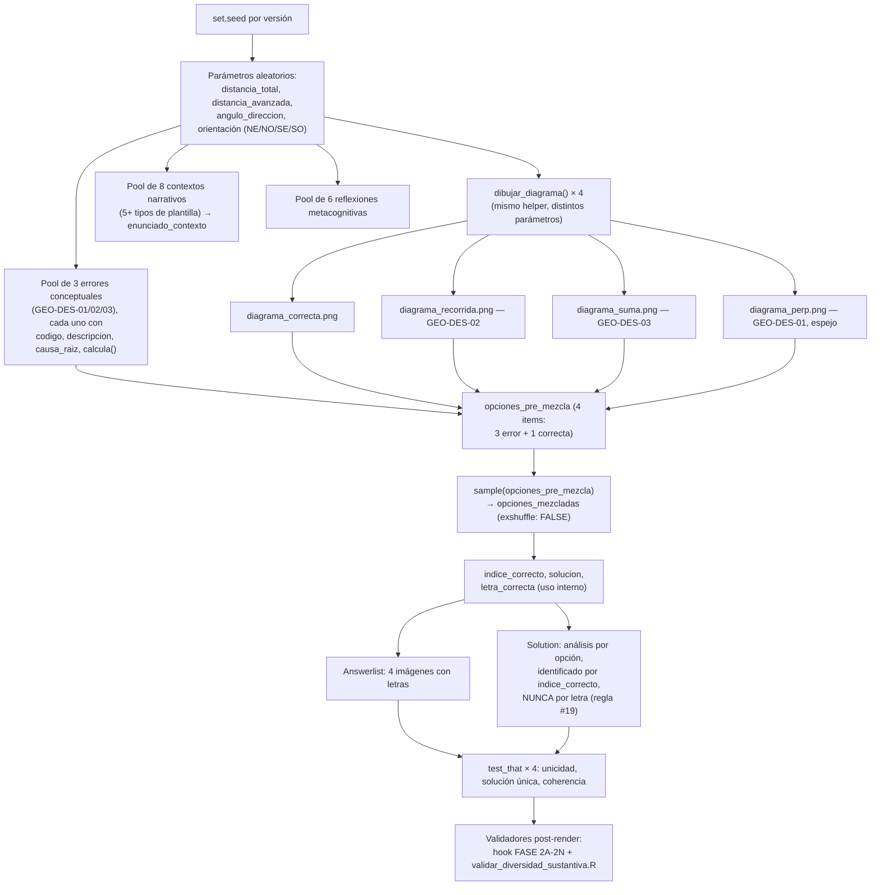

# Blueprint — Desplazamiento avión→aeropuerto

> Arquitectura técnica del ejercicio. Para el estado de trabajo y decisiones de proceso ver
> [`../HANDOFF.md`](../HANDOFF.md); para qué evalúa pedagógicamente ver
> [`SYLLABUS.md`](SYLLABUS.md).

## 1. Pipeline de generación



## 2. Los 7 chunks del `.Rmd` (561 líneas)

| Chunk | Líneas | Responsabilidad |
|---|---|---|
| `data_generation` | 1–424 | Parámetros aleatorios, dibujo de los 4 PNG, pool de errores conceptuales, pool de contextos narrativos, pool de reflexiones, mezcla interna, `test_that` de verificación |
| `enunciado` | 433–435 | Emite el texto del contexto seleccionado (`enunciado_contexto`) |
| `answerlist_opciones` | 442–446 | Emite `{width=70%}` para cada una de las 4 opciones, en el orden ya mezclado |
| `solution_setup` | 451–459 | Mapeos internos letra→descripción y letra→código de error, para uso en los chunks siguientes |
| `analisis_diagramas` | 463–484 | Describe cada una de las 4 opciones en la Solution (correcta con distancia/ángulo; distractores con `descripcion_larga` del error) |
| `diagrama_correcto_solucion` | 503–507 | Muestra el PNG de la opción correcta en la Solution, identificado por `opciones_mezcladas[[indice_correcto]]` — **por posición interna, no por letra** |
| `explicacion_errores` | 511–527 | Lista la `causa_raiz` de cada distractor en la Solution |

## 3. Contrato de `dibujar_diagrama()`

Definida en `.Rmd` líneas 54–115. Es el **único** generador de los 4 PNG — nunca hay
`file.copy()` de imágenes estáticas (cumple regla #22, ver §4).

```r
dibujar_diagrama(archivo, etiqueta_dist, dist_km, escala_px_km, angulo, th_axis, dir_sign)
```

| Parámetro | Tipo | Significado |
|---|---|---|
| `archivo` | string | Ruta del PNG de salida (p. ej. `"diagrama_correcta.png"`) |
| `etiqueta_dist` | string | Texto de la etiqueta de distancia sobre el diagrama (p. ej. `"70 km"`) |
| `dist_km` | numérico | Distancia real en km que determina la longitud del vector dibujado |
| `escala_px_km` | numérico | Factor de conversión km→px, **compartido por las 4 llamadas de una misma versión** (línea 120: `120 / (distancia_total + distancia_avanzada)`) |
| `angulo` | numérico | Ángulo en grados entre el eje cardinal de referencia y el vector |
| `th_axis` | numérico | Eje cardinal de referencia en convención matemática (90 = norte, 270 = sur) |
| `dir_sign` | `+1` / `-1` | Sentido de medición del ángulo respecto al eje (determina el lado este/oeste) |

**Invariantes que respeta la función** (no debatibles al refactorizar — ver `BACKLOG.md`, ítem
P1.1):

1. **Escala compartida**: las 4 llamadas de una misma versión usan el mismo `escala_px_km`, así
   que las longitudes de los 4 vectores son directamente comparables entre opciones (proporción
   real, no engañosa).
2. **Convención de ángulo matemático**: `th_axis` en {90 (N), 270 (S)}; el vector final se
   calcula como `th_line = th_axis + dir_sign * angulo`, con `dy` invertido porque el canvas de
   `grid` crece hacia abajo (línea 79).
3. **Piso `R_fit >= 50`** (línea 94, fix Error 23): el radio de la etiqueta del ángulo nunca baja
   de 50 px, para que el texto `"NN°"` no se solape con el vértice en ángulos grandes (cuña
   ancha). Ver §5.
4. **"Aeropuerto" en el cuadrante opuesto al vuelo** (líneas 97-101): la etiqueta del origen se
   posiciona dinámicamente según el signo de `dx`/`dy` del vector, para no superponerse nunca con
   el vector dibujado.
5. **Radio mínimo legible para "Avión"** (línea 104: `rtext <- max(Lpx, 58)`): si el vector es muy
   corto, la etiqueta del extremo igual se aleja lo suficiente para ser legible, sin mover el
   punto naranja de su posición proporcional real.

## 4. Decisiones de diseño con su porqué

| Decisión | Dónde | Por qué |
|---|---|---|
| **`exshuffle: FALSE` + `sample()` interno** | Meta-information línea 546; mezcla en línea 365 | Regla general de `../../../.claude/rules/graficos-como-opciones.md`: con opciones gráficas PNG, `exshuffle: TRUE` re-mezclaría el orden pero la Solution seguiría refiriéndose a la opción por su identidad interna (`indice_correcto`), rompiendo la coherencia si se referenciara por letra. Aquí la mezcla la hace `sample(opciones_pre_mezcla)` en `data_generation`, garantizando aleatoriedad real en cada semilla sin depender de `exshuffle` |
| **`letra_correcta` solo de uso interno** | Línea 389: comentario explícito `"# ... (solo para uso interno)"` | Regla #19 (`solution-letter-independence.md`): la Solution identifica la opción correcta por `indice_correcto` (línea 505: `opciones_mezcladas[[indice_correcto]]`), nunca emitiendo la letra al estudiante. `letra_correcta` existe como variable R pero no se interpola en ningún `cat()` visible |
| **Par correcta/espejo (`GEO-DES-01`) con igual longitud** | `diagrama_correcta.png` y `diagrama_perp.png` comparten `dist_km = distancia_restante` (líneas 121, 124); solo difieren en `th_axis`/`dir_sign` | Decisión deliberada (commit `779d7383`, resolviendo regla #22 §P5): un distractor de dirección que además tuviera otra magnitud sería un outlier eliminable "a ojo" por su longitud, sin que el estudiante tuviera que verificar la dirección. Al igualar la longitud, el único criterio que distingue la opción correcta de `GEO-DES-01` es la dirección — fuerza al estudiante a leer el ángulo/lado, no solo la magnitud |
| **Orientación global aleatoria (`orient`)** | Pool `orientaciones` (líneas 29-34), uno de 4 cuadrantes elegido por `sample()` | Corrige el Error 24 (predictibilidad posicional): sin esto, la respuesta correcta caería siempre en el mismo cuadrante visual (p. ej. siempre noreste) y el estudiante podría aprender la posición en vez de analizar los datos. Con 4 orientaciones posibles, la MISMA transformación se aplica a las 4 opciones de una versión (preserva la estructura relativa correcta) |
| **Formato equilibrado por construcción** | Las 4 opciones son PNG con el mismo estilo visual (cruz de ejes + vector + etiquetas) | La sección "Formato Equilibrado" de `../../../.claude/rules/graficos-como-opciones.md` exige que al menos 2 opciones compartan el formato de la correcta para evitar que el estudiante adivine por formato. Aquí el formato es único (las 4 son diagramas vectoriales generados por la misma función), así que la regla está satisfecha trivialmente — no hay mezcla de formatos (p. ej. barras vs. tortas) que pudiera sesgar la elección |
| **Pool de errores con `calcula()` puras y `precondicion` declarada** | Líneas 127-155 | Regla de `../../../.claude/rules/ejercicios-metacognitivos.md`: cada error debe ser reproducible de forma determinista (sin `sample`/`runif` dentro de `calcula()`) y declarar cuándo aplica. Los tres errores de este ejercicio tienen `precondicion = function(params) TRUE` (siempre aplican, no dependen de paridad ni otras propiedades condicionales) |
| **Filtro `avanzadas_validas`** | Línea 17: excluye `distancia_total == 2 * distancia_avanzada` | Evita que `distancia_restante == distancia_avanzada` (empate de longitud entre la opción correcta y `GEO-DES-02`), lo que produciría dos opciones con exactamente la misma magnitud aunque distinta dirección — caso ambiguo no deseado |

## 5. Invariantes que no se deben romper

Estas propiedades fueron ajustadas tras incidentes reales documentados en
`../../../.claude/docs/patrones-errores-conocidos.md` (Errores 23 y 24, ambos originados en este
subproyecto). Cualquier refactor (p. ej. OE6, modularización) debe preservarlas y volver a
verificarlas visualmente, no solo confiar en que el código se movió sin cambios:

1. **Piso `R_fit >= 50`** (línea 94). Antes del fix, la fórmula `(8 + 11*cos(semi))/sin(semi)`
   sin piso daba ~30 px para ángulos grandes (cuña ancha, p. ej. 70°), y la etiqueta del ángulo
   quedaba clipada contra la línea casi horizontal. El piso de 50 (no 34, que fue insuficiente en
   una primera iteración) da holgura suficiente. Ver Error 23 en el catálogo
   (`.claude/docs/patrones-errores-conocidos.md`, sección "Error 23").
2. **Pool `orientaciones` con 4 cuadrantes y aplicación uniforme a las 4 opciones de una misma
   versión** (líneas 29-35, 121-124). Romper esto (p. ej. fijar `orient` a un solo valor, o
   aplicar orientaciones distintas a cada opción) reintroduce el Error 24 (predictibilidad
   posicional) — ver la sección "Error 24" del catálogo.
3. **`escala_px_km` compartida entre las 4 llamadas de `dibujar_diagrama()` en una misma
   versión** (línea 120, usada en las 4 invocaciones de líneas 121-124). Si se derivan escalas
   independientes por opción, las longitudes dejan de ser proporcionalmente comparables y el
   ítem pierde validez visual (una opción con distancia menor podría dibujarse más larga que
   una con distancia mayor). **Nota**: esta misma línea es la causa raíz del hallazgo P0 de
   [BACKLOG.md](BACKLOG.md) — el fix de ese hallazgo debe modificar *cómo* se deriva
   `escala_px_km`, no eliminar la invariante de que sea compartida.
4. **`letra_correcta` nunca se interpola en un `cat()` visible al estudiante** (regla #19). Al
   modularizar, si el helper de Solution se mueve a `SP/R/`, debe seguir recibiendo
   `indice_correcto` (o el objeto `opciones_mezcladas[[indice_correcto]]`), no la letra.
5. **Las 4 imágenes con `{width=...}` explícito** en el Answerlist (línea 444) y en la Solution
   (línea 506) — regla #18, anti-`\pandocbounded`. Cualquier nuevo punto donde se emita una
   imagen debe incluir el atributo.
6. **Guard `\newcounter{none}`** al inicio de `Question` (líneas 429-431) — regla #20. Aunque
   este ejercicio no tiene tablas Markdown hoy, el guard ya está presente; no removerlo, y
   agregarlo también si un refactor introduce tablas nuevas.

## 6. Referencias cruzadas

- [`../HANDOFF.md`](../HANDOFF.md) — anatomía completa, decisiones de sesión, riesgos
- [`SYLLABUS.md`](SYLLABUS.md) — qué evalúa pedagógicamente cada elemento de este pipeline
- [`BACKLOG.md`](BACKLOG.md) — P0.1 (escala compartida como causa raíz del sesgo de longitud),
  P1.1 (modularización de los bloques descritos en §3-4)
- `../../../.claude/rules/graficos-como-opciones.md` — opciones gráficas, `exshuffle`, formato
  equilibrado
- `../../../.claude/rules/markdown-imagenes-pdf.md` — regla #18, `{width=...}`
- `../../../.claude/rules/solution-letter-independence.md` — regla #19
- `../../../.claude/rules/markdown-tablas-pandoc.md` — regla #20
- `../../../.claude/rules/ejercicios-metacognitivos.md` — pool de errores, `calcula()` puras,
  `precondicion`
- `../../../.claude/rules/diversidad-sustantiva.md` — regla #22
- `../../../.claude/docs/patrones-errores-conocidos.md` — Errores 22 (`repeat` sin cota, no
  aplica aquí porque se usa `Filter` en vez de `repeat`), 23 (etiquetas solapadas) y 24
  (predictibilidad posicional)
