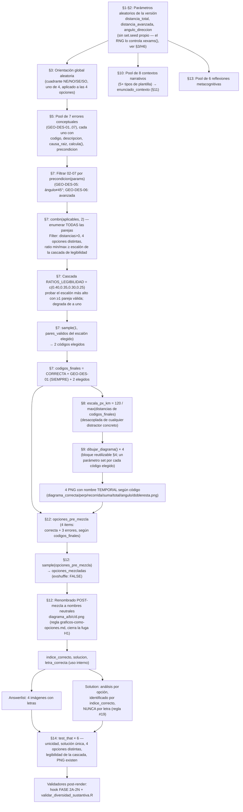

# Blueprint — Desplazamiento avión→aeropuerto

> Arquitectura técnica del ejercicio. Para el estado de trabajo y decisiones de proceso ver
> [`../HANDOFF.md`](../HANDOFF.md); para qué evalúa pedagógicamente ver
> [`SYLLABUS.md`](SYLLABUS.md).
>
> **Nota sobre estabilidad de las citas de línea**: el `.Rmd` está en desarrollo activo y su
> longitud cambia entre sesiones (561 → 667 → 756 → 760 líneas en la última semana). Este
> documento cita el chunk `data_generation` primero por su **índice interno de 14 secciones**
> (`§1`-`§14`, declarado en un comentario al inicio del chunk — ver §2 abajo), que es más estable
> que el número de línea exacto, y complementa con líneas solo como referencia aproximada
> verificada en la fecha de la última revisión (ver §6). Para una cita exacta, `grep -n
> '^# ---- §'` sobre el `.Rmd` siempre gana sobre lo escrito aquí.

## 1. Pipeline de generación



## 2. Los 7 chunks del `.Rmd` (760 líneas al 2026-07-28, verificado con `grep -n`)

El chunk `data_generation` lleva, desde el 2026-07-28, un **índice interno de 14 secciones**
(`§1`-`§14`) y un bloque de **5 invariantes** declarados en un comentario al inicio (líneas 8-32
de la versión verificada), para que un agente que retome el archivo entienda de inmediato qué no
debe romper sin tener que reconstruir el porqué desde cero:

```
I1  Ninguna letra (a/b/c/d) se asigna antes de la mezcla         -> regla #19 + regla #22 §P6
I2  Los 4 PNG se generan por versión, nunca se copian            -> regla #22 (diversidad)
I3  La correcta comparte longitud con >=1 distractor             -> regla #22 §P5
I4  La opción más corta respeta el ratio de legibilidad vigente  -> H7 (docs/BACKLOG.md P1.4)
I5  Sin bucles de reintento sin cota                             -> regla #21 Familia 1
```

| Chunk | Líneas (aprox.) | Responsabilidad |
|---|---|---|
| `data_generation` | 7–623 | Índice §1-§14 + 5 invariantes; parámetros aleatorios (sin `set.seed` propio, §1), orientación global (§3), bloque reutilizable de dibujo (§4), pool de 7 errores conceptuales (§5), selección de 3 por versión con enumeración de parejas + cascada de legibilidad (§7), escala desacoplada (§8), generación de los 4 PNG (§9), pool de contextos narrativos (§10) y de reflexiones (§13), mezcla + renombrado neutral (§12), `test_that` × 6 (§14) |
| `enunciado` | 632–634 | Emite el texto del contexto seleccionado (`enunciado_contexto`) |
| `answerlist_opciones` | 641–645 | Emite `{width=70%}` para cada una de las 4 opciones, en el orden ya mezclado |
| `solution_setup` | 650–658 | Mapeos internos letra→descripción y letra→código de error, para uso en los chunks siguientes |
| `analisis_diagramas` | 662–683 | Describe cada una de las 4 opciones en la Solution (correcta con distancia/ángulo; distractores con `descripcion_larga` del error) |
| `diagrama_correcto_solucion` | 702–706 | Muestra el PNG de la opción correcta en la Solution, identificado por `opciones_mezcladas[[indice_correcto]]` — **por posición interna, no por letra** |
| `explicacion_errores` | 710–726 | Lista la `causa_raiz` de cada distractor en la Solution |

Entre `explicacion_errores` y `Meta-information` (línea 740) van, en Markdown plano (sin chunk
R): "### Reflexión metacognitiva" (`` `r reflexion` ``) y "### Estrategia para interpretar
diagramas de desplazamiento" (lista numerada 1-5, ver §5 más abajo sobre el fix de numeración
H5).

## 3. Contrato de `dibujar_diagrama()`

Definida en `.Rmd` §4 (bloque reutilizable, líneas 97-176; la función en sí, líneas 115-176). Es
el **único** generador de los 4 PNG — nunca hay `file.copy()` de imágenes estáticas (cumple
regla #22, ver §4 más abajo).

**Procedencia declarada en el propio `.Rmd`** (recuadro de comentario al inicio de §4): esta
función es una **copia local de la Familia 6** de
`.claude/scripts/snippets_familias_rmd.R` (`dibujar_diagrama_cardinal`,
`orientaciones_cardinales`, `seleccionar_combinacion_con_cascada`, `renombrar_opciones_neutral`).
La librería de la regla #21 es la fuente de verdad canónica; esta copia está adaptada al dominio
(aeropuerto/avión, kilómetros) y puede diferir en nombres. Copiar en vez de `source()` es el
patrón que prescribe la regla #21 (Familias de Soluciones Reutilizables), no una omisión — si se
corrige un defecto de dibujo aquí, debe propagarse también a la librería.

```r
dibujar_diagrama(archivo, etiqueta_dist, dist_km, escala_px_km, angulo, th_axis, dir_sign)
```

| Parámetro | Tipo | Significado |
|---|---|---|
| `archivo` | string | Ruta del PNG de salida (temporal, p. ej. `"diagrama_correcta.png"`; se renombra a `diagrama_a/b/c/d.png` POST-mezcla en §12) |
| `etiqueta_dist` | string | Texto de la etiqueta de distancia sobre el diagrama (p. ej. `"70 km"`) |
| `dist_km` | numérico | Distancia real en km que determina la longitud del vector dibujado |
| `escala_px_km` | numérico | Factor de conversión km→px, **compartido por las 4 llamadas de una misma versión**, derivado del máximo de las 4 opciones REALMENTE seleccionadas en esa versión (§8: `120 / max(distancias_finales)` — desacoplado de cualquier distractor concreto, ver §4) |
| `angulo` | numérico | Ángulo en grados entre el eje cardinal de referencia y el vector |
| `th_axis` | numérico | Eje cardinal de referencia en convención matemática (90 = norte, 270 = sur) |
| `dir_sign` | `+1` / `-1` | Sentido de medición del ángulo respecto al eje (determina el lado este/oeste) |

**Invariantes que respeta la función** (no debatibles al refactorizar — ver `BACKLOG.md`, ítem
P1.1):

1. **Escala compartida**: las 4 llamadas de una misma versión usan el mismo `escala_px_km`, así
   que las longitudes de los 4 vectores son directamente comparables entre opciones (proporción
   real, no engañosa).
2. **Convención de ángulo matemático**: `th_axis` en {90 (N), 270 (S)}; el vector final se
   calcula como `th_line = th_axis + dir_sign * angulo`, con `dy` invertido porque el canvas de
   `grid` crece hacia abajo.
3. **Piso `R_fit >= 50`** (fix Error 23): el radio de la etiqueta del ángulo nunca baja de 50 px,
   para que el texto `"NN°"` no se solape con el vértice en ángulos grandes (cuña ancha). Ver §5.
4. **"Aeropuerto" en el cuadrante opuesto al vuelo**: la etiqueta del origen se posiciona
   dinámicamente según el signo de `dx`/`dy` del vector, para no superponerse nunca con el
   vector dibujado.
5. **Radio mínimo legible para "Avión"** (`rtext <- max(Lpx, 58)`): si el vector es muy corto, la
   etiqueta del extremo igual se aleja lo suficiente para ser legible, sin mover el punto naranja
   de su posición proporcional real.

## 4. Decisiones de diseño con su porqué

| Decisión | Dónde (§ del `.Rmd`) | Por qué |
|---|---|---|
| **`exshuffle: FALSE` + `sample()` interno** | Meta-information (`exshuffle: FALSE`); mezcla en §12 (`opciones_mezcladas <- sample(opciones_pre_mezcla)`) | Regla general de `../../../../.claude/rules/graficos-como-opciones.md`: con opciones gráficas PNG, `exshuffle: TRUE` re-mezclaría el orden pero la Solution seguiría refiriéndose a la opción por su identidad interna (`indice_correcto`), rompiendo la coherencia si se referenciara por letra. Aquí la mezcla la hace `sample(opciones_pre_mezcla)` en §12, garantizando aleatoriedad real en cada semilla sin depender de `exshuffle` |
| **`letra_correcta` solo de uso interno** | §12, comentario explícito `"# ... (solo para uso interno)"` junto a `letra_correcta <- letras[indice_correcto]` | Regla #19 (`solution-letter-independence.md`): la Solution identifica la opción correcta por `indice_correcto` (chunk `diagrama_correcto_solucion`: `opciones_mezcladas[[indice_correcto]]$archivo`), nunca emitiendo la letra al estudiante. `letra_correcta` existe como variable R pero no se interpola en ningún `cat()` visible |
| **Par correcta/espejo (`GEO-DES-01`) con igual longitud** | §7-§8: `dist_por_codigo` asigna `distancia_restante` tanto a `CORRECTA` como a `GEO-DES-01`; solo difieren en `th_axis`/`dir_sign` (§3, `th_axis_espejo`/`dir_sign_espejo`) | Decisión deliberada (resolviendo regla #22 §P5): un distractor de dirección que además tuviera otra magnitud sería un outlier eliminable "a ojo" por su longitud, sin que el estudiante tuviera que verificar la dirección. Al igualar la longitud, el único criterio que distingue la opción correcta de `GEO-DES-01` es la dirección — fuerza al estudiante a leer el ángulo/lado, no solo la magnitud |
| **Orientación global aleatoria (`orient`)** | §3: pool `orientaciones` (4 cuadrantes), uno elegido por `sample()` | Corrige el Error 24 (predictibilidad posicional): sin esto, la respuesta correcta caería siempre en el mismo cuadrante visual (p. ej. siempre noreste) y el estudiante podría aprender la posición en vez de analizar los datos. Con 4 orientaciones posibles, la MISMA transformación se aplica a las 4 opciones de una versión (preserva la estructura relativa correcta) |
| **Formato equilibrado por construcción** | Las 4 opciones son PNG con el mismo estilo visual (cruz de ejes + vector + etiquetas) | La sección "Formato Equilibrado" de `../../../../.claude/rules/graficos-como-opciones.md` exige que al menos 2 opciones compartan el formato de la correcta para evitar que el estudiante adivine por formato. Aquí el formato es único (las 4 son diagramas vectoriales generados por la misma función), así que la regla está satisfecha trivialmente — no hay mezcla de formatos (p. ej. barras vs. tortas) que pudiera sesgar la elección |
| **Pool de 7 errores conceptuales, 3 elegidos por versión (`GEO-DES-01` fijo + 2 sorteados de `{02,03,04,05,06,07}`)** | §5 (pool), §7 (selección por enumeración de parejas + cascada de legibilidad) | Resuelve el hallazgo P0.1 (H3) de [`BACKLOG.md`](BACKLOG.md) (regla #22 §P5): con solo 3 errores fijos, `GEO-DES-03` (suma) era, por identidad algebraica, siempre el vector más largo de las 4 opciones — un atajo perceptual ("la más larga nunca es la correcta") permitía descartarlo sin razonar sobre distancia ni dirección. El pool subió primero a 6 (resolviendo H3) y luego a 7 con `GEO-DES-07` (resolviendo H4, ver fila siguiente) |
| **Séptimo error `GEO-DES-07` (ángulo medido desde el eje cardinal opuesto)** | §5 (pool), §3 (`th_axis_opuesto`, `dir_sign_opuesto`, `eje_opuesto`) | Resuelve H4 (ver [BACKLOG.md](BACKLOG.md) P1.5): con el pool de 6, el rótulo de distancia visible en cada diagrama permitía descartar opciones sin razonar sobre la dirección (solo quedaban 2 candidatas en el 40% de las versiones). `GEO-DES-07` conserva distancia **y** lado, fallando solo en el eje de referencia — con él, tres distractores (`01`, `05`, `07`) comparten la magnitud de la correcta, así que el rótulo numérico deja de ser suficiente para descartar opciones con la misma frecuencia. Garantías geométricas demostradas (no muestreadas, ver `.Rmd` §3): `th_axis + 180` nunca colisiona con la correcta (exigiría ángulo de 90°, fuera del rango 30-70), ni con el espejo `GEO-DES-01` (difieren exactamente 180°), ni con `GEO-DES-05` (difieren 90° o 270° según cuadrante) — por eso su `precondicion` es `TRUE` incondicional |
| **Escala `escala_px_km` desacoplada de cualquier distractor concreto** | §8: `escala_px_km <- 120 / max(distancias_finales)` (antes: `120 / (distancia_total + distancia_avanzada)`, ver §5 más abajo) | Antes, la escala se derivaba exactamente del valor de `GEO-DES-03`, lo que lo fijaba en 120 px exactos en el 100% de las versiones (identidad algebraica, no azar). Al derivarla del máximo de las 4 opciones REALMENTE seleccionadas en cada versión (`distancias_finales`, §8), ningún distractor concreto queda "pre-asignado" al extremo visual por diseño |
| **Cascada de ratios de legibilidad (`RATIOS_LEGIBILIDAD <- c(0.40, 0.35, 0.30, 0.25)`)** | §7: se prueba el escalón más alto y, si ninguna pareja de distractores aplicables lo cumple, se baja un escalón, hasta el mínimo histórico 0.25 (siempre viable) | Resuelve H7 (ver [BACKLOG.md](BACKLOG.md) P1.4): con un umbral único de 0.25, el vector más corto medía 30 px en ~10% de las versiones, y ahí el arco (radio 28) y la etiqueta del ángulo (radio ≥50) quedaban fuera del propio vector. Un barrido de 40 semillas por valor mostró que 0.40 es alcanzable en la gran mayoría de las versiones (mínimo 48 px) pero que, a partir de 0.45, hay versiones sin ninguna pareja válida — de ahí la cascada en vez de un umbral único más alto, que habría convertido esas versiones en errores de render (`stopifnot` fallando) |
| **Retiro del reseed por reloj (`set.seed(as.integer(Sys.time())...)`, H6)** | §1: el chunk ya NO llama a `set.seed()` propio | Verificado en el fuente de `exams:::xexams()`: el control del RNG es del llamador, no del ejercicio. `xexams()` tiene dos regímenes — sin `seed` (deja correr el flujo RNG global, cada versión continúa donde quedó la anterior) y con `seed` (fija y restaura `.Random.seed` por versión, el mecanismo documentado para reproducir una versión exacta). Un `set.seed()` derivado del reloj dentro del chunk pisaba ese segundo régimen: si alguien fijaba `seed` a propósito para reproducir un fallo, el reseed interno lo invalidaba silenciosamente. Retirarlo no reduce la diversidad medida (ver [`../HANDOFF.md` §3](../HANDOFF.md#3-estado-real-del-ejercicio-verificado-2026-07-28): 39/40 valores únicos, mejor que los 35/40 previos) |
| **Fix de numeración de la lista "Procedimiento correcto" (H5)** | Chunk `analisis_diagramas` → Markdown, sección "### Procedimiento correcto" (item 4, la ecuación en display) | La ecuación `$$d_{\text{nueva}} = ...$$` estaba escrita a columna 0 dentro del ítem 4 de una lista numerada; pandoc interpretaba eso como el fin de la lista y el inicio de una nueva, así que en PDF el ítem 5 ("Dirección final") aparecía renumerado como "(a)" en vez de continuar en "(e)". Fix: la ecuación se indentó 3 espacios para quedar dentro del mismo ítem de la lista. Verificado: la lista renderiza (a)→(e) sin reinicio |
| **Pool de errores con `calcula()` puras y `precondicion` declarada** | §5 | Regla de `../../../../.claude/rules/ejercicios-metacognitivos.md`: cada error debe ser reproducible de forma determinista (sin `sample`/`runif` dentro de `calcula()`) y declarar cuándo aplica. Cinco errores (`GEO-DES-01/02/03/04/07`) tienen `precondicion = function(params) TRUE` (siempre aplican); dos (`GEO-DES-05/06`) son condicionales — evitan casos degenerados donde el error coincidiría con otra opción o produciría un valor no representable |
| **Filtro `avanzadas_validas`** | §2: excluye `distancia_total == 2 * distancia_avanzada` | Evita que `distancia_restante == distancia_avanzada` (empate de longitud entre la opción correcta y `GEO-DES-02`), lo que produciría dos opciones con exactamente la misma magnitud aunque distinta dirección — caso ambiguo no deseado |
| **Auto-contención deliberada (NO modularizar)** | Comentario "NOTA DE DISEÑO" al inicio de §4 | Se intentó extraer `dibujar_diagrama()`/`km()`/`.cols` a `R/helpers_diagramas.R` con `include_supplement()` + `source()` (mecanismo oficial de R/exams). Los 5 formatos renderizaron bien, pero `validar_diversidad_sustantiva.R` (regla #22, obligatorio) falló en 40/40 semillas porque evalúa el chunk aislado en un `tempdir()`, fuera del pipeline de `xexams()`, donde `include_supplement()` no tiene contexto. Revertido; ver [BACKLOG.md](BACKLOG.md) P1.1 (BLOQUEADO) |

## 5. Invariantes que no se deben romper

Estas propiedades fueron ajustadas tras incidentes reales documentados en
`../../../../.claude/docs/patrones-errores-conocidos.md` (Errores 23 y 24, ambos originados en este
subproyecto) y en la resolución de los hallazgos H3, H4, H6 y H7 de [`BACKLOG.md`](BACKLOG.md)
(regla #22 §P5, 2026-07-28). Cualquier refactor (p. ej. OE6, modularización, cuando se
desbloquee) debe preservarlas y volver a verificarlas visualmente, no solo confiar en que el
código se movió sin cambios:

1. **Piso `R_fit >= 50`** (§4, función `dibujar_diagrama()`). Antes del fix, la fórmula
   `(8 + 11*cos(semi))/sin(semi)` sin piso daba ~30 px para ángulos grandes (cuña ancha, p. ej.
   70°), y la etiqueta del ángulo quedaba clipada contra la línea casi horizontal. El piso de 50
   (no 34, que fue insuficiente en una primera iteración) da holgura suficiente. Ver Error 23 en
   el catálogo (`.claude/docs/patrones-errores-conocidos.md`, sección "Error 23").
2. **Pool `orientaciones` con 4 cuadrantes y aplicación uniforme a las 4 opciones de una misma
   versión** (§3, aplicado a los 4 diagramas seleccionados en las tablas
   `th_axis_por_codigo`/`dir_sign_por_codigo` de §7 y en el bucle de dibujo de §9). Romper esto
   (p. ej. fijar `orient` a un solo valor, o aplicar orientaciones distintas a cada opción)
   reintroduce el Error 24 (predictibilidad posicional) — ver la sección "Error 24" del
   catálogo.
3. **`escala_px_km` compartida entre las 4 llamadas de `dibujar_diagrama()` en una misma
   versión, derivada del máximo de las 4 opciones REALMENTE seleccionadas** (§8:
   `escala_px_km <- 120 / max(distancias_finales)`, usada en las 4 invocaciones del bucle de §9).
   Si se derivan escalas independientes por opción, las longitudes dejan de ser
   proporcionalmente comparables y el ítem pierde validez visual. **Invariante reforzada
   2026-07-28 (regla #22 §P5, hallazgo H3/P0.1 de [`BACKLOG.md`](BACKLOG.md), RESUELTO)**: la
   escala NUNCA debe volver a derivarse del valor fijo de un distractor concreto — como ocurría
   antes con `distancia_total + distancia_avanzada`, que coincidía exactamente con `GEO-DES-03`
   y lo fijaba en 120 px exactos por identidad algebraica en el 100% de las versiones. Debe
   seguir calculándose sobre `distancias_finales` (§8), el vector de las 4 opciones efectivamente
   elegidas en esa versión.
4. **`letra_correcta` nunca se interpola en un `cat()` visible al estudiante** (regla #19). Al
   modularizar, si el helper de Solution se mueve a `SP/R/`, debe seguir recibiendo
   `indice_correcto` (o el objeto `opciones_mezcladas[[indice_correcto]]`), no la letra.
5. **Las 4 imágenes con `{width=...}` explícito** en el Answerlist y en la Solution (chunks
   `answerlist_opciones` y `diagrama_correcto_solucion`) — regla #18, anti-`\pandocbounded`.
   Cualquier nuevo punto donde se emita una imagen debe incluir el atributo.
6. **Guard `\newcounter{none}`** al inicio de `Question` — regla #20. Aunque este ejercicio no
   tiene tablas Markdown hoy, el guard ya está presente; no removerlo, y agregarlo también si un
   refactor introduce tablas nuevas.
7. **`GEO-DES-01` (espejo) SIEMPRE presente en `codigos_finales`** (§7:
   `codigos_finales <- c("CORRECTA", "GEO-DES-01", codigos_extra)`). Es el discriminador central
   del ítem — el único distractor que garantiza compartir la magnitud exacta de la respuesta
   correcta (ver invariante 9). Un refactor que lo vuelva "sorteable" junto con los otros seis
   candidatos elimina esa garantía y reabre el riesgo de que el estudiante descarte opciones
   solo por la longitud.
8. **La legibilidad (`min/max` de distancias) se verifica sobre las 4 opciones REALMENTE
   seleccionadas, en la SELECCIÓN — no filtrando parámetros de entrada** (constante
   `RATIOS_LEGIBILIDAD` en §7; filtro dentro de `pares_validos <- filtrar_pares(r_min)` con
   cascada de escalones). El filtro que existía antes sobre `distancia_avanzada` se **eliminó**:
   filtrar un parámetro de entrada no garantiza la legibilidad del conjunto final de 4 opciones,
   porque el pool ampliado hace que el conjunto de candidatos varíe por versión — la
   verificación debe hacerse sobre las combinaciones ya formadas. **Invariante reforzada
   2026-07-28 (H7, RESUELTO)**: no debe volver a haber un umbral único fijo — la cascada de
   escalones es lo que evita que una versión sin pareja válida en el escalón más alto termine en
   error de render.
9. **Siempre hay al menos 2 opciones con la misma longitud que la correcta.** Garantizado
   estructuralmente porque `GEO-DES-01` comparte `dist_km = distancia_restante` con `CORRECTA`
   (§7, ambas entradas de `dist_por_codigo`) y está siempre presente (invariante 7). Con el pool
   de 7, `GEO-DES-05` y `GEO-DES-07` también comparten esa magnitud cuando su `precondicion` se
   cumple y son sorteados, subiendo hasta 3 el número de opciones con la longitud de la
   correcta. Es la garantía que impide que la longitud del vector identifique la respuesta por
   sí sola — ver [`SYLLABUS.md` §3](SYLLABUS.md#3-pool-de-errores-conceptuales-distractores-diagnósticos)
   y los hallazgos H3/H4 (RESUELTOS) de [`BACKLOG.md`](BACKLOG.md).
10. **El chunk `data_generation` NO debe llamar a `set.seed()` propio** (§1, invariante reforzada
    2026-07-28 tras H6, RESUELTO). El control del RNG por versión es responsabilidad exclusiva
    del llamador (`xexams()`/`exams2*()`), que expone el argumento `seed` precisamente para ese
    propósito. Un reseed interno (por reloj o por cualquier otra fuente) rompe la reproducibilidad
    que ese argumento garantiza. Excepción explícita: `SemilleroCloze.R:95`, un `set.seed()`
    dentro de una función de prueba de humo (`prueba_rapida()`), fuera del `.Rmd` — ahí es
    intencional que la prueba sea siempre la misma versión.

## 6. Verificación de citas de línea (2026-07-28, última pasada)

El `.Rmd` ha crecido en tres saltos verificados esta semana: 561 → 667 líneas (ampliación del
pool de errores de 3 a 6, ver revisión anterior de este documento) → **760 líneas** (adición de
`GEO-DES-07`, cascada de legibilidad, retiro del reseed, reestructuración con índice §1-§14 y
notas ampliadas — última verificación con `grep -n`/`nl -ba` el 2026-07-28). Dado el ritmo de
cambio, este documento prioriza los marcadores `§1`-`§14` (estables por diseño) sobre líneas
exactas; la tabla siguiente registra el snapshot verificado en la última pasada, no una garantía
de que la línea exacta se mantenga en la próxima sesión:

| Elemento | Línea (snapshot 2026-07-28) |
|---|---|
| Total de líneas del `.Rmd` | 760 |
| Índice §1-§14 + 5 invariantes (comentario) | líneas 8-32 |
| Chunk `data_generation` | 7-623 |
| §1 Semilla (sin `set.seed` propio) | línea 35 |
| §2 Parámetros aleatorios | línea 56 |
| §3 Orientación global (`orientaciones`, `orient`, `dir_desc`) | línea 69 (pool en 74-79; `orient` en 80; `dir_desc` en 95) |
| §4 Bloque reutilizable (`dibujar_diagrama()`) | línea 97 (función en sí: 115-176; `R_fit`: 155; `rtext`: 165) |
| §5 Pool de 7 errores conceptuales | línea 180 (lista `errores_conceptuales` desde 181) |
| §6 La opción correcta | línea 247 |
| §7 Selección de distractores (cascada) | línea 255 (`RATIOS_LEGIBILIDAD`: 324; `codigos_finales`: 347) |
| §8 Escala desacoplada | línea 349 (`distancias_finales`: 352; `escala_px_km`: 353) |
| §9 Generar los 4 diagramas | línea 355 |
| §10 Pool de contextos narrativos (8) | línea 363 |
| §11 Seleccionar contexto | línea 519 |
| §12 Mezcla + renombrado neutral | línea 524 (`opciones_pre_mezcla`: 540; `sample()`: 550; `indice_correcto`: 553; `letra_correcta`: 575) |
| §13 Pool de reflexiones (6) | línea 577 |
| §14 Verificaciones `test_that` × 6 | línea 588 |
| `Question` / guard `\newcounter{none}` | línea 625 / 628-630 |
| Chunk `enunciado` | 632-634 |
| `Answerlist` / chunk `answerlist_opciones` (`{width=70%}`) | línea 638 / 641-645 |
| `Solution` / chunk `solution_setup` | línea 647 / 650-658 |
| Chunk `analisis_diagramas` | 662-683 |
| "### Procedimiento correcto" (lista 1-5, fix H5 en el ítem 4) | línea 685 (ítem 4: 692; ítem 5: 696) |
| Chunk `diagrama_correcto_solucion` (`{width=55%}`) | 702-706 |
| Chunk `explicacion_errores` | 710-726 |
| "### Reflexión metacognitiva" / "### Estrategia..." | línea 728 / 732 |
| `Meta-information` (bloque completo) | línea 740 (fin de archivo, 760) |
| `exshuffle: FALSE` | línea 745 |

## 7. Referencias cruzadas

- [`../HANDOFF.md`](../HANDOFF.md) — anatomía completa, decisiones de sesión, riesgos
- [`SYLLABUS.md`](SYLLABUS.md) — qué evalúa pedagógicamente cada elemento de este pipeline, y la
  evolución del pool de errores (H3, H4, H7)
- [`BACKLOG.md`](BACKLOG.md) — P0.1/H3 (pool 3→6 y escala desacoplada), P1.1 (modularización,
  BLOQUEADO), P1.4/H7 (cascada de legibilidad), P1.5/H4 (`GEO-DES-07`)
- `../../../../.claude/rules/graficos-como-opciones.md` — opciones gráficas, `exshuffle`, formato
  equilibrado
- `../../../../.claude/rules/markdown-imagenes-pdf.md` — regla #18, `{width=...}`
- `../../../../.claude/rules/solution-letter-independence.md` — regla #19
- `../../../../.claude/rules/markdown-tablas-pandoc.md` — regla #20
- `../../../../.claude/rules/familias-soluciones-rmd.md` — regla #21, Familia 6 (procedencia de
  `dibujar_diagrama()`), Familia 1 (sin bucles sin cota)
- `../../../../.claude/rules/ejercicios-metacognitivos.md` — pool de errores, `calcula()` puras,
  `precondicion`
- `../../../../.claude/rules/diversidad-sustantiva.md` — regla #22, origen de H3/H4/H6/H7
- `../../../../.claude/docs/patrones-errores-conocidos.md` — Errores 22 (`repeat` sin cota, no
  aplica aquí porque se usa `Filter`/enumeración en vez de `repeat`), 23 (etiquetas solapadas) y
  24 (predictibilidad posicional)
