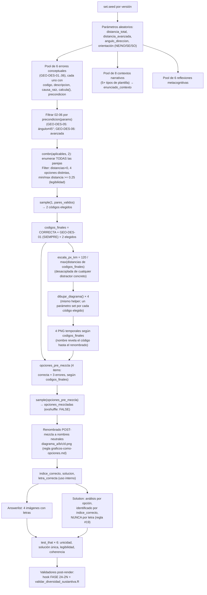

# Blueprint — Desplazamiento avión→aeropuerto

> Arquitectura técnica del ejercicio. Para el estado de trabajo y decisiones de proceso ver
> [`../HANDOFF.md`](../HANDOFF.md); para qué evalúa pedagógicamente ver
> [`SYLLABUS.md`](SYLLABUS.md).

## 1. Pipeline de generación



## 2. Los 7 chunks del `.Rmd` (667 líneas)

| Chunk | Líneas | Responsabilidad |
|---|---|---|
| `data_generation` | 1–530 | Parámetros aleatorios, pool de 6 errores conceptuales, selección de 3 por versión (enumeración de parejas + `sample()`), dibujo de los 4 PNG, pool de contextos narrativos, pool de reflexiones, mezcla interna, `test_that` de verificación |
| `enunciado` | 539–541 | Emite el texto del contexto seleccionado (`enunciado_contexto`) |
| `answerlist_opciones` | 548–552 | Emite `{width=70%}` para cada una de las 4 opciones, en el orden ya mezclado |
| `solution_setup` | 557–565 | Mapeos internos letra→descripción y letra→código de error, para uso en los chunks siguientes |
| `analisis_diagramas` | 569–590 | Describe cada una de las 4 opciones en la Solution (correcta con distancia/ángulo; distractores con `descripcion_larga` del error) |
| `diagrama_correcto_solucion` | 609–613 | Muestra el PNG de la opción correcta en la Solution, identificado por `opciones_mezcladas[[indice_correcto]]` — **por posición interna, no por letra** |
| `explicacion_errores` | 617–633 | Lista la `causa_raiz` de cada distractor en la Solution |

## 3. Contrato de `dibujar_diagrama()`

Definida en `.Rmd` líneas 54–115. Es el **único** generador de los 4 PNG — nunca hay
`file.copy()` de imágenes estáticas (cumple regla #22, ver §4).

```r
dibujar_diagrama(archivo, etiqueta_dist, dist_km, escala_px_km, angulo, th_axis, dir_sign)
```

| Parámetro | Tipo | Significado |
|---|---|---|
| `archivo` | string | Ruta del PNG de salida (p. ej. `"diagrama_correcta.png"`) |
| `etiqueta_dist` | string | Texto de la etiqueta de distancia sobre el diagrama (p. ej. `"70 km"`) |
| `dist_km` | numérico | Distancia real en km que determina la longitud del vector dibujado |
| `escala_px_km` | numérico | Factor de conversión km→px, **compartido por las 4 llamadas de una misma versión**, derivado del máximo de las 4 opciones REALMENTE seleccionadas en esa versión (línea 265: `120 / max(distancias_finales)` — desacoplado de cualquier distractor concreto, ver §4) |
| `angulo` | numérico | Ángulo en grados entre el eje cardinal de referencia y el vector |
| `th_axis` | numérico | Eje cardinal de referencia en convención matemática (90 = norte, 270 = sur) |
| `dir_sign` | `+1` / `-1` | Sentido de medición del ángulo respecto al eje (determina el lado este/oeste) |

**Invariantes que respeta la función** (no debatibles al refactorizar — ver `BACKLOG.md`, ítem
P1.1):

1. **Escala compartida**: las 4 llamadas de una misma versión usan el mismo `escala_px_km`, así
   que las longitudes de los 4 vectores son directamente comparables entre opciones (proporción
   real, no engañosa).
2. **Convención de ángulo matemático**: `th_axis` en {90 (N), 270 (S)}; el vector final se
   calcula como `th_line = th_axis + dir_sign * angulo`, con `dy` invertido porque el canvas de
   `grid` crece hacia abajo (línea 79).
3. **Piso `R_fit >= 50`** (línea 94, fix Error 23): el radio de la etiqueta del ángulo nunca baja
   de 50 px, para que el texto `"NN°"` no se solape con el vértice en ángulos grandes (cuña
   ancha). Ver §5.
4. **"Aeropuerto" en el cuadrante opuesto al vuelo** (líneas 97-101): la etiqueta del origen se
   posiciona dinámicamente según el signo de `dx`/`dy` del vector, para no superponerse nunca con
   el vector dibujado.
5. **Radio mínimo legible para "Avión"** (línea 104: `rtext <- max(Lpx, 58)`): si el vector es muy
   corto, la etiqueta del extremo igual se aleja lo suficiente para ser legible, sin mover el
   punto naranja de su posición proporcional real.

## 4. Decisiones de diseño con su porqué

| Decisión | Dónde | Por qué |
|---|---|---|
| **`exshuffle: FALSE` + `sample()` interno** | Meta-information línea 652; mezcla en línea 462 | Regla general de `../../../.claude/rules/graficos-como-opciones.md`: con opciones gráficas PNG, `exshuffle: TRUE` re-mezclaría el orden pero la Solution seguiría refiriéndose a la opción por su identidad interna (`indice_correcto`), rompiendo la coherencia si se referenciara por letra. Aquí la mezcla la hace `sample(opciones_pre_mezcla)` en `data_generation`, garantizando aleatoriedad real en cada semilla sin depender de `exshuffle` |
| **`letra_correcta` solo de uso interno** | Línea 486: comentario explícito `"# ... (solo para uso interno)"` | Regla #19 (`solution-letter-independence.md`): la Solution identifica la opción correcta por `indice_correcto` (línea 611: `opciones_mezcladas[[indice_correcto]]`), nunca emitiendo la letra al estudiante. `letra_correcta` existe como variable R pero no se interpola en ningún `cat()` visible |
| **Par correcta/espejo (`GEO-DES-01`) con igual longitud** | `dist_por_codigo` asigna `distancia_restante` tanto a `CORRECTA` como a `GEO-DES-01` (línea 209); solo difieren en `th_axis`/`dir_sign` (líneas 198-207) | Decisión deliberada (commit `779d7383`, resolviendo regla #22 §P5): un distractor de dirección que además tuviera otra magnitud sería un outlier eliminable "a ojo" por su longitud, sin que el estudiante tuviera que verificar la dirección. Al igualar la longitud, el único criterio que distingue la opción correcta de `GEO-DES-01` es la dirección — fuerza al estudiante a leer el ángulo/lado, no solo la magnitud |
| **Orientación global aleatoria (`orient`)** | Pool `orientaciones` (líneas 29-34), uno de 4 cuadrantes elegido por `sample()` | Corrige el Error 24 (predictibilidad posicional): sin esto, la respuesta correcta caería siempre en el mismo cuadrante visual (p. ej. siempre noreste) y el estudiante podría aprender la posición en vez de analizar los datos. Con 4 orientaciones posibles, la MISMA transformación se aplica a las 4 opciones de una versión (preserva la estructura relativa correcta) |
| **Formato equilibrado por construcción** | Las 4 opciones son PNG con el mismo estilo visual (cruz de ejes + vector + etiquetas) | La sección "Formato Equilibrado" de `../../../.claude/rules/graficos-como-opciones.md` exige que al menos 2 opciones compartan el formato de la correcta para evitar que el estudiante adivine por formato. Aquí el formato es único (las 4 son diagramas vectoriales generados por la misma función), así que la regla está satisfecha trivialmente — no hay mezcla de formatos (p. ej. barras vs. tortas) que pudiera sesgar la elección |
| **Pool ampliado de 3 a 6 errores conceptuales, 3 elegidos por versión (`GEO-DES-01` fijo + 2 sorteados de `{02,03,04,05,06}`)** | Pool en líneas 119-175; selección por enumeración de parejas (`combn()`) + `sample()` en líneas 185-259 | Resuelve el hallazgo P0.1 de [`BACKLOG.md`](BACKLOG.md) (regla #22 §P5, `../../../.claude/rules/diversidad-sustantiva.md`): con solo 3 errores fijos, `GEO-DES-03` (suma) era, por identidad algebraica, siempre el vector más largo de las 4 opciones — un atajo perceptual ("la más larga nunca es la correcta") permitía descartarlo sin razonar sobre distancia ni dirección. Con 6 candidatos y solo 3 presentes por versión (incluyendo dos errores nuevos, `GEO-DES-05` de igual magnitud y `GEO-DES-06` de menor magnitud), la longitud deja de identificar sistemáticamente ningún distractor extremo |
| **Escala `escala_px_km` desacoplada de cualquier distractor concreto** | Línea 265: `escala_px_km <- 120 / max(distancias_finales)` (antes: `120 / (distancia_total + distancia_avanzada)`, ver §3) | Antes, la escala se derivaba exactamente del valor de `GEO-DES-03`, lo que lo fijaba en 120 px exactos en el 100% de las versiones (identidad algebraica, no azar). Al derivarla del máximo de las 4 opciones REALMENTE seleccionadas en cada versión (`distancias_finales`, línea 264), ningún distractor concreto queda "pre-asignado" al extremo visual por diseño |
| **Pool de errores con `calcula()` puras y `precondicion` declarada** | Líneas 119-175 | Regla de `../../../.claude/rules/ejercicios-metacognitivos.md`: cada error debe ser reproducible de forma determinista (sin `sample`/`runif` dentro de `calcula()`) y declarar cuándo aplica. Cuatro errores (`GEO-DES-01/02/03/04`) tienen `precondicion = function(params) TRUE` (siempre aplican); dos (`GEO-DES-05/06`) son condicionales — evitan casos degenerados donde el error coincidiría con otra opción o produciría un valor no representable |
| **Filtro `avanzadas_validas`** | Línea 16: excluye `distancia_total == 2 * distancia_avanzada` | Evita que `distancia_restante == distancia_avanzada` (empate de longitud entre la opción correcta y `GEO-DES-02`), lo que produciría dos opciones con exactamente la misma magnitud aunque distinta dirección — caso ambiguo no deseado |

## 5. Invariantes que no se deben romper

Estas propiedades fueron ajustadas tras incidentes reales documentados en
`../../../.claude/docs/patrones-errores-conocidos.md` (Errores 23 y 24, ambos originados en este
subproyecto) y en la resolución del hallazgo P0.1 de [`BACKLOG.md`](BACKLOG.md) (regla #22 §P5,
2026-07-28). Cualquier refactor (p. ej. OE6, modularización) debe preservarlas y volver a
verificarlas visualmente, no solo confiar en que el código se movió sin cambios:

1. **Piso `R_fit >= 50`** (línea 94). Antes del fix, la fórmula `(8 + 11*cos(semi))/sin(semi)`
   sin piso daba ~30 px para ángulos grandes (cuña ancha, p. ej. 70°), y la etiqueta del ángulo
   quedaba clipada contra la línea casi horizontal. El piso de 50 (no 34, que fue insuficiente en
   una primera iteración) da holgura suficiente. Ver Error 23 en el catálogo
   (`.claude/docs/patrones-errores-conocidos.md`, sección "Error 23").
2. **Pool `orientaciones` con 4 cuadrantes y aplicación uniforme a las 4 opciones de una misma
   versión** (pool en líneas 29-35; aplicado a los 4 diagramas seleccionados en las tablas
   `th_axis_por_codigo`/`dir_sign_por_codigo`, líneas 198-207, y en el bucle de dibujo, líneas
   268-273). Romper esto (p. ej. fijar `orient` a un solo valor, o aplicar orientaciones
   distintas a cada opción) reintroduce el Error 24 (predictibilidad posicional) — ver la
   sección "Error 24" del catálogo.
3. **`escala_px_km` compartida entre las 4 llamadas de `dibujar_diagrama()` en una misma
   versión, derivada del máximo de las 4 opciones REALMENTE seleccionadas** (línea 265:
   `escala_px_km <- 120 / max(distancias_finales)`, usada en las 4 invocaciones del bucle de
   líneas 268-273). Si se derivan escalas independientes por opción, las longitudes dejan de ser
   proporcionalmente comparables y el ítem pierde validez visual. **Invariante reforzada
   2026-07-28 (regla #22 §P5, hallazgo [`BACKLOG.md`](BACKLOG.md) P0.1, RESUELTO)**: la escala
   NUNCA debe volver a derivarse del valor fijo de un distractor concreto — como ocurría antes
   con `distancia_total + distancia_avanzada`, que coincidía exactamente con `GEO-DES-03` y lo
   fijaba en 120 px exactos por identidad algebraica en el 100% de las versiones. Debe seguir
   calculándose sobre `distancias_finales` (línea 264), el vector de las 4 opciones
   efectivamente elegidas en esa versión.
4. **`letra_correcta` nunca se interpola en un `cat()` visible al estudiante** (regla #19). Al
   modularizar, si el helper de Solution se mueve a `SP/R/`, debe seguir recibiendo
   `indice_correcto` (o el objeto `opciones_mezcladas[[indice_correcto]]`), no la letra.
5. **Las 4 imágenes con `{width=...}` explícito** en el Answerlist (línea 550) y en la Solution
   (línea 612) — regla #18, anti-`\pandocbounded`. Cualquier nuevo punto donde se emita una
   imagen debe incluir el atributo.
6. **Guard `\newcounter{none}`** al inicio de `Question` (líneas 535-537) — regla #20. Aunque
   este ejercicio no tiene tablas Markdown hoy, el guard ya está presente; no removerlo, y
   agregarlo también si un refactor introduce tablas nuevas.
7. **`GEO-DES-01` (espejo) SIEMPRE presente en `codigos_finales`** (línea 259:
   `codigos_finales <- c("CORRECTA", "GEO-DES-01", codigos_extra)`). Es el discriminador central
   del ítem — el único distractor que garantiza compartir la magnitud exacta de la respuesta
   correcta (ver invariante 9). Un refactor que lo vuelva "sorteable" junto con los otros cinco
   candidatos elimina esa garantía y reabre el riesgo de que el estudiante descarte opciones
   solo por la longitud.
8. **El ratio de legibilidad `min/max >= 0.25` se verifica sobre las 4 opciones REALMENTE
   seleccionadas, en la SELECCIÓN — no filtrando parámetros de entrada** (constante
   `RATIO_MIN_LEGIBILIDAD` en línea 244; filtro dentro de `pares_validos <- Filter(...)`, líneas
   246-253). El filtro que existía antes sobre `distancia_avanzada` se **eliminó** (ver
   comentario líneas 12-15): filtrar un parámetro de entrada no garantiza la legibilidad del
   conjunto final de 4 opciones, porque el pool ampliado hace que el conjunto de candidatos
   varíe por versión — la verificación debe hacerse sobre las combinaciones ya formadas.
9. **Siempre hay al menos 2 opciones con la misma longitud que la correcta.** Garantizado
   estructuralmente porque `GEO-DES-01` comparte `dist_km = distancia_restante` con `CORRECTA`
   (línea 209, ambas entradas de `dist_por_codigo`) y está siempre presente (invariante 7). Es
   la garantía que impide que la longitud del vector identifique la respuesta por sí sola — ver
   [`SYLLABUS.md` §3](SYLLABUS.md#3-pool-de-errores-conceptuales-distractores-diagnósticos) y el
   hallazgo P0.1 (RESUELTO) de [`BACKLOG.md`](BACKLOG.md).

## 6. Verificación de citas de línea (2026-07-28)

El `.Rmd` pasó de **561 a 667 líneas** al ampliar el pool de errores de 3 a 6 y desacoplar la
escala (§4). Todas las citas de línea de este documento fueron re-verificadas contra el archivo
vigente con `grep -n`; las que cambiaron se corrigieron arriba. Tabla de verificación:

| Elemento | Línea antes (561 líneas) | Línea ahora (667 líneas) |
|---|---|---|
| Total de líneas del `.Rmd` | 561 | 667 |
| Chunk `data_generation` | 1–424 | 1–530 |
| Chunk `enunciado` | 433–435 | 539–541 |
| Chunk `answerlist_opciones` | 442–446 | 548–552 |
| Chunk `solution_setup` | 451–459 | 557–565 |
| Chunk `analisis_diagramas` | 463–484 | 569–590 |
| Chunk `diagrama_correcto_solucion` | 503–507 | 609–613 |
| Chunk `explicacion_errores` | 511–527 | 617–633 |
| Fórmula `escala_px_km` (§3, §4) | línea 120 (`120/(distancia_total+distancia_avanzada)`) | línea 265 (`120/max(distancias_finales)`) — cambió la fórmula, no solo la línea |
| `exshuffle: FALSE` (Meta-information) | línea 546 | línea 652 |
| Mezcla interna `sample(opciones_pre_mezcla)` | línea 365 | línea 462 |
| Comentario `letra_correcta` (uso interno) | línea 389 | línea 486 |
| `dist_km` compartido correcta/`GEO-DES-01` | líneas 121, 124 | línea 209 (`dist_por_codigo`) |
| Pool de errores conceptuales (`errores_conceptuales`) | líneas 127–155 (3 errores) | líneas 119–175 (6 errores) |
| Filtro `avanzadas_validas` | línea 17 | línea 16 |
| Pool `orientaciones` aplicado a las 4 llamadas | líneas 121-124 | líneas 198–207 (tablas por código) y 268–273 (bucle de dibujo) |
| `{width=...}` Answerlist | línea 444 | línea 550 |
| `{width=...}` Solution (diagrama correcto) | línea 506 | línea 612 |
| Guard `\newcounter{none}` | líneas 429–431 | líneas 535–537 |

**Sin cambio** (todas anteriores a la sección de pool de errores, línea 119, por lo que no se
desplazaron): función `dibujar_diagrama()` (54–115), inversión de `dy` (línea 79), piso `R_fit`
(línea 94), etiqueta "Aeropuerto" (líneas 97-101), radio mínimo `rtext` (línea 104), pool
`orientaciones` en sí (líneas 29-35).

`SYLLABUS.md` también tenía citas afectadas por el mismo corrimiento; se corrigieron en su
lugar: `líneas 544-561` → `650-667` (Meta-information), `líneas 166-319` → `275-429` (pool de
contextos), `líneas 486-499` → `592-605` (procedimiento correcto), `líneas 127-155` → `119-175`
(pool de errores).

## 7. Referencias cruzadas

- [`../HANDOFF.md`](../HANDOFF.md) — anatomía completa, decisiones de sesión, riesgos
- [`SYLLABUS.md`](SYLLABUS.md) — qué evalúa pedagógicamente cada elemento de este pipeline
- [`BACKLOG.md`](BACKLOG.md) — P0.1 (RESUELTO 2026-07-28: pool 6→3 y escala desacoplada, ver §4),
  P1.1 (modularización de los bloques descritos en §3-4, BLOQUEADO)
- `../../../.claude/rules/graficos-como-opciones.md` — opciones gráficas, `exshuffle`, formato
  equilibrado
- `../../../.claude/rules/markdown-imagenes-pdf.md` — regla #18, `{width=...}`
- `../../../.claude/rules/solution-letter-independence.md` — regla #19
- `../../../.claude/rules/markdown-tablas-pandoc.md` — regla #20
- `../../../.claude/rules/ejercicios-metacognitivos.md` — pool de errores, `calcula()` puras,
  `precondicion`
- `../../../.claude/rules/diversidad-sustantiva.md` — regla #22
- `../../../.claude/docs/patrones-errores-conocidos.md` — Errores 22 (`repeat` sin cota, no
  aplica aquí porque se usa `Filter` en vez de `repeat`), 23 (etiquetas solapadas) y 24
  (predictibilidad posicional)
