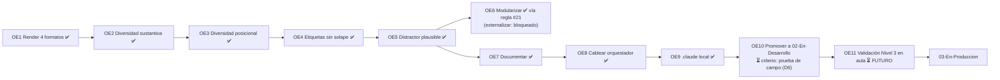

# Roadmap — Desplazamiento avión→aeropuerto

> Estado detallado y contexto de decisiones en [`../HANDOFF.md`](../HANDOFF.md). Este documento
> ordena los hitos en el tiempo con fechas absolutas y marca explícitamente qué bloquea qué.

## 1. Línea de tiempo (hitos completados)

| Fecha | Hito | Commit / evidencia |
|---|---|---|
| 2026-06-27 07:31 | Inicio del workflow (`ejercicio_state.json` creado) | — |
| 2026-06-27 16:06 | `.Rmd` generado, renderiza en 4 formatos | `renderizado_4_formatos` completado |
| 2026-06-27 16:18 | Detractor FASE 2C — veredicto **APROBAR** | `detractor_fase2c.veredicto = "APROBAR"` |
| 2026-06-27 16:20 | Validación de diversidad — 294/300 versiones únicas | `validar_diversidad.versiones_unicas = 294` |
| 2026-06-27 21:03 | Aprobación de usuario (workflow de 11 pasos declarado completo) | `aprobacion_usuario.completado = true` |
| 2026-06-28 | Error 23 (etiquetas solapadas) y Error 24 (predictibilidad posicional) corregidos y verificados | commits `169ab8c6`, `287afc01`, `dd5f10d1`, `779d7383` |
| 2026-07-28 (mañana) | `HANDOFF.md` redactado; inventario de ruido vs. fuente activa (`Semillero*.R`) corregido; `SP/docs/` creado (README, SYLLABUS, ROADMAP, BACKLOG, BLUEPRINT); `SP/.claude/` local creado | Esta sesión |
| 2026-07-28 | Revisión adversarial doble + auditoría visual sobre 200 versiones: detecta H1-H7 (ver [BACKLOG.md](BACKLOG.md)) | HANDOFF §5 |
| 2026-07-28 | H1 (fuga de nombre de archivo en Moodle) y H2 (diagramas degenerados) corregidos | commit `08b0130b` |
| 2026-07-28 | H3 / P0.1 resuelto: pool ampliado de 3 a 6 errores conceptuales + escala de dibujo desacoplada de cualquier distractor concreto | commit `1e5482c9` |
| 2026-07-28 | H5 (numeración de la lista "Procedimiento correcto" se reiniciaba en el PDF) corregido | commit `defe2f24` |
| 2026-07-28 (tarde) | H4 (el rótulo numérico permitía descartar 2 de 4 opciones) resuelto: séptimo error conceptual `GEO-DES-07` (pool 6→7); H6 (reseed por reloj que rompía la reproducibilidad multi-semilla) retirado; H7 (piso de legibilidad único y apretado) resuelto con cascada de ratios; chunk `data_generation` reestructurado con índice interno de 14 secciones y 5 invariantes declaradas | HANDOFF §4-§5, `.Rmd` líneas 8-32 |
| 2026-07-28 (cierre de sesión) | Re-validación completa tras los siete fixes: **200/200** versiones únicas de render, diversidad sustantiva PASS, **20/20** suites de test en verde, 5 formatos (HTML/PDF/DOCX/NOPS/Moodle) OK, XML de Moodle sin fugas de nombre | HANDOFF §3 |

**Los siete hallazgos H1-H7 de la sesión del 2026-07-28 están cerrados** (ver
[BACKLOG.md](BACKLOG.md) para el detalle de cada uno). La aprobación de usuario del
2026-06-27 21:03 quedó superada por estas dos rondas de correcciones (2026-06-28 y 2026-07-28);
los pasos `renderizado_4_formatos`, `coherencias_5` y `validar_diversidad` de
`ejercicio_state.json` se re-confirmaron con timestamp nuevo el 2026-07-28 (ver
[BACKLOG.md](BACKLOG.md) P1.2).

## 2. Estado actual de los objetivos específicos (OE1-OE11)

Fuente: [`../HANDOFF.md` §2](../HANDOFF.md#2-objetivos-específicos).

| OE | Estado | Bloquea a |
|---|---|---|
| OE1-OE5 | ✅ Hecho (re-verificado 2026-07-28 tras H1-H7) | — |
| OE6 (modularizar helpers) | ✅ **Hecho en la forma que el ecosistema admite** (2026-07-28): helpers canónicos en `../../../../.claude/scripts/snippets_familias_rmd.R` (**Familia 6**) + copia con procedencia declarada en §4 del chunk, que es el patrón que prescribe la regla #21. La extracción a **archivo externo** sigue 🚫 bloqueada: `include_supplement()` depende de estado interno de `xexams()` que la evaluación aislada del validador no puede reproducir — ver [BACKLOG.md](BACKLOG.md) P1.1 | Nada — **no** es prerrequisito de OE10 |
| OE7 (documentación) | ✅ Hecho (README, SYLLABUS, ROADMAP, BACKLOG, BLUEPRINT en `SP/docs/`) | — |
| OE8 (cablear orquestador) | ✅ Hecho — los wrappers `orquestador-schoice`/`orquestador-cloze` documentan la regla #22, el Error 24 y el incidente "distractor extremo por construcción" | — |
| OE9 (`SP/.claude/` local) | ✅ Hecho — `.claude/CLAUDE.md` + `.claude/rules/diagramas-vectoriales.md` | — |
| OE10 (promover a `02-En-Desarrollo/`) | ⏳ Pendiente — **el único criterio que falta es la prueba de campo con estudiantes (decisión D6, ver §3)**, no validación técnica adicional | OE11 |
| OE11 (validación Nivel 3 en aula) | ⏳ Futuro | Promoción a `03-En-Produccion/` |

## 3. Vía a `02-En-Desarrollo/`

**Criterio vigente (decisión D6 del usuario, 2026-07-28): la promoción a `02-En-Desarrollo/`
(OE10) NO depende de completar más validación técnica.** Esa validación ya está completa:

- H1-H7 cerrados (ver [BACKLOG.md](BACKLOG.md)).
- P0.1 (distractor extremo por construcción), P1.2 (re-confirmación de `ejercicio_state.json`),
  P1.4 (piso de legibilidad) y P1.5 (rótulo numérico) están **RESUELTOS**.
- Re-validación del 2026-07-28: diversidad sustantiva PASS, 5 formatos OK, 20/20 suites de test,
  sin fugas de nombre en el XML de Moodle (ver [`../HANDOFF.md` §3](../HANDOFF.md#3-estado-real-del-ejercicio-verificado-2026-07-28)).

El único paso pendiente es:

1. **Aplicar el ejercicio en un aula con estudiantes reales** (formato NOPS o Moodle).
2. **Recoger evidencia** de que los distractores `GEO-DES-01` a `GEO-DES-07` discriminan según lo
   esperado (los estudiantes que cometen el error conceptual seleccionan la opción
   correspondiente, no al azar).
3. Ejecutar `/promover-ejercicio` (o el paso equivalente del orquestador) con esa evidencia.

**No hay tareas técnicas intermedias.** OE6 (modularización) está cerrado en la forma que el
ecosistema admite —Familia 6 en la librería de snippets del repo + copia con procedencia en el
`.Rmd`—; solo la extracción a archivo externo sigue bloqueada, y no es prerrequisito de nada.

**Nota sobre el criterio anterior (obsoleto)**: hasta el 2026-06-28, la vía a `02-En-Desarrollo/`
se entendía como "resolver H3/P0.1 + re-validar los 4 formatos y la diversidad". Esa lectura
quedó **superada** por la decisión D6: aun con H3 (y el resto de hallazgos) resueltos, la
promoción sigue sin habilitarse porque el criterio de fondo pasó a ser la prueba de campo, no la
validación automática.

## 4. Gate de validación Nivel 3 (aula) para `03-En-Produccion/`

Según `../../../../.claude/rules/detractor-obligatorio.md` y el flujo general documentado en
`../../../../.claude/CLAUDE.md`, la promoción final a `03-En-Produccion/` (OE11) requiere
**evidencia de aplicación real con estudiantes** (Nivel 3), no solo validación automática
(Nivel 1-2). Con la decisión D6 (§3), este mismo tipo de evidencia — aplicación en aula — es
también el criterio que falta para OE10: en la práctica, la evidencia de campo que habilite el
paso a `02-En-Desarrollo/` es la misma clase de evidencia (aplicación real, discriminación de
distractores observada) que luego se documenta con más detalle para justificar el paso final a
`03-En-Produccion/`.

- El ejercicio debe aplicarse en aula (formato NOPS o Moodle) con un grupo real de estudiantes.
- Se debe recoger evidencia de que los distractores discriminan como se espera (los estudiantes
  que cometen el error conceptual `GEO-DES-0X` seleccionan la opción correspondiente, no al
  azar).
- Esta evidencia es un **requisito de `/promover-ejercicio`**, no un paso automatizable — no
  tiene fecha objetivo fijada porque depende de la disponibilidad de un grupo de aplicación.

**No se fija fecha para OE10 ni OE11** porque ambas dependen de la programación académica de la
institución, no del ritmo de desarrollo del ejercicio — que, del lado técnico, ya está completo
(ver §1 y §2).

## 5. Referencias cruzadas

- [`../HANDOFF.md`](../HANDOFF.md) — objetivos, decisiones (incluida D6), hallazgos, riesgos
- [`BACKLOG.md`](BACKLOG.md) — ítems priorizados con criterios de aceptación verificables
- [`SYLLABUS.md`](SYLLABUS.md) — pool de errores conceptuales y su evolución (H3, H4, H7)
- [`BLUEPRINT.md`](BLUEPRINT.md) — arquitectura técnica vigente tras los fixes del 2026-07-28
- `../../../../.claude/rules/workflow-state-enforcement.md` — los 11 pasos del workflow y su gate
- `../../../../.claude/rules/detractor-obligatorio.md` — requisito de evidencia Nivel 3 para promover
- `../../../../.claude/rules/diversidad-sustantiva.md` — regla #22, origen de H3/P0.1
