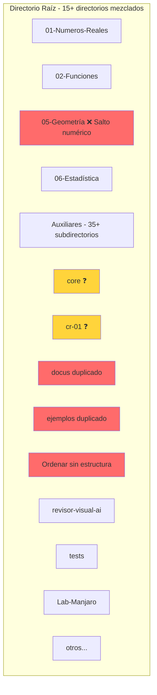
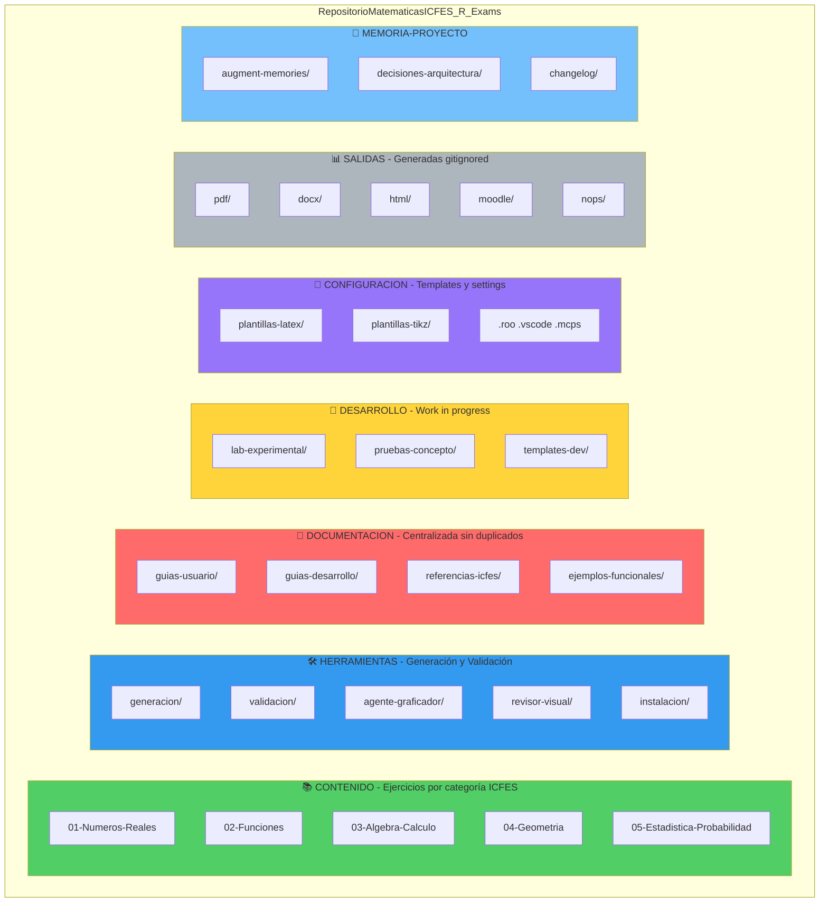
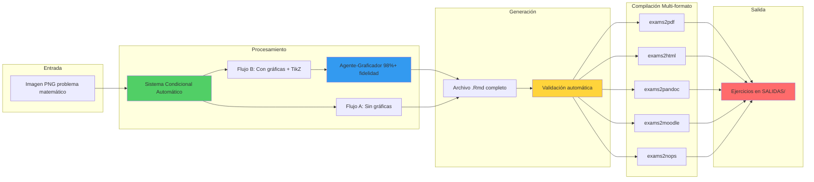
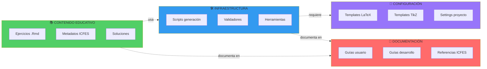
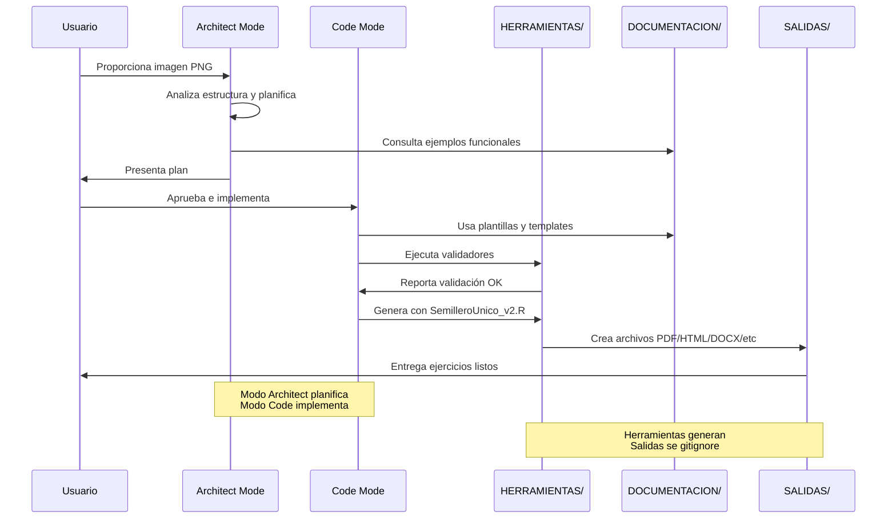
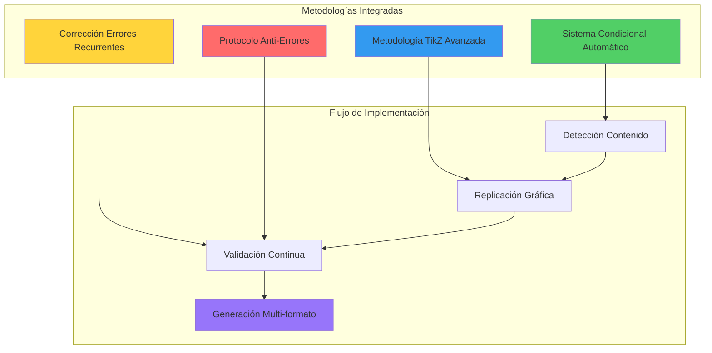
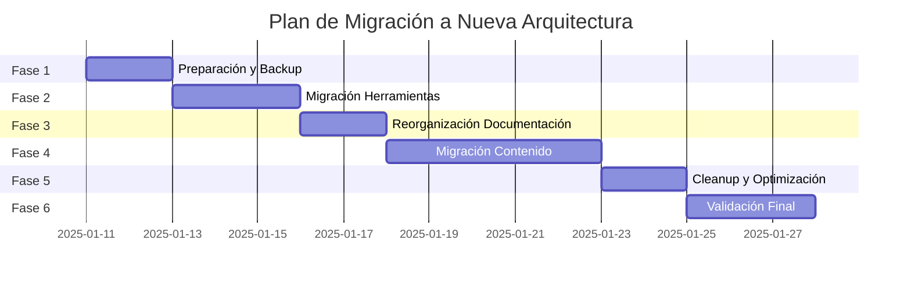
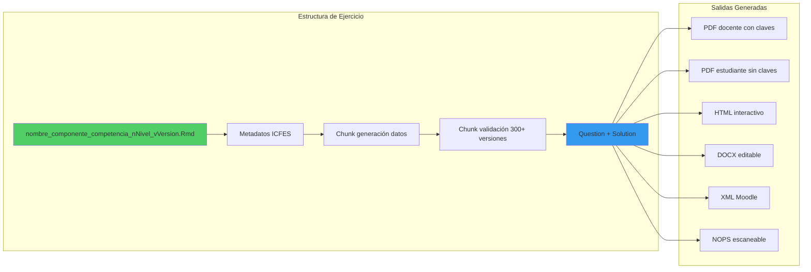

# 🏗️ Diagrama de Arquitectura Optimizada - Repositorio ICFES R-Exams

## 📊 Comparación: Arquitectura Actual vs Propuesta

### Arquitectura Actual (Problemática)

### Arquitectura Propuesta (Optimizada)

## 🔄 Flujo de Trabajo Optimizado

## 📁 Separación de Responsabilidades

## 🗂️ Jerarquía de Directorios Detallada

```mermaid
graph TD
    ROOT[RepositorioMatematicasICFES_R_Exams]
    
    ROOT --> CONT[CONTENIDO/]
    CONT --> C1[01-Numeros-Reales/]
    CONT --> C2[02-Funciones/]
    CONT --> C3[03-Algebra-Calculo/]
    CONT --> C4[04-Geometria/]
    CONT --> C5[05-Estadistica-Probabilidad/]
    
    C1 --> C1P[Pensamiento-Numerico/]
    C1P --> C1E[ejercicio1/...ejercicioN/]
    
    ROOT --> HERR[HERRAMIENTAS/]
    HERR --> H1[generacion/]
    HERR --> H2[validacion/]
    HERR --> H3[agente-graficador/]
    HERR --> H4[revisor-visual/]
    HERR --> H5[instalacion/]
    
    ROOT --> DOC[DOCUMENTACION/]
    DOC --> D1[guias-usuario/]
    DOC --> D2[guias-desarrollo/]
    DOC --> D3[referencias-icfes/]
    DOC --> D4[ejemplos-funcionales/]
    
    ROOT --> DEV[DESARROLLO/]
    DEV --> DV1[lab-experimental/]
    DEV --> DV2[pruebas-concepto/]
    DEV --> DV3[templates-dev/]
    
    ROOT --> CONFIG[CONFIGURACION/]
    CONFIG --> CF1[plantillas-latex/]
    CONFIG --> CF2[plantillas-tikz/]
    CONFIG --> CF3[.roo .vscode .mcps/]
    
    ROOT --> SAL[SALIDAS/ gitignored]
    SAL --> S1[pdf/]
    SAL --> S2[docx/]
    SAL --> S3[html/]
    SAL --> S4[moodle/]
    SAL --> S5[nops/]
    
    ROOT --> MEM[MEMORIA-PROYECTO/]
    MEM --> M1[augment-memories/]
    MEM --> M2[decisiones-arquitectura/]
    MEM --> M3[changelog/]
    
    style ROOT fill:#495057
    style CONT fill:#51cf66
    style HERR fill:#339af0
    style DOC fill:#ff6b6b
    style DEV fill:#ffd43b
    style CONFIG fill:#9775fa
    style SAL fill:#adb5bd
    style MEM fill:#74c0fc
```

## 🎯 Ciclo de Vida de un Ejercicio

## 📊 Métricas de Mejora

```mermaid
graph LR
    subgraph ANTES[Antes - Arquitectura Actual]
        A1[Numeración: Inconsistente ❌]
        A2[Directorios raíz: 15+ mezclados ❌]
        A3[Búsqueda: Confusa ❌]
        A4[Mantenimiento: Difícil ❌]
        A5[Escalabilidad: Limitada ❌]
    end
    
    subgraph DESPUES[Después - Arquitectura Optimizada]
        D1[Numeración: Secuencial 01-05 ✅]
        D2[Directorios raíz: 7 organizados ✅]
        D3[Búsqueda: Intuitiva ✅]
        D4[Mantenimiento: Fácil ✅]
        D5[Escalabilidad: Excelente ✅]
    end
    
    ANTES -->|Migración<br/>10-17 días| DESPUES
    
    style ANTES fill:#ff6b6b
    style DESPUES fill:#51cf66
```

## 🔧 Integración de Metodologías

## 🚀 Roadmap de Implementación

## 🔐 Control de Versiones y Nomenclatura

---

## 📝 Leyenda de Colores

- 🟢 **Verde**: Contenido educativo y procesos exitosos
- 🔵 **Azul**: Herramientas e infraestructura
- 🟣 **Morado**: Configuración y templates
- 🔴 **Rojo**: Documentación y referencias
- 🟡 **Amarillo**: Desarrollo y validación
- ⚪ **Gris**: Salidas generadas (temporales)
- 🔷 **Azul claro**: Memoria del proyecto

---

## 🔗 Referencias Cruzadas

Este diagrama complementa el documento principal:
- [Plan de Arquitectura Optimizada](plan_arquitectura_optimizada.md)
- [Contexto Global ICFES](../rules_full/rules_full_v1.md)
- [Guía de Implementación](../guia_implementacion_icfes.md)

---

**Versión:** 1.0  
**Fecha:** 2025-01-11  
**Autor:** Roo Architect (Claude Sonnet 4.5)  
**Herramienta:** Mermaid Diagrams