# Plan de Optimización para Manjaro Plasma KDE en Lenovo

## Diagrama General del Plan de Optimización

```mermaid
flowchart TD
    A[Plan de Optimización Manjaro KDE] --> B[1. Análisis del Sistema]
    A --> C[2. Optimización del Arranque]
    A --> D[3. Reducción de Consumo de RAM]
    A --> E[4. Optimización CPU/GPU]
    A --> F[5. Extensión de Duración de Batería]
    
    B --> B1[Recopilación de información del hardware]
    B --> B2[Análisis de servicios y procesos]
    B --> B3[Evaluación de rendimiento actual]
    
    C --> C1[Optimización de servicios de inicio]
    C --> C2[Configuración del gestor de arranque]
    C --> C3[Optimización de systemd]
    
    D --> D1[Gestión de procesos en segundo plano]
    D --> D2[Optimización de efectos visuales KDE]
    D --> D3[Ajuste de caché y swap]
    
    E --> E1[Configuración de gobernadores de CPU]
    E --> E2[Optimización de controladores gráficos]
    E --> E3[Ajustes de rendimiento del kernel]
    
    F --> F1[Configuración de TLP/powertop]
    F --> F2[Optimización de servicios para batería]
    F --> F3[Ajustes específicos de KDE para ahorro de energía]
```



## 1. Análisis del Sistema

### 1.1 Recopilación de información del hardware
- Identificar especificaciones exactas del hardware (CPU, RAM, GPU, almacenamiento)
- Verificar controladores actuales y su compatibilidad
- Identificar posibles cuellos de botella en el rendimiento

### 1.2 Análisis de servicios y procesos
- Identificar servicios innecesarios que se ejecutan al inicio
- Analizar procesos que consumen más recursos
- Evaluar aplicaciones de inicio automático

### 1.3 Evaluación de rendimiento actual
- Medir tiempos de arranque actuales
- Evaluar uso de memoria en reposo
- Medir consumo de energía y duración de batería
- Evaluar rendimiento de CPU/GPU bajo carga

## 2. Optimización del Arranque

### 2.1 Optimización de servicios de inicio
- Deshabilitar servicios innecesarios:
  ```bash
  # Listar servicios activos
  systemctl list-unit-files --state=enabled
  
  # Deshabilitar servicios innecesarios (ejemplos)
  sudo systemctl disable avahi-daemon
  sudo systemctl disable cups.service  # Impresión, mencionaste que no es necesario
  sudo systemctl disable ModemManager
  ```

- Enmascarar servicios problemáticos:
  ```bash
  sudo systemctl mask lvm2-monitor
  sudo systemctl mask systemd-udev-settle
  ```

### 2.2 Configuración del gestor de arranque (GRUB)
- Reducir tiempo de espera:
  ```bash
  # Editar configuración de GRUB
  sudo nano /etc/default/grub
  
  # Cambiar GRUB_TIMEOUT=1
  # Añadir parámetros: GRUB_CMDLINE_LINUX_DEFAULT="quiet splash noresume mitigations=off"
  
  # Actualizar GRUB
  sudo update-grub
  ```

### 2.3 Optimización de systemd
- Habilitar paralelización de servicios:
  ```bash
  sudo systemctl edit systemd-analyze
  # Añadir:
  [Service]
  Environment=SYSTEMD_ANALYZE_VERIFICATION_LEVEL=0
  ```

- Optimizar tiempo de espera de servicios:
  ```bash
  sudo nano /etc/systemd/system.conf
  # Modificar:
  DefaultTimeoutStartSec=10s
  DefaultTimeoutStopSec=10s
  ```

## 3. Reducción de Consumo de RAM

### 3.1 Gestión de procesos en segundo plano
- Configurar límites de memoria para aplicaciones:
  ```bash
  # Crear archivo de configuración para límites
  sudo nano /etc/security/limits.d/90-memory.conf
  
  # Añadir:
  * soft memlock 512000
  * hard memlock 512000
  ```

- Ajustar comportamiento de OOM Killer:
  ```bash
  sudo nano /etc/sysctl.d/99-sysctl.conf
  
  # Añadir:
  vm.oom_kill_allocating_task=1
  vm.swappiness=10
  ```

### 3.2 Optimización de efectos visuales KDE
- Desactivar efectos visuales innecesarios:
  - Configuración del Sistema > Efectos de Escritorio
  - Desactivar transparencias, sombras y animaciones complejas
  - Usar el tema "Breeze Light" que consume menos recursos

- Reducir número de actividades y escritorios virtuales

### 3.3 Ajuste de caché y swap
- Configurar zram para mejor gestión de memoria:
  ```bash
  sudo pacman -S zram-generator
  
  # Configurar zram
  sudo nano /etc/systemd/zram-generator.conf
  
  # Añadir:
  [zram0]
  zram-size = ram / 2
  compression-algorithm = zstd
  swap-priority = 100
  ```

- Optimizar parámetros de swap:
  ```bash
  sudo nano /etc/sysctl.d/99-sysctl.conf
  
  # Añadir:
  vm.swappiness=10
  vm.vfs_cache_pressure=50
  ```

## 4. Optimización CPU/GPU

### 4.1 Configuración de gobernadores de CPU
- Instalar y configurar herramientas de gestión de energía:
  ```bash
  sudo pacman -S cpupower
  
  # Configurar gobernador de CPU
  sudo nano /etc/default/cpupower
  
  # Modificar:
  # Para rendimiento: governor='performance'
  # Para equilibrio: governor='schedutil'
  # Para ahorro de batería: governor='powersave'
  
  # Activar el servicio
  sudo systemctl enable --now cpupower
  ```

### 4.2 Optimización de controladores gráficos
- Para Intel:
  ```bash
  sudo pacman -S intel-media-driver vulkan-intel
  
  # Crear archivo de configuración
  sudo nano /etc/X11/xorg.conf.d/20-intel.conf
  
  # Añadir:
  Section "Device"
    Identifier "Intel Graphics"
    Driver "intel"
    Option "TearFree" "true"
    Option "AccelMethod" "sna"
    Option "DRI" "3"
  EndSection
  ```

- Para NVIDIA:
  ```bash
  # Instalar controladores propietarios
  sudo pacman -S nvidia nvidia-utils nvidia-settings
  
  # Configurar Prime Render Offload para laptops híbridas
  sudo nano /etc/X11/xorg.conf.d/10-nvidia-drm-outputclass.conf
  
  # Añadir para laptops híbridas:
  Section "OutputClass"
    Identifier "intel"
    MatchDriver "i915"
    Driver "modesetting"
  EndSection
  
  Section "OutputClass"
    Identifier "nvidia"
    MatchDriver "nvidia-drm"
    Driver "nvidia"
    Option "AllowEmptyInitialConfiguration"
    Option "PrimaryGPU" "yes"
    ModulePath "/usr/lib/nvidia/xorg"
    ModulePath "/usr/lib/xorg/modules"
  EndSection
  ```

### 4.3 Ajustes de rendimiento del kernel
- Optimizar parámetros del kernel:
  ```bash
  sudo nano /etc/sysctl.d/99-sysctl.conf
  
  # Añadir:
  # Mejora la respuesta del sistema
  kernel.sched_autogroup_enabled=1
  # Mejora el rendimiento de E/S
  vm.dirty_ratio=10
  vm.dirty_background_ratio=5
  # Mejora la gestión de memoria
  vm.min_free_kbytes=65536
  ```

## 5. Extensión de Duración de Batería

### 5.1 Configuración de TLP/powertop
- Instalar y configurar TLP:
  ```bash
  sudo pacman -S tlp tlp-rdw
  
  # Habilitar el servicio
  sudo systemctl enable --now tlp.service
  
  # Configuración personalizada
  sudo nano /etc/tlp.conf
  
  # Modificar:
  CPU_SCALING_GOVERNOR_ON_AC=performance
  CPU_SCALING_GOVERNOR_ON_BAT=powersave
  CPU_ENERGY_PERF_POLICY_ON_AC=performance
  CPU_ENERGY_PERF_POLICY_ON_BAT=power
  PLATFORM_PROFILE_ON_AC=performance
  PLATFORM_PROFILE_ON_BAT=low-power
  ```

- Optimizar con powertop:
  ```bash
  sudo pacman -S powertop
  
  # Generar informe
  sudo powertop --auto-tune
  
  # Crear servicio para aplicar optimizaciones al inicio
  sudo nano /etc/systemd/system/powertop.service
  
  # Añadir:
  [Unit]
  Description=Powertop tunings
  
  [Service]
  Type=oneshot
  ExecStart=/usr/bin/powertop --auto-tune
  
  [Install]
  WantedBy=multi-user.target
  
  # Habilitar el servicio
  sudo systemctl enable powertop.service
  ```

### 5.2 Optimización de servicios para batería
- Crear perfiles de energía con scripts personalizados:
  ```bash
  # Crear script para modo batería
  sudo nano /usr/local/bin/battery-mode
  
  # Añadir:
  #!/bin/bash
  # Desactivar servicios no esenciales
  systemctl stop bluetooth.service
  # Reducir brillo de pantalla
  brightnessctl set 40%
  # Configurar CPU para ahorro de energía
  cpupower frequency-set -g powersave
  
  # Dar permisos de ejecución
  sudo chmod +x /usr/local/bin/battery-mode
  ```

### 5.3 Ajustes específicos de KDE para ahorro de energía
- Configurar opciones de energía en KDE:
  - Configuración del Sistema > Gestión de Energía
  - Reducir tiempo de apagado de pantalla a 2 minutos en batería
  - Activar suspensión automática después de 15 minutos en batería
  - Configurar brillo reducido en modo batería

- Optimizar Compositor de KDE:
  - Configuración del Sistema > Efectos de Escritorio > Avanzado
  - Cambiar método de renderizado a "XRender" en lugar de "OpenGL" para ahorrar batería
  - Desactivar "Permitir aplicaciones para bloquear la composición"

## Implementación y Seguimiento

### Fase 1: Análisis y Preparación
- Realizar copia de seguridad del sistema
- Ejecutar comandos de diagnóstico para establecer línea base
- Instalar herramientas necesarias

### Fase 2: Implementación por Etapas
- Implementar optimizaciones de arranque
- Aplicar configuraciones para reducir consumo de RAM
- Configurar optimizaciones de CPU/GPU
- Implementar ajustes para extender duración de batería

### Fase 3: Pruebas y Ajustes
- Medir mejoras en tiempo de arranque
- Evaluar reducción en consumo de RAM
- Probar rendimiento de CPU/GPU
- Medir mejoras en duración de batería
- Realizar ajustes finos según resultados
## Solución de Problemas Comunes

### Problema: Arranque lento después de optimizaciones
- Verificar servicios conflictivos:
  ```bash
  systemd-analyze blame
  systemd-analyze critical-chain
  ```
- Revisar journalctl para errores:
  ```bash
  journalctl -p 3 -xb
  ```

### Problema: Alto consumo de RAM
- Identificar procesos problemáticos:
  ```bash
  htop
  ```
- Verificar fugas de memoria:
  ```bash
  sudo slabtop -o | head -20
  ```

### Problema: Sobrecalentamiento
- Monitorear temperaturas:
  ```bash
  sensors
  ```
- Ajustar gobernador de CPU:
  ```bash
  cpupower frequency-set -g powersave
  ```

## Verificaciones Post-Implementación

1. Ejecutar pruebas de rendimiento:
   ```bash
   stress-ng --cpu 4 --io 2 --vm 2 --vm-bytes 1G --timeout 60s
   ```

2. Medir consumo de energía:
   ```bash
   powertop --html=power_report.html
   ```

3. Verificar estabilidad del sistema:
   ```bash
   sudo dmesg -T | grep -i error
   ```