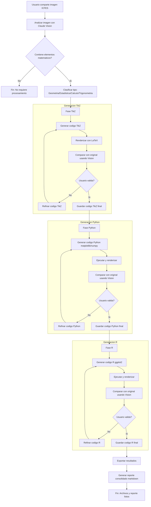

# Graficador Experto ICFES 📐📊

Sistema automatizado inteligente para convertir imágenes matemáticas de problemas ICFES en código reproducible en TikZ (LaTeX), Python (matplotlib/numpy) y R (ggplot2) con validación visual iterativa.

## 🎯 Descripción

Este proyecto implementa un workflow avanzado que utiliza visión por computadora de Claude para analizar imágenes matemáticas y generar código equivalente en tres lenguajes de programación. El sistema refina iterativamente el código generado hasta lograr una representación precisa o mejorada del original.

## 🌟 Características Principales

- **Análisis Visual Inteligente**: Identifica automáticamente el tipo de contenido matemático (Geometría, Estadística, Cálculo, Trigonometría)
- **Generación Multi-Lenguaje**: Produce código en TikZ, Python y R
- **Validación Visual Iterativa**: Compara las imágenes generadas con el original usando Claude Vision
- **Refinamiento Automático**: Ajusta el código basándose en diferencias identificadas
- **Reportes Detallados**: Genera documentación completa del proceso y resultados

## 📁 Estructura del Proyecto

```
Graficador-Experto/
├── .claude/                   # Configuración de Claude Code
│   ├── commands/              # Comandos slash personalizados
│   │   ├── analizar-imagen.md
│   │   ├── generar-tikz.md
│   │   ├── generar-python.md
│   │   ├── generar-r.md
│   │   ├── comparar.md
│   │   ├── iterar.md
│   │   └── exportar.md
│   ├── skills/                # Skills especializadas
│   │   ├── analizar-imagen-matematica/
│   │   ├── generar-tikz/
│   │   ├── generar-python/
│   │   ├── generar-r/
│   │   ├── comparar-visual/
│   │   └── refinar-codigo/
│   └── README.md              # Documentación de configuración
├── outputs/                   # Archivos generados
│   ├── output_tikz.tex        # Código TikZ final
│   ├── output_python.py       # Código Python final
│   ├── output_r.R             # Código R final
│   ├── reporte_matematico.md  # Reporte consolidado
│   └── renders/               # Imágenes renderizadas
└── README.md                  # Este archivo
```

## 🚀 Inicio Rápido

### 1. Compartir una Imagen

Simplemente comparte una imagen matemática de un problema ICFES con Claude.

### 2. Iniciar el Workflow

```
/analizar-imagen
```

Este comando:

1. Analiza la imagen con Claude Vision
2. Identifica el tipo de contenido matemático
3. Extrae elementos visuales y matemáticos
4. Inicia automáticamente la generación en los tres lenguajes

### 3. Validación y Refinamiento

El sistema:

- Genera código en cada lenguaje
- Lo renderiza/ejecuta automáticamente
- Compara con el original
- Te presenta el resultado para validación
- Refina si solicitas mejoras

### 4. Exportar Resultados

```
/exportar
```

Genera archivos finales y reporte consolidado.

## 🔗 Integración con Workflow Principal R-Exams

El Graficador-Experto está **integrado** con el workflow principal de generación de ejercicios R-Exams:

### Repositorio Centralizado

Las gráficas TikZ generadas se guardan automáticamente en:

```
Repositorio-Graficas-TikZ/
```

Este repositorio permite:

- **Reutilización**: Gráficas validadas disponibles para múltiples ejercicios
- **Consistencia**: Estilo visual uniforme entre ejercicios
- **Eficiencia**: No regenerar desde cero cada gráfica
- **Calidad**: Solo código TikZ validado visualmente entra al repositorio

### Integración Automática

Cuando se genera un ejercicio con `/generar-schoice` o `/generar-cloze`:

1. **Si detecta necesidad de gráficas TikZ**:
   - Consulta automáticamente `Repositorio-Graficas-TikZ/`
   - Lista opciones disponibles según categoría y tags
   - Permite seleccionar gráfica existente o generar nueva

2. **Si selecciona gráfica existente**:
   - Carga código TikZ del repositorio
   - Integra función parametrizable en el ejercicio
   - Usa valores aleatorios del ejercicio para parametrizar

3. **Si genera nueva gráfica**:
   - Usa workflow completo del Graficador-Experto
   - Guarda automáticamente en repositorio con metadata
   - Disponible para uso futuro

### Comando de Generación Integrado

```
/generar-grafica-nueva [imagen.png]
```

Este comando ejecuta el workflow completo y guarda en el repositorio:

1. Análisis de imagen con Claude Vision
2. Generación iterativa de TikZ (máximo 5 iteraciones)
3. Validación visual (objetivo: >95% similitud)
4. Parametrización con placeholders
5. Guardado en repositorio con metadata JSON
6. Actualización de índice centralizado

### Hook Automático

Un hook (`post-grafica-generada`) detecta cuando se guarda código TikZ en `outputs/` y:

- Copia automáticamente al repositorio
- Solicita metadata (categoría, tags, descripción)
- Genera archivo JSON de metadata
- Actualiza índice del repositorio

**Documentación completa**: 
- `Repositorio-Graficas-TikZ/README.md` - Repositorio centralizado
- `.claude/commands/generar-grafica-nueva.md` - Comando integrado
- `.claude/hooks/post-grafica-generada.md` - Hook automático

## 📝 Comandos Disponibles

### `/analizar-imagen`
Inicia el workflow completo con análisis visual de la imagen compartida.

**Ejemplo**:
```
Usuario: [adjunta imagen de gráfico]
Usuario: /analizar-imagen
```

### `/generar-tikz`
Genera código TikZ para la imagen analizada.

**Opciones**:

- `--refinar`: Refina código existente
- `--forzar`: Regenera desde cero

### `/generar-python`
Genera código Python (matplotlib/numpy).

**Opciones**:

- `--refinar`: Refina código existente
- `--forzar`: Regenera desde cero
- `--formato png|svg`: Especifica formato de salida

### `/generar-r`
Genera código R (ggplot2).

**Opciones**:

- `--refinar`: Refina código existente
- `--forzar`: Regenera desde cero
- `--formato png|svg|pdf`: Especifica formato de salida

### `/comparar`
Compara la imagen generada con la original usando Claude Vision.

**Uso**:
```
/comparar [lenguaje]
```

Genera reporte detallado de diferencias con sugerencias de corrección.

### `/iterar`
Refina el código del lenguaje actual basándose en la última comparación.

**Uso**:
```
/iterar [lenguaje] [descripción de cambios]
```

### `/exportar`
Genera archivos finales y reporte consolidado.

**Opciones**:

- `--solo-codigo`: Solo archivos de código
- `--solo-reporte`: Solo reporte
- `--formato html|md`: Formato del reporte

## 🔄 Workflow Visual



## 💻 Requisitos del Sistema

### Para TikZ

- LaTeX (TeX Live, MiKTeX, o MacTeX)
- Paquetes: `tikz`, `pgfplots`, `amsmath`, `amssymb`
- Compilador: `pdflatex` o `xelatex`
- Conversor PDF a imagen: ImageMagick o Poppler

### Para Python

- Python 3.8+
- matplotlib
- numpy
- scipy (opcional)
- Pillow

### Para R

- R 4.0+
- ggplot2
- dplyr (recomendado)
- scales (recomendado)

## 📊 Tipos de Contenido Soportados

### Geometría

- Figuras planas y 3D
- Construcciones geométricas
- Transformaciones
- Ángulos y medidas

### Estadística

- Gráficos de barras
- Histogramas
- Gráficos circulares
- Diagramas de dispersión
- Boxplots

### Cálculo

- Gráficas de funciones
- Límites y continuidad
- Derivadas e integrales
- Áreas bajo la curva

### Trigonometría

- Círculo trigonométrico
- Funciones trigonométricas
- Identidades
- Aplicaciones

## 🎓 Ejemplos de Uso

### Ejemplo 1: Función Cuadrática

```
Usuario: [Adjunta imagen de parábola con ejes]
Usuario: /analizar-imagen

Claude: Analizando imagen...
        Tipo: Cálculo - Función cuadrática
        Función detectada: f(x) = x² - 4x + 3
        Vértice: (2, -1)
        Raíces: x ≈ 1, x ≈ 3
        
        Generando código TikZ...
        [Genera, compila y compara]
        
        Similitud visual: 92%
        Diferencias menores en colores de ejes.
        ¿Deseas refinar o continuar a Python?
```

### Ejemplo 2: Gráfico Estadístico

```
Usuario: [Adjunta gráfico de barras]
Usuario: /analizar-imagen

Claude: Analizando imagen...
        Tipo: Estadística - Gráfico de barras
        Categorías: A, B, C, D, E
        Valores: 12, 18, 7, 22, 15
        
        Generando versiones en TikZ, Python y R...
        [Proceso completo automatizado]
        
Usuario: /exportar

Claude: ✅ Archivos generados:

        - outputs/output_tikz.tex
        - outputs/output_python.py
        - outputs/output_r.R
        - outputs/reporte_matematico.md
```

### Ejemplo 3: Refinamiento Específico

```
Usuario: /comparar tikz

Claude: [Muestra reporte detallado de diferencias]

        - Color del título incorrecto
        - Grosor de línea muy delgado
        - Falta etiqueta en eje Y

Usuario: /iterar tikz "Corregir color del título a azul y aumentar grosor"

Claude: Aplicando correcciones...
        [Refina código, recompila y compara]
        Similitud mejorada: 92% → 98%
        ¿Validar y continuar?
```

## 📈 Métricas de Calidad

El sistema evalúa:

- **Precisión Matemática**: Valores, coordenadas, escalas correctas
- **Fidelidad Visual**: Colores, proporciones, estilos coincidentes
- **Completitud**: Todos los elementos presentes
- **Similitud Visual**: Porcentaje estimado (objetivo: >95%)

## 🛠️ Skills Especializadas

El sistema incluye 6 skills principales:

1. **Análisis Visual Matemático**: Identifica y extrae información de imágenes
2. **Generación TikZ**: Crea código LaTeX/TikZ preciso
3. **Generación Python**: Produce código matplotlib/numpy profesional
4. **Generación R**: Genera código ggplot2 eficiente
5. **Comparación Visual Inteligente**: Analiza diferencias con Claude Vision
6. **Refinamiento Iterativo**: Mejora código basándose en comparaciones

## 🔧 Configuración Avanzada

### Hooks Automáticos

El sistema incluye hooks que:

- Compilan TikZ automáticamente al guardar
- Ejecutan Python/R automáticamente al guardar
- Detectan imágenes compartidas y sugieren iniciar workflow
- Inyectan contexto relevante en comparaciones

### Personalización

Puedes modificar:

- `.claude/commands.json`: Ajustar comandos o crear nuevos
- `.claude/hooks.json`: Configurar automatizaciones
- `skills/*.md`: Extender capacidades de cada skill

## 📄 Licencia

Este proyecto es parte del repositorio de matemáticas ICFES y está diseñado para uso educativo.

## 🤝 Contribuciones

Para mejorar el workflow:

1. Identifica áreas de mejora
2. Modifica los archivos de configuración o skills
3. Documenta los cambios
4. Prueba con diferentes tipos de imágenes matemáticas

## 📞 Soporte

Para problemas o sugerencias sobre el workflow, consulta la documentación de cada skill en el directorio `skills/`.

---

**Versión**: 1.0  
**Última actualización**: Diciembre 2025  
**Mantenedor**: Equipo ICFES Matemáticas

