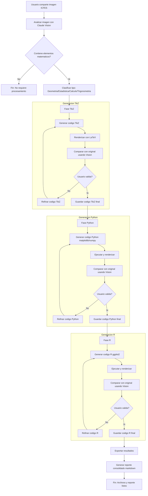

# Diagrama del Workflow - Graficador Experto ICFES

Este documento presenta el diagrama completo del workflow automatizado para conversión de imágenes matemáticas.

## Flujo Principal



## Descripción de Fases

### 1. Análisis Inicial

- **Entrada**: Imagen matemática del usuario
- **Proceso**: Claude Vision analiza la imagen identificando tipo, elementos y propiedades
- **Salida**: Reporte estructurado de análisis
- **Comando**: `/analizar-imagen`

### 2. Generación TikZ (Primera Fase)

- **Entrada**: Reporte de análisis
- **Proceso Iterativo**:
  1. Generar código LaTeX/TikZ
  2. Compilar con pdflatex
  3. Convertir a PNG
  4. Comparar con original (Claude Vision)
  5. Usuario valida o solicita refinamiento
  6. Si no valida, refinar y repetir desde paso 1
- **Salida**: `output_tikz.tex` validado
- **Comandos**: `/generar-tikz`, `/comparar tikz`, `/iterar tikz`

### 3. Generación Python (Segunda Fase)

- **Entrada**: Reporte de análisis (+ referencia TikZ opcional)
- **Proceso Iterativo**:
  1. Generar código Python (matplotlib/numpy)
  2. Ejecutar script
  3. Generar PNG
  4. Comparar con original (Claude Vision)
  5. Usuario valida o solicita refinamiento
  6. Si no valida, refinar y repetir desde paso 1
- **Salida**: `output_python.py` validado
- **Comandos**: `/generar-python`, `/comparar python`, `/iterar python`

### 4. Generación R (Tercera Fase)

- **Entrada**: Reporte de análisis (+ referencias TikZ/Python opcionales)
- **Proceso Iterativo**:
  1. Generar código R (ggplot2)
  2. Ejecutar con Rscript
  3. Generar PNG
  4. Comparar con original (Claude Vision)
  5. Usuario valida o solicita refinamiento
  6. Si no valida, refinar y repetir desde paso 1
- **Salida**: `output_r.R` validado
- **Comandos**: `/generar-r`, `/comparar r`, `/iterar r`

### 5. Exportación Final

- **Entrada**: Códigos validados de los tres lenguajes
- **Proceso**:
  1. Guardar archivos de código finales
  2. Generar reporte markdown consolidado con:
     - Análisis inicial
     - Comparación entre implementaciones
     - Ventajas/desventajas de cada lenguaje
     - Imágenes comparativas
     - Historial de iteraciones
- **Salida**: 
  - `output_tikz.tex`
  - `output_python.py`
  - `output_r.R`
  - `reporte_matematico.md`
  - Imágenes renderizadas
- **Comando**: `/exportar`

## Puntos de Decisión

### ¿Contiene elementos matemáticos?

- **Sí**: Continuar con clasificación y generación
- **No**: Terminar workflow (imagen no requiere procesamiento)

### ¿Usuario valida? (En cada lenguaje)

- **Sí**: Guardar código final y continuar a siguiente lenguaje/fase
- **No**: Refinar código basándose en comparación visual y repetir ciclo

## Ciclos Iterativos

Cada lenguaje tiene su propio ciclo de refinamiento:

```
Generar Código → Renderizar → Comparar → Validar
                                  ↓            ↓
                            Refinar ←---------- No
                                              ↓
                                             Sí
                                              ↓
                                           Guardar
```

### Criterios de Refinamiento

- **Similitud visual < 95%**: Refinar automáticamente
- **Errores matemáticos detectados**: Refinar con prioridad alta
- **Elementos faltantes**: Refinar añadiendo elementos
- **Usuario solicita cambios específicos**: Refinar según solicitud

### Límites de Iteración

- **Recomendado**: Máximo 5 iteraciones por lenguaje
- **Límite duro**: 10 iteraciones (configurable)
- **Convergencia**: Si mejora < 2% en iteración, considerar validar

## Automatizaciones (Hooks)

### Pre-Tool Use

- **Validar Imagen**: Antes de procesar, verificar que el archivo sea una imagen válida

### Post-Tool Use

- **Auto-Compilar TikZ**: Después de guardar `.tex`, compilar automáticamente
- **Auto-Ejecutar Python**: Después de guardar `.py`, ejecutar automáticamente
- **Auto-Ejecutar R**: Después de guardar `.R`, ejecutar automáticamente

### User Prompt Submit

- **Detectar Imagen**: Sugerir `/analizar-imagen` cuando usuario comparte imagen
- **Inyectar Contexto**: Añadir información relevante para comandos de comparación

## Herramientas y Tecnologías

### Análisis y Comparación

- **Claude Vision API**: Análisis visual y detección de diferencias

### Generación y Renderizado

- **LaTeX/TikZ**: Gráficos vectoriales matemáticos
- **Python**: matplotlib, numpy, scipy
- **R**: ggplot2, dplyr, scales

### Automatización

- **Bash Scripts**: Compilación y ejecución automática
- **Hooks de Claude Code**: Integración en ciclo de vida

## Métricas de Éxito

### Por Iteración

- **Similitud Visual**: Objetivo >95%
- **Mejora por Iteración**: Ideal >5%
- **Tiempo de Procesamiento**: <2 minutos por iteración

### Workflow Completo

- **Iteraciones Totales**: <15 (promedio 8-10)
- **Tiempo Total**: <15 minutos
- **Precisión Final**: >98%
- **Completitud**: 100% de elementos presentes

## Flujo de Datos

```
Imagen Original
    ↓
Análisis Visual
    ↓
Reporte Estructurado
    ↓
    ├─→ TikZ → Código .tex → PDF → PNG ─┐
    │                                     ↓
    │                            Comparación Visual
    │                                     ↓
    │                              Refinamiento (N veces)
    │                                     ↓
    ├─→ Python → Código .py → PNG ───────┤
    │                                     ↓
    │                            Comparación Visual
    │                                     ↓
    │                              Refinamiento (N veces)
    │                                     ↓
    └─→ R → Código .R → PNG ─────────────┤
                                          ↓
                                 Comparación Visual
                                          ↓
                                   Refinamiento (N veces)
                                          ↓
                                    Exportación
                                          ↓
                              Archivos Finales + Reporte
```

## Casos de Uso

### Caso 1: Workflow Completo Automático
```
Usuario comparte imagen → /analizar-imagen
Sistema procesa TikZ (3 iteraciones)
Sistema procesa Python (2 iteraciones)
Sistema procesa R (2 iteraciones)
Usuario → /exportar
Sistema genera todos los archivos
```

### Caso 2: Generación Selectiva
```
Usuario comparte imagen → /analizar-imagen
Usuario → /generar-tikz
Usuario revisa → /comparar tikz
Usuario → /iterar tikz "Ajustar colores"
Usuario valida
Usuario → /generar-python
[proceso similar]
```

### Caso 3: Refinamiento Intensivo
```
Usuario → /generar-python
Similitud: 75%
Sistema → /iterar python (automático)
Similitud: 83%
Sistema → /iterar python
Similitud: 89%
Usuario → /iterar python "Corregir etiquetas eje Y"
Similitud: 96%
Usuario valida
```

---

**Última actualización**: Diciembre 2025  
**Versión del diagrama**: 1.0

