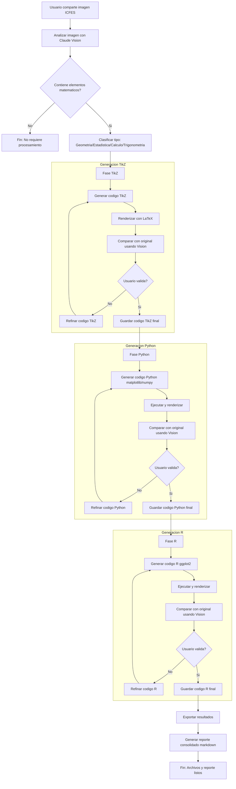

# Diagrama del Workflow - Graficador Experto ICFES v2.0

Este documento presenta el diagrama completo del workflow automatizado para conversión de imágenes matemáticas con optimizaciones de estado persistente, métricas cuantitativas y transferencia de conocimiento.

## Flujo Principal



## Descripción de Fases

### 1. Análisis Inicial [MEJORADO]

- **Entrada**: Imagen matemática del usuario
- **Proceso**: 
  1. Claude Vision analiza la imagen identificando tipo, elementos y propiedades
  2. **[NUEVO]** Guarda análisis estructurado en `outputs/analisis_inicial.json`
  3. **[NUEVO]** Inicializa estado del workflow en `outputs/workflow_state.json`
  4. **[NUEVO]** Crea reporte inicial en `outputs/reporte_matematico.md`
- **Salida**: 
  - Reporte estructurado de análisis
  - `analisis_inicial.json` (formato reutilizable)
  - `workflow_state.json` (estado inicial)
- **Comando**: `/analizar-imagen`

### 2. Generación TikZ (Primera Fase) [MEJORADO]

- **Entrada**: 
  - Reporte de análisis
  - **[NUEVO]** `analisis_inicial.json` (reutilizable)
- **Proceso Iterativo**:
  1. **[NUEVO]** Actualizar estado: `tikz.estado = "en_iteracion"`, `iteracion_actual = 1`
  2. **[NUEVO]** Reutilizar elementos visuales del análisis estructurado
  3. Generar código LaTeX/TikZ
  4. Compilar con pdflatex
  5. Convertir a PNG
  6. **[NUEVO]** Comparar con original calculando métricas cuantitativas (0-100 puntos)
  7. **[NUEVO]** Actualizar `workflow_state.json` con similitud actual e historial
  8. **[NUEVO]** Actualizar reporte incremental con sección de iteración
  9. Usuario valida o solicita refinamiento (basado en recomendación objetiva)
  10. Si no valida, **[NUEVO]** incrementar contador de iteración y refinar
- **Salida**: 
  - `output_tikz.tex` validado
  - **[NUEVO]** Estado actualizado con historial de similitudes
  - **[NUEVO]** Lecciones aprendidas capturadas (éxitos y problemas)
- **Comandos**: `/generar-tikz`, `/comparar tikz`, `/iterar tikz`, **[NUEVO]** `/auto-iterar tikz`, **[NUEVO]** `/estado`

### 3. Generación Python (Segunda Fase) [MEJORADO]

- **Entrada**: 
  - Reporte de análisis
  - **[NUEVO]** `analisis_inicial.json` (reutilizable)
  - **[NUEVO]** `lecciones_aprendidas.json` (lecciones de TikZ)
- **Proceso Iterativo**:
  1. **[NUEVO]** Actualizar estado: `python.estado = "en_iteracion"`, `iteracion_actual = 1`
  2. **[NUEVO]** Leer y aplicar lecciones aprendidas de TikZ (colores RGB, estrategias exitosas)
  3. **[NUEVO]** Reutilizar elementos visuales del análisis estructurado
  4. Generar código Python (matplotlib/numpy)
  5. Ejecutar script
  6. Generar PNG
  7. **[NUEVO]** Comparar con original calculando métricas cuantitativas (0-100 puntos)
  8. **[NUEVO]** Actualizar `workflow_state.json` con similitud actual e historial
  9. **[NUEVO]** Actualizar reporte incremental con sección de iteración
  10. Usuario valida o solicita refinamiento (basado en recomendación objetiva)
  11. Si no valida, **[NUEVO]** incrementar contador de iteración y refinar
- **Salida**: 
  - `output_python.py` validado
  - **[NUEVO]** Estado actualizado con historial de similitudes
  - **[NUEVO]** Lecciones aprendidas propias capturadas
- **Comandos**: `/generar-python`, `/comparar python`, `/iterar python`, **[NUEVO]** `/auto-iterar python`, **[NUEVO]** `/estado`

### 4. Generación R (Tercera Fase) [MEJORADO]

- **Entrada**: 
  - Reporte de análisis
  - **[NUEVO]** `analisis_inicial.json` (reutilizable)
  - **[NUEVO]** `lecciones_aprendidas.json` (lecciones de TikZ y Python)
- **Proceso Iterativo**:
  1. **[NUEVO]** Actualizar estado: `r.estado = "en_iteracion"`, `iteracion_actual = 1`
  2. **[NUEVO]** Leer y aplicar lecciones aprendidas de TikZ y Python
  3. **[NUEVO]** Reutilizar elementos visuales del análisis estructurado
  4. Generar código R (ggplot2)
  5. Ejecutar con Rscript
  6. Generar PNG
  7. **[NUEVO]** Comparar con original calculando métricas cuantitativas (0-100 puntos)
  8. **[NUEVO]** Actualizar `workflow_state.json` con similitud actual e historial
  9. **[NUEVO]** Actualizar reporte incremental con sección de iteración
  10. Usuario valida o solicita refinamiento (basado en recomendación objetiva)
  11. Si no valida, **[NUEVO]** incrementar contador de iteración y refinar
- **Salida**: 
  - `output_r.R` validado
  - **[NUEVO]** Estado actualizado con historial de similitudes
  - **[NUEVO]** Lecciones aprendidas propias capturadas
- **Comandos**: `/generar-r`, `/comparar r`, `/iterar r`, **[NUEVO]** `/auto-iterar r`, **[NUEVO]** `/estado`

### 5. Exportación Final [MEJORADO]

- **Entrada**: 
  - Códigos validados de los tres lenguajes
  - **[NUEVO]** `workflow_state.json` con estadísticas completas
- **Proceso**:
  1. **[NUEVO]** Leer estado del workflow para extraer estadísticas
  2. Guardar archivos de código finales
  3. **[NUEVO]** Generar reporte markdown consolidado con:
     - Análisis inicial
     - **[NUEVO]** Resumen ejecutivo con estadísticas del workflow
     - **[NUEVO]** Iteraciones totales y similitudes finales por lenguaje
     - **[NUEVO]** Historial de similitud como gráfico de progreso
     - **[NUEVO]** Tiempos de desarrollo por lenguaje
     - **[NUEVO]** Mejora promedio por iteración
     - Comparación entre implementaciones
     - Ventajas/desventajas de cada lenguaje
     - Imágenes comparativas
     - Historial de iteraciones (ya documentado incrementalmente)
- **Salida**: 
  - `output_tikz.tex`
  - `output_python.py`
  - `output_r.R`
  - `reporte_matematico.md` (completo con estadísticas)
  - Imágenes renderizadas
  - **[NUEVO]** `workflow_state.json` (estado final)
  - **[NUEVO]** `analisis_inicial.json`
  - **[NUEVO]** `lecciones_aprendidas.json`
- **Comando**: `/exportar`

## Puntos de Decisión

### ¿Contiene elementos matemáticos?

- **Sí**: Continuar con clasificación y generación
- **No**: Terminar workflow (imagen no requiere procesamiento)

### ¿Usuario valida? (En cada lenguaje)

- **Sí**: Guardar código final y continuar a siguiente lenguaje/fase
- **No**: Refinar código basándose en comparación visual y repetir ciclo

## Ciclos Iterativos

Cada lenguaje tiene su propio ciclo de refinamiento:

```
Generar Código → Renderizar → Comparar → Validar
                                  ↓            ↓
                            Refinar ←---------- No
                                              ↓
                                             Sí
                                              ↓
                                           Guardar
```

### Criterios de Refinamiento [MEJORADO]

Basado en **métricas cuantitativas (0-100 puntos)**:

- **Puntuación < 70**: ❌ Iterar o regenerar - Pobre, requiere correcciones mayores
- **Puntuación 70-84**: ⚠️ Iterar - Regular, necesita refinamiento
- **Puntuación 85-94**: ⚠️ Considerar validar o iterar - Bueno, mejoras menores posibles
- **Puntuación 95-100**: ✅ Validar - Excelente similitud

Criterios adicionales:
- **Errores matemáticos detectados**: Refinar con prioridad alta (afecta categoría "Valores")
- **Elementos faltantes**: Refinar añadiendo elementos (afecta categoría "Elementos")
- **Colores incorrectos**: Refinar paleta (afecta categoría "Colores")
- **Usuario solicita cambios específicos**: Refinar según solicitud

### Límites de Iteración

- **Recomendado**: Máximo 5 iteraciones por lenguaje
- **Límite duro**: 10 iteraciones (configurable)
- **Convergencia**: Si mejora < 2% en iteración, considerar validar

## Automatizaciones (Hooks)

### Pre-Tool Use

- **Validar Imagen**: Antes de procesar, verificar que el archivo sea una imagen válida

### Post-Tool Use

- **Auto-Compilar TikZ**: Después de guardar `.tex`, compilar automáticamente
- **Auto-Ejecutar Python**: Después de guardar `.py`, ejecutar automáticamente
- **Auto-Ejecutar R**: Después de guardar `.R`, ejecutar automáticamente

### User Prompt Submit

- **Detectar Imagen**: Sugerir `/analizar-imagen` cuando usuario comparte imagen
- **Inyectar Contexto**: Añadir información relevante para comandos de comparación

## Herramientas y Tecnologías

### Análisis y Comparación

- **Claude Vision API**: Análisis visual y detección de diferencias

### Generación y Renderizado

- **LaTeX/TikZ**: Gráficos vectoriales matemáticos
- **Python**: matplotlib, numpy, scipy
- **R**: ggplot2, dplyr, scales

### Automatización

- **Bash Scripts**: Compilación y ejecución automática
- **Hooks de Claude Code**: Integración en ciclo de vida

## Métricas de Éxito [MEJORADO]

### Sistema de Puntuación Cuantitativa [NUEVO]

Puntuación total: 0-100 puntos distribuidos en 6 categorías:

- **Colores (0-20 puntos)**: Coincidencia exacta de paleta
- **Posiciones (0-20 puntos)**: Precisión de ubicación de elementos
- **Valores (0-20 puntos)**: Correctitud de etiquetas, escalas, anotaciones
- **Proporciones (0-15 puntos)**: Aspect ratio y escalas correctas
- **Estilos (0-15 puntos)**: Grosor de líneas, tipos, fuentes, marcadores
- **Elementos (0-10 puntos)**: Completitud (todos presentes, ninguno extra)

### Por Iteración

- **Similitud Visual**: Objetivo >95 puntos (objetivo anterior: >95%)
- **Mejora por Iteración**: Ideal >5 puntos
- **Tiempo de Procesamiento**: <2 minutos por iteración

### Workflow Completo (v2.0 Optimizado)

- **Iteraciones Totales**: <12 (promedio 6-8) - Reducción del 20-30%
- **Tiempo Total**: <12 minutos - Reducción del 20%
- **Precisión Final**: >96 puntos (objetivo anterior: >98%)
- **Completitud**: 100% de elementos presentes (10/10 puntos en categoría Elementos)

## Flujo de Datos [MEJORADO]

```
Imagen Original
    ↓
Análisis Visual
    ↓
[NUEVO] → analisis_inicial.json (Análisis estructurado reutilizable)
[NUEVO] → workflow_state.json (Estado inicial)
[NUEVO] → reporte_matematico.md (Sección: Análisis Inicial)
    ↓
    ├─→ TikZ (lee analisis_inicial.json)
    │    ↓
    │   Código .tex → PDF → PNG
    │    ↓
    │   Comparación Visual + Métricas Cuantitativas (0-100 pts)
    │    ↓
    │   [NUEVO] → Actualiza workflow_state.json (similitud + historial)
    │   [NUEVO] → Actualiza reporte_matematico.md (Iteración N - TikZ)
    │   [NUEVO] → Captura lecciones_aprendidas.json (éxitos/problemas)
    │    ↓
    │   Refinamiento (N veces si puntuación < 95)
    │    ↓
    ├─→ Python (lee analisis_inicial.json + lecciones TikZ)
    │    ↓
    │   [NUEVO] → Aplica lecciones aprendidas de TikZ
    │   Código .py → PNG
    │    ↓
    │   Comparación Visual + Métricas Cuantitativas (0-100 pts)
    │    ↓
    │   [NUEVO] → Actualiza workflow_state.json (similitud + historial)
    │   [NUEVO] → Actualiza reporte_matematico.md (Iteración N - Python)
    │   [NUEVO] → Captura lecciones_aprendidas.json (éxitos/problemas propios)
    │    ↓
    │   Refinamiento (N veces si puntuación < 95)
    │    ↓
    └─→ R (lee analisis_inicial.json + lecciones TikZ + lecciones Python)
         ↓
        [NUEVO] → Aplica lecciones aprendidas de TikZ y Python
        Código .R → PNG
         ↓
        Comparación Visual + Métricas Cuantitativas (0-100 pts)
         ↓
        [NUEVO] → Actualiza workflow_state.json (similitud + historial)
        [NUEVO] → Actualiza reporte_matematico.md (Iteración N - R)
        [NUEVO] → Captura lecciones_aprendidas.json (éxitos/problemas propios)
         ↓
        Refinamiento (N veces si puntuación < 95)
         ↓
        Exportación (lee workflow_state.json para estadísticas)
         ↓
        Archivos Finales + Reporte (con estadísticas completas)
         ↓
        [NUEVO] → workflow_state.json (estado final)
        [NUEVO] → analisis_inicial.json
        [NUEVO] → lecciones_aprendidas.json
```

## Casos de Uso

### Caso 1: Workflow Completo Automático
```
Usuario comparte imagen → /analizar-imagen
Sistema procesa TikZ (3 iteraciones)
Sistema procesa Python (2 iteraciones)
Sistema procesa R (2 iteraciones)
Usuario → /exportar
Sistema genera todos los archivos
```

### Caso 2: Generación Selectiva
```
Usuario comparte imagen → /analizar-imagen
Usuario → /generar-tikz
Usuario revisa → /comparar tikz
Usuario → /iterar tikz "Ajustar colores"
Usuario valida
Usuario → /generar-python
[proceso similar]
```

### Caso 3: Refinamiento Intensivo (Manual)
```
Usuario → /generar-python
Puntuación: 75/100 (❌ Iterar o regenerar)
Usuario → /iterar python
Puntuación: 83/100 (⚠️ Iterar)
Usuario → /iterar python
Puntuación: 89/100 (⚠️ Considerar validar o iterar)
Usuario → /iterar python "Corregir etiquetas eje Y"
Puntuación: 96/100 (✅ Validar)
Usuario valida
```

### Caso 4: Iteración Automática [NUEVO]
```
Usuario comparte imagen → /analizar-imagen
Sistema → Guarda analisis_inicial.json + inicializa workflow_state.json
Usuario → /auto-iterar tikz 95 10
Sistema → Iteración 1: 75 pts (❌)
Sistema → Iteración 2: 82 pts (⚠️)
Sistema → Iteración 3: 89 pts (⚠️)
Sistema → Iteración 4: 96 pts (✅ Validar)
Sistema → ✅ TikZ validado en 4 iteraciones
Usuario → /auto-iterar python 95 10
Sistema → Aplica lecciones de TikZ
Sistema → Iteración 1: 88 pts (⚠️)
Sistema → Iteración 2: 94 pts (⚠️)
Sistema → Iteración 3: 96 pts (✅ Validar)
Sistema → ✅ Python validado en 3 iteraciones (menos que TikZ gracias a lecciones)
Usuario → /estado
Sistema → [Muestra progreso: TikZ ✅ 96%, Python ✅ 96%, R ⚪ Pendiente]
```

### Caso 5: Consulta de Estado [NUEVO]
```
Usuario → /estado
Sistema:
    📊 ESTADO DEL WORKFLOW
    
    Progreso General:
    🟢 TikZ: VALIDADO (4 iteraciones, 96% similitud)
    🟡 Python: EN ITERACIÓN (2 iteraciones, 88% similitud)
    ⚪ R: PENDIENTE
    
    Tiempo Transcurrido: 45 minutos
    
    Próximos Pasos:
    1. Ejecutar /comparar python
    2. Si < 95%: Ejecutar /iterar python
    3. Si ≥ 95%: Ejecutar /generar-r
```

## Archivos Generados Automáticamente [NUEVO]

Durante el workflow se generan automáticamente los siguientes archivos de estado y análisis:

### En `outputs/`

- **`workflow_state.json`**: Estado persistente del workflow
  - Fase actual, progreso por lenguaje
  - Iteraciones y similitudes históricas
  - Timestamps de inicio/fin de cada fase
  - Permite recuperación ante interrupciones

- **`analisis_inicial.json`**: Análisis estructurado de la imagen
  - Elementos visuales (ejes, funciones, puntos, anotaciones)
  - Paleta de colores identificada
  - Recomendaciones técnicas por lenguaje
  - Reutilizable en las 3 generaciones

- **`lecciones_aprendidas.json`**: Transferencia de conocimiento
  - Éxitos por lenguaje (qué funcionó bien)
  - Problemas por lenguaje (qué requirió múltiples iteraciones)
  - Aplicación de lecciones en lenguajes subsecuentes

- **`reporte_matematico.md`**: Documentación incremental
  - Actualizado en cada paso del workflow
  - Incluye análisis, código, comparaciones e iteraciones
  - Reporte completo disponible en todo momento

---

**Última actualización**: Diciembre 28, 2025  
**Versión del diagrama**: 2.0 (Optimizada)

