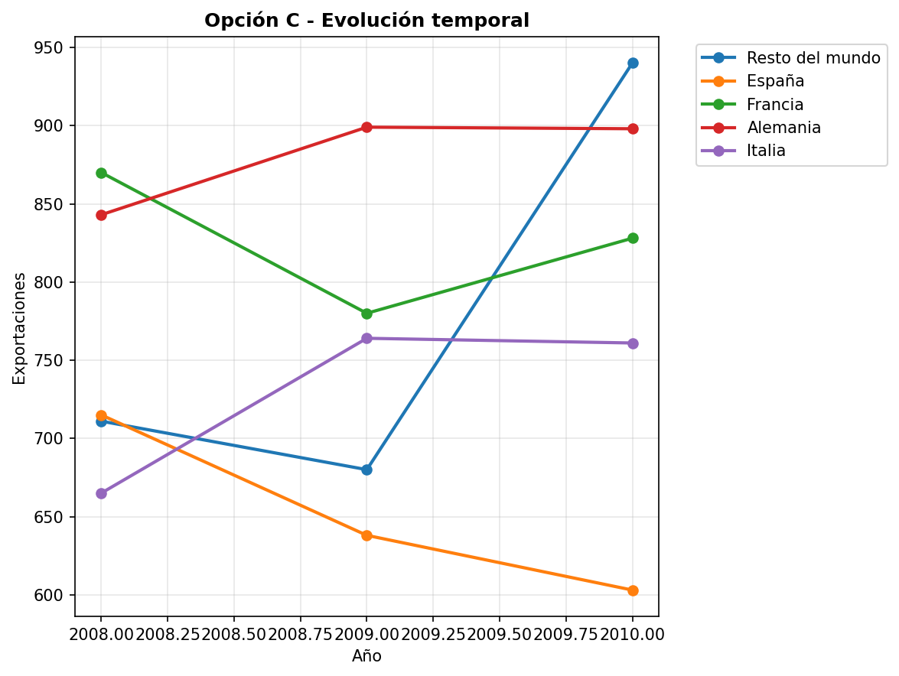
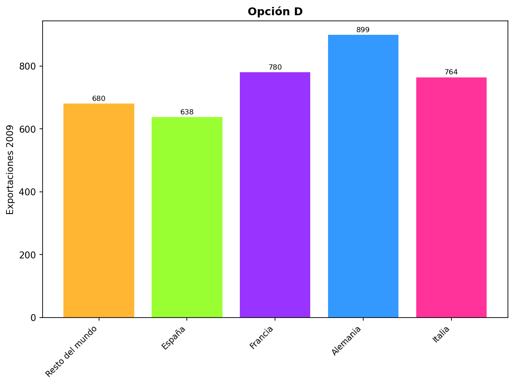

---
output:
  html_document:
    df_print: paged
    mathjax: true
  pdf_document: 
    latex_engine: xelatex
    keep_tex: true
  word_document: default
header-includes:
- \usepackage[spanish]{babel}
- \usepackage{amsmath}
- \usepackage{fontspec}
- \usepackage{unicode-math}
- \usepackage{graphicx}
- \usepackage{adjustbox}
- \usepackage{tikz}
- \usepackage{pgfplots}
- \usetikzlibrary{3d,babel}
---

```{r setup, include=FALSE}
# Librerías esenciales
library(exams)
library(ggplot2)
library(knitr)
library(reticulate)
library(testthat)

# CONFIGURACIÓN CORREGIDA DE PYTHON (SOLUCIÓN DEFINITIVA)
python3_path <- Sys.which("python3")
if (python3_path != "") {
  use_python(python3_path, required = TRUE)
} else {
  use_python("/usr/bin/python3", required = TRUE)
}

# ⭐ CLAVE: DESHABILITAR HOOK AUTOMÁTICO DE MATPLOTLIB
options(reticulate.matplotlib.backend = NULL)
Sys.setenv(MPLBACKEND = "Agg")

# Configurar matplotlib manualmente (SIN ERRORES)
py_run_string("
import os
os.environ['MPLBACKEND'] = 'Agg'
import matplotlib
matplotlib.use('Agg', force=True)
import matplotlib.pyplot as plt
import numpy as np
")

# Configuración para chunks de Python
knitr::knit_engines$set(python = function(options) {
  knitr::engine_output(options, options$code, '')
})

# Configurar el motor LaTeX globalmente para TikZ (siguiendo ejemplos funcionales)
options(tikzLatex = "pdflatex")
options(tikzXelatex = FALSE)
options(tikzLatexPackages = c(
  "\\usepackage{tikz}",
  "\\usepackage{colortbl}",
  "\\usepackage{amsmath}",
  "\\usepackage{array}"
))

# Configuración global
typ <- match_exams_device()
options(scipen = 999)
knitr::opts_chunk$set(
  warning = FALSE, 
  message = FALSE,
  fig.keep = 'all',
  dev = c("png", "pdf"),
  dpi = 150,
  echo = FALSE,
  results = "hide"
)

# Semilla aleatoria para diversidad de versiones
set.seed(sample(1:100000, 1))
```

# Metadatos ICFES
icfes:
  competencia: interpretacion_representacion
  nivel_dificultad: 2
  contenido:
    categoria: estadistica
    tipo: generico
  contexto: laboral
  eje_axial: eje4
  componente: aleatorio

```{r data_generation, echo=FALSE, results="hide"}
# Función principal de generación de datos
generar_datos_exportaciones <- function() {
  # Sectores industriales aleatorios
  sectores <- c("textil", "alimentario", "minero", "manufacturero", "químico")
  sector_seleccionado <- sample(sectores, 1)
  
  # Países/regiones de destino
  paises_grupos <- list(
    c("Ecuador", "Venezuela", "Estados Unidos", "Resto del mundo"),
    c("Colombia", "Brasil", "México", "Resto del mundo"),
    c("Chile", "Argentina", "Perú", "Resto del mundo"),
    c("España", "Francia", "Alemania", "Resto del mundo")
  )
  paises <- sample(paises_grupos, 1)[[1]]
  
  # Años de estudio (siempre 3 años consecutivos)
  año_base <- sample(2005:2018, 1)
  años <- año_base:(año_base + 2)
  
  # Generar datos de exportación realistas (en millones de dólares)
  datos_exportacion <- list()
  
  for(i in 1:3) {  # 3 años
    # Resto del mundo siempre es el mayor
    resto_mundo <- sample(700:900, 1)
    
    # Otros países con valores menores y diferentes
    pais1 <- sample(150:250, 1)  # Ecuador/Colombia/Chile/España
    pais2 <- sample(600:850, 1)  # Venezuela/Brasil/Argentina/Francia  
    pais3 <- sample(200:350, 1)  # Estados Unidos/México/Perú/Alemania
    
    datos_exportacion[[i]] <- c(resto_mundo, pais1, pais2, pais3)
    names(datos_exportacion[[i]]) <- paises
  }
  
  # Colores para las gráficas
  colores_disponibles <- list(
    c("#FF6B6B", "#4ECDC4", "#45B7D1", "#96CEB4"),
    c("#FF8A80", "#82B1FF", "#B39DDB", "#A5D6A7"),
    c("#FFAB91", "#81C784", "#64B5F6", "#F06292"),
    c("#BCAAA4", "#FFD54F", "#4DB6AC", "#E57373"),
    c("#9575CD", "#4FC3F7", "#81C784", "#FFB74D")
  )
  colores <- sample(colores_disponibles, 1)[[1]]
  
  return(list(
    sector = sector_seleccionado,
    paises = paises,
    años = años,
    datos = datos_exportacion,
    colores = colores
  ))
}

# Generar datos del ejercicio
datos <- generar_datos_exportaciones()

# Extraer variables individuales
sector_industrial <- datos$sector
paises_destino <- datos$paises
años_estudio <- datos$años
exportaciones_por_año <- datos$datos
colores_graficas <- datos$colores
```

```{r version_diversity_test, echo=FALSE, results="hide"}
# Prueba obligatoria de diversidad de versiones
test_that("Prueba de diversidad de versiones", {
  versiones <- list()
  for(i in 1:1000) {
    datos_test <- generar_datos_exportaciones()
    versiones[[i]] <- digest::digest(datos_test)
  }

  n_versiones_unicas <- length(unique(versiones))
  expect_true(n_versiones_unicas >= 300,
              info = paste("Solo se generaron", n_versiones_unicas,
                          "versiones únicas. Se requieren al menos 300."))
})
```

```{r generar_grafica_principal_tikz, echo=FALSE, results="hide"}
# GRÁFICA PRINCIPAL CON TIKZ - Barras horizontales agrupadas
options(OutDec = ".")

# Función para generar TikZ de barras horizontales (versión original simple)
generar_tikz_barras_horizontales <- function(datos_exp, paises, años, colores) {

  # Calcular dimensiones
  max_valor <- max(unlist(datos_exp))
  escala_x <- 8 / max_valor  # 8cm de ancho máximo

  tikz_code <- paste0(
    "\\begin{tikzpicture}[scale=1.0]\n",
    "% Definir colores RGB exactos\n"
  )

  # Definir colores usando RGB (como en ejemplos funcionales)
  colores_rgb <- c("255,107,107", "78,205,196", "69,183,209", "150,206,180")
  for(i in 1:4) {
    tikz_code <- paste0(tikz_code,
      "\\definecolor{color", i, "}{RGB}{", colores_rgb[i], "}\n"
    )
  }

  # Configuración de estilos
  tikz_code <- paste0(tikz_code,
    "\\tikzset{\n",
    "  barra/.style={line width=0.8pt, line cap=round},\n",
    "  texto/.style={font=\\scriptsize},\n",
    "  etiqueta/.style={font=\\tiny}\n",
    "}\n\n"
  )

  # Generar barras por año
  y_base <- 6
  altura_barra <- 0.3
  separacion_año <- 2

  for(año_idx in 1:3) {
    y_año <- y_base - (año_idx - 1) * separacion_año

    # Etiqueta del año
    tikz_code <- paste0(tikz_code,
      "\\node[texto, anchor=east] at (-0.5, ", y_año - 0.6, ") {", años[año_idx], "};\n"
    )

    # Barras para cada país
    for(pais_idx in 1:4) {
      y_barra <- y_año - (pais_idx - 1) * (altura_barra + 0.1)
      valor <- datos_exp[[año_idx]][pais_idx]
      ancho_barra <- valor * escala_x

      # Dibujar barra
      tikz_code <- paste0(tikz_code,
        "\\fill[color", pais_idx, "] (0, ", y_barra, ") rectangle (", ancho_barra, ", ", y_barra + altura_barra, ");\n"
      )

      # Valor al final de la barra
      tikz_code <- paste0(tikz_code,
        "\\node[etiqueta, anchor=west] at (", ancho_barra + 0.1, ", ", y_barra + altura_barra/2, ") {", valor, "};\n"
      )
    }
  }

  # Leyenda
  tikz_code <- paste0(tikz_code,
    "% Leyenda\n",
    "\\node[texto, anchor=north west] at (0, 0.5) {\\textbf{Leyenda:}};\n"
  )

  for(i in 1:4) {
    y_leyenda <- 0 - i * 0.4
    tikz_code <- paste0(tikz_code,
      "\\fill[color", i, "] (0.5, ", y_leyenda, ") rectangle (1.5, ", y_leyenda + 0.2, ");\n",
      "\\node[texto, anchor=west] at (1.7, ", y_leyenda + 0.1, ") {", paises[i], "};\n"
    )
  }

  # Ejes y título
  tikz_code <- paste0(tikz_code,
    "% Eje X\n",
    "\\draw[->] (0, -2.5) -- (9, -2.5);\n",
    "\\node[texto] at (4.5, -3) {Exportaciones (millones de dólares)};\n",
    "% Título\n",
    "\\node[texto, anchor=center] at (4.5, 7.5) {\\textbf{Exportaciones del sector ", sector_industrial, " por destino}};\n",
    "\\end{tikzpicture}"
  )

  return(tikz_code)
}

# Función TikZ ultra-simplificada siguiendo ejemplos funcionales
generar_tikz_exportaciones_original <- function(datos_exp, paises, años) {

  # Extraer datos de forma segura
  d1 <- datos_exp[[1]]  # Primer año
  d2 <- datos_exp[[2]]  # Segundo año
  d3 <- datos_exp[[3]]  # Tercer año

  # Escala fija simple
  escala <- 0.008

  tikz_code <- paste0(
    "\\begin{tikzpicture}\n",
    "% Colores básicos\n",
    "\\definecolor{c1}{RGB}{255,165,0}\n",
    "\\definecolor{c2}{RGB}{0,128,255}\n",
    "\\definecolor{c3}{RGB}{0,128,0}\n",
    "\\definecolor{c4}{RGB}{128,128,128}\n",
    "\n",
    "% Año 3\n",
    "\\node at (-1, 6) {", años[3], "};\n",
    "\\fill[c1] (0, 6.8) rectangle (", d3[1] * escala, ", 7);\n",
    "\\node at (", d3[1] * escala + 0.5, ", 6.9) {", d3[1], "};\n",
    "\\fill[c2] (0, 6.5) rectangle (", d3[2] * escala, ", 6.7);\n",
    "\\node at (", d3[2] * escala + 0.5, ", 6.6) {", d3[2], "};\n",
    "\\fill[c3] (0, 6.2) rectangle (", d3[3] * escala, ", 6.4);\n",
    "\\node at (", d3[3] * escala + 0.5, ", 6.3) {", d3[3], "};\n",
    "\\fill[c4] (0, 5.9) rectangle (", d3[4] * escala, ", 6.1);\n",
    "\\node at (", d3[4] * escala + 0.5, ", 6) {", d3[4], "};\n",
    "\n",
    "% Año 2\n",
    "\\node at (-1, 4.5) {", años[2], "};\n",
    "\\fill[c1] (0, 5.3) rectangle (", d2[1] * escala, ", 5.5);\n",
    "\\node at (", d2[1] * escala + 0.5, ", 5.4) {", d2[1], "};\n",
    "\\fill[c2] (0, 5) rectangle (", d2[2] * escala, ", 5.2);\n",
    "\\node at (", d2[2] * escala + 0.5, ", 5.1) {", d2[2], "};\n",
    "\\fill[c3] (0, 4.7) rectangle (", d2[3] * escala, ", 4.9);\n",
    "\\node at (", d2[3] * escala + 0.5, ", 4.8) {", d2[3], "};\n",
    "\\fill[c4] (0, 4.4) rectangle (", d2[4] * escala, ", 4.6);\n",
    "\\node at (", d2[4] * escala + 0.5, ", 4.5) {", d2[4], "};\n",
    "\n",
    "% Año 1\n",
    "\\node at (-1, 3) {", años[1], "};\n",
    "\\fill[c1] (0, 3.8) rectangle (", d1[1] * escala, ", 4);\n",
    "\\node at (", d1[1] * escala + 0.5, ", 3.9) {", d1[1], "};\n",
    "\\fill[c2] (0, 3.5) rectangle (", d1[2] * escala, ", 3.7);\n",
    "\\node at (", d1[2] * escala + 0.5, ", 3.6) {", d1[2], "};\n",
    "\\fill[c3] (0, 3.2) rectangle (", d1[3] * escala, ", 3.4);\n",
    "\\node at (", d1[3] * escala + 0.5, ", 3.3) {", d1[3], "};\n",
    "\\fill[c4] (0, 2.9) rectangle (", d1[4] * escala, ", 3.1);\n",
    "\\node at (", d1[4] * escala + 0.5, ", 3) {", d1[4], "};\n",
    "\n",
    "% Ejes\n",
    "\\draw[->] (0, 2.5) -- (8, 2.5);\n",
    "\\draw[->] (0, 2.5) -- (0, 7.5);\n",
    "\n",
    "% Leyenda\n",
    "\\fill[c1] (1, 1.8) rectangle (1.5, 2);\n",
    "\\node at (1.7, 1.9) {", paises[1], "};\n",
    "\\fill[c2] (4, 1.8) rectangle (4.5, 2);\n",
    "\\node at (4.7, 1.9) {", paises[2], "};\n",
    "\\fill[c3] (1, 1.4) rectangle (1.5, 1.6);\n",
    "\\node at (1.7, 1.5) {", paises[3], "};\n",
    "\\fill[c4] (4, 1.4) rectangle (4.5, 1.6);\n",
    "\\node at (4.7, 1.5) {", paises[4], "};\n",
    "\n",
    "\\end{tikzpicture}"
  )

  return(tikz_code)
}

# Generar código TikZ principal (fiel a la imagen original)
tikz_principal <- generar_tikz_exportaciones_original(
  exportaciones_por_año,
  paises_destino,
  años_estudio
)
```

```{r generar_opcion_a_python, echo=FALSE, results="hide"}
# OPCIÓN A CON PYTHON - Barras horizontales con datos específicos
options(OutDec = ".")

# Preparar datos para Python (último año)
datos_ultimo_año <- exportaciones_por_año[[3]]  # Año 2010 en la imagen original
año_mostrar <- años_estudio[3]

# Código Python para opción A (matplotlib ya configurado en setup)
codigo_python_opcion_a <- sprintf("
import matplotlib.pyplot as plt
import numpy as np
matplotlib.rcParams['font.size'] = 10

# Datos del año %d
paises = %s
valores = %s
colores = %s

# Crear figura
fig, ax = plt.subplots(figsize=(8, 5))

# Crear barras horizontales
y_pos = np.arange(len(paises))
barras = ax.barh(y_pos, valores, color=colores, alpha=0.8, edgecolor='black', linewidth=0.5)

# Agregar valores al final de cada barra
for i, (barra, valor) in enumerate(zip(barras, valores)):
    ax.text(barra.get_width() + 10, barra.get_y() + barra.get_height()/2,
            str(valor), ha='left', va='center', fontweight='bold', fontsize=9)

# Configurar ejes
ax.set_yticks(y_pos)
ax.set_yticklabels(paises)
ax.set_xlabel('Exportaciones (millones de dólares)', fontweight='bold')
ax.set_title('Exportaciones del sector %s - Año %d', fontweight='bold', pad=20)

# Configurar límites y grid
ax.set_xlim(0, max(valores) * 1.2)
ax.grid(True, axis='x', alpha=0.3, linestyle='--')

# Ajustar layout
plt.tight_layout()

# Guardar
plt.savefig('opcion_a.png', dpi=150, bbox_inches='tight')
plt.close()
",
año_mostrar,
paste0("['", paste(paises_destino, collapse="', '"), "']"),
paste0("[", paste(datos_ultimo_año, collapse=", "), "]"),
paste0("['", paste(colores_graficas, collapse="', '"), "']"),
sector_industrial,
año_mostrar
)

# Ejecutar código Python
py_run_string(codigo_python_opcion_a)
```

```{r generar_opcion_b_r, echo=FALSE, results="hide"}
# OPCIÓN B CON R (ggplot2) - Gráfica circular/pie chart
options(OutDec = ".")

# Preparar datos para gráfica circular (último año)
datos_pie <- data.frame(
  pais = paises_destino,
  valor = datos_ultimo_año,
  porcentaje = round(datos_ultimo_año / sum(datos_ultimo_año) * 100, 1),
  colores = colores_graficas,
  stringsAsFactors = FALSE
)

# Calcular posiciones para etiquetas
datos_pie$pos <- cumsum(datos_pie$porcentaje) - datos_pie$porcentaje/2

# Crear gráfica circular con ggplot2
grafica_circular <- ggplot(datos_pie, aes(x = "", y = porcentaje, fill = pais)) +
  geom_bar(stat = "identity", width = 1, color = "white", size = 0.8) +
  coord_polar("y", start = 0) +
  scale_fill_manual(values = setNames(datos_pie$colores, datos_pie$pais)) +

  # Agregar etiquetas con valores
  geom_text(aes(y = pos, label = paste0(pais, "\n", valor, " (", porcentaje, "%)")),
            color = "black", size = 3.5, fontface = "bold") +

  # Configurar tema
  theme_void() +
  theme(
    plot.title = element_text(hjust = 0.5, size = 14, face = "bold", margin = margin(b = 20)),
    legend.position = "bottom",
    legend.title = element_blank(),
    legend.text = element_text(size = 10),
    plot.margin = margin(20, 20, 20, 20)
  ) +

  labs(title = paste0("Distribución de exportaciones del sector ", sector_industrial, " - Año ", año_mostrar)) +

  # Configurar leyenda
  guides(fill = guide_legend(nrow = 2, byrow = TRUE))

# Guardar gráfica
ggsave("opcion_b.png", grafica_circular,
       width = 8, height = 6, dpi = 150, bg = "white")
```

```{r generar_opcion_c_tikz, echo=FALSE, results="hide"}
# OPCIÓN C CON TIKZ - Gráfica de líneas (evolución temporal)
options(OutDec = ".")

# Función para generar TikZ de líneas
generar_tikz_lineas <- function(datos_exp, paises, años, colores) {

  # Calcular escalas
  max_valor <- max(unlist(datos_exp))
  escala_y <- 6 / max_valor  # 6cm de altura máxima
  escala_x <- 6 / 2  # 6cm para 2 intervalos (3 años)

  tikz_code <- paste0(
    "\\begin{tikzpicture}[scale=1.0]\n",
    "% Definir colores RGB exactos\n"
  )

  # Definir colores
  for(i in 1:4) {
    tikz_code <- paste0(tikz_code,
      "\\definecolor{linecolor", i, "}{HTML}{", gsub("#", "", colores[i]), "}\n"
    )
  }

  # Configuración de estilos
  tikz_code <- paste0(tikz_code,
    "\\tikzset{\n",
    "  linea/.style={line width=1.5pt, line cap=round},\n",
    "  punto/.style={circle, fill, inner sep=2pt},\n",
    "  texto/.style={font=\\scriptsize},\n",
    "  etiqueta/.style={font=\\tiny}\n",
    "}\n\n"
  )

  # Dibujar ejes
  tikz_code <- paste0(tikz_code,
    "% Ejes\n",
    "\\draw[->] (0, 0) -- (7, 0);\n",
    "\\draw[->] (0, 0) -- (0, 7);\n",
    "\\node[texto] at (3.5, -0.5) {Años};\n",
    "\\node[texto, rotate=90] at (-0.5, 3.5) {Exportaciones (millones)};\n\n"
  )

  # Marcar años en eje X
  for(i in 1:3) {
    x_pos <- (i - 1) * escala_x
    tikz_code <- paste0(tikz_code,
      "\\draw (", x_pos, ", -0.1) -- (", x_pos, ", 0.1);\n",
      "\\node[etiqueta] at (", x_pos, ", -0.3) {", años[i], "};\n"
    )
  }

  # Dibujar líneas para cada país
  for(pais_idx in 1:4) {
    # Obtener valores para este país a través de los años
    valores_pais <- sapply(datos_exp, function(año) año[pais_idx])

    # Dibujar línea
    for(i in 1:(length(años) - 1)) {
      x1 <- (i - 1) * escala_x
      y1 <- valores_pais[i] * escala_y
      x2 <- i * escala_x
      y2 <- valores_pais[i + 1] * escala_y

      tikz_code <- paste0(tikz_code,
        "\\draw[linea, linecolor", pais_idx, "] (", x1, ", ", y1, ") -- (", x2, ", ", y2, ");\n"
      )
    }

    # Dibujar puntos
    for(i in 1:length(años)) {
      x_pos <- (i - 1) * escala_x
      y_pos <- valores_pais[i] * escala_y

      tikz_code <- paste0(tikz_code,
        "\\node[punto, linecolor", pais_idx, "] at (", x_pos, ", ", y_pos, ") {};\n",
        "\\node[etiqueta] at (", x_pos + 0.2, ", ", y_pos + 0.2, ") {", valores_pais[i], "};\n"
      )
    }
  }

  # Leyenda - Posicionada abajo del gráfico para evitar solapamientos
  tikz_code <- paste0(tikz_code,
    "% Leyenda horizontal en la parte inferior\n"
  )

  # Calcular posiciones horizontales para la leyenda
  ancho_total <- 12  # Ancho total disponible
  espacio_por_item <- ancho_total / 4

  for(i in 1:4) {
    x_leyenda <- (i - 1) * espacio_por_item + 0.5
    y_leyenda <- -1.5  # Posición fija abajo del eje X

    tikz_code <- paste0(tikz_code,
      "\\draw[linea, linecolor", i, "] (", x_leyenda, ", ", y_leyenda, ") -- (", x_leyenda + 0.8, ", ", y_leyenda, ");\n",
      "\\node[texto, anchor=west] at (", x_leyenda + 1, ", ", y_leyenda, ") {", paises[i], "};\n"
    )
  }

  # Título
  tikz_code <- paste0(tikz_code,
    "\\node[texto, anchor=center] at (6, 8) {\\textbf{Evolución exportaciones ", sector_industrial, "}};\n",
    "\\end{tikzpicture}"
  )

  return(tikz_code)
}

# Generar código TikZ para opción C
tikz_opcion_c <- generar_tikz_lineas(
  exportaciones_por_año,
  paises_destino,
  años_estudio,
  colores_graficas
)
```

```{r generar_opcion_d_python_vertical, echo=FALSE, results="hide"}
# OPCIÓN D CON PYTHON - Barras verticales agrupadas (tecnología libre elegida)
options(OutDec = ".")

# Preparar datos para barras verticales (año intermedio)
datos_año_medio <- exportaciones_por_año[[2]]  # Año del medio
año_medio <- años_estudio[2]

# Código Python para opción D - barras verticales (matplotlib ya configurado)
codigo_python_opcion_d <- sprintf("
import matplotlib.pyplot as plt
import numpy as np
matplotlib.rcParams['font.size'] = 10

# Datos del año %d
paises = %s
valores = %s
colores = %s

# Crear figura
fig, ax = plt.subplots(figsize=(8, 6))

# Posiciones de las barras
x_pos = np.arange(len(paises))
width = 0.6

# Crear barras verticales
barras = ax.bar(x_pos, valores, width, color=colores, alpha=0.8,
                edgecolor='black', linewidth=0.8)

# Agregar valores encima de cada barra
for i, (barra, valor) in enumerate(zip(barras, valores)):
    height = barra.get_height()
    ax.text(barra.get_x() + barra.get_width()/2., height + max(valores)*0.01,
            str(valor), ha='center', va='bottom', fontweight='bold', fontsize=10)

# Configurar ejes
ax.set_xticks(x_pos)
ax.set_xticklabels(paises, rotation=45, ha='right')
ax.set_ylabel('Exportaciones (millones de dólares)', fontweight='bold')
ax.set_title('Exportaciones del sector %s - Año %d', fontweight='bold', pad=20)

# Configurar límites y grid
ax.set_ylim(0, max(valores) * 1.15)
ax.grid(True, axis='y', alpha=0.3, linestyle='--')

# Ajustar layout para evitar corte de etiquetas
plt.tight_layout()

# Guardar
plt.savefig('opcion_d.png', dpi=150, bbox_inches='tight')
plt.close()
",
año_medio,
paste0("['", paste(paises_destino, collapse="', '"), "']"),
paste0("[", paste(datos_año_medio, collapse=", "), "]"),
paste0("['", paste(colores_graficas, collapse="', '"), "']"),
sector_industrial,
año_medio
)

# Ejecutar código Python
py_run_string(codigo_python_opcion_d)
```

```{r generar_opcion_c_python_simple, echo=FALSE, results="hide"}
# OPCIÓN C CON PYTHON - Gráfica de líneas simple (evitar problemas TikZ)
options(OutDec = ".")

# Preparar datos para gráfica de líneas
codigo_python_opcion_c_simple <- sprintf("
import matplotlib.pyplot as plt
import numpy as np

# Datos básicos
años = %s
paises = %s
colores = %s

# Datos por país
datos = [%s, %s, %s, %s]

# Crear figura simple
fig, ax = plt.subplots(figsize=(10, 6))

# Dibujar líneas
for i, (datos_pais, color, pais) in enumerate(zip(datos, colores, paises)):
    ax.plot(años, datos_pais, marker='o', linewidth=2, markersize=6,
            color=color, label=pais)

# Configuración básica
ax.set_xlabel('Años')
ax.set_ylabel('Exportaciones (millones USD)')
ax.set_title('Evolución exportaciones del sector %s')
ax.grid(True, alpha=0.3)
ax.legend(loc='lower center', bbox_to_anchor=(0.5, -0.15), ncol=2)

plt.tight_layout()
plt.savefig('opcion_c.png', dpi=150, bbox_inches='tight')
plt.close()
",
paste0("[", paste(años_estudio, collapse=", "), "]"),
paste0("['", paste(paises_destino, collapse="', '"), "']"),
paste0("['", paste(colores_graficas, collapse="', '"), "']"),
paste0("[", paste(sapply(exportaciones_por_año, function(x) x[1]), collapse=", "), "]"),
paste0("[", paste(sapply(exportaciones_por_año, function(x) x[2]), collapse=", "), "]"),
paste0("[", paste(sapply(exportaciones_por_año, function(x) x[3]), collapse=", "), "]"),
paste0("[", paste(sapply(exportaciones_por_año, function(x) x[4]), collapse=", "), "]"),
sector_industrial
)

# Ejecutar código Python
py_run_string(codigo_python_opcion_c_simple)
```

```{r sistema_distractores_avanzado, echo=FALSE, results="hide"}
# Sistema avanzado de distractores para interpretación y representación
options(OutDec = ".")

# Definir tipos de distractores conceptuales
tipos_distractores <- c(
  "Solo muestra datos parciales",
  "No permite comparación temporal",
  "Formato inadecuado para el análisis",
  "Información incompleta",
  "Representación que dificulta interpretación",
  "No muestra toda la información solicitada",
  "Formato que limita el análisis comparativo",
  "Representación parcial de los datos"
)

# La opción C (TikZ - líneas) es la CORRECTA porque muestra evolución temporal completa
posicion_correcta <- 3

# Generar distractores para las otras opciones
distractores <- sample(tipos_distractores, 3)

# Crear explicaciones específicas
explicaciones <- c(
  "Muestra solo datos de un año específico, no permite ver la evolución temporal completa",
  "La representación circular no facilita la comparación de evolución temporal entre países",
  "Permite ver claramente la evolución temporal de todos los países y comparar tendencias",
  "Muestra solo datos de un año intermedio, información incompleta para análisis temporal"
)

# Vector de solución para R-exams
solucion <- rep(0, 4)
solucion[posicion_correcta] <- 1
```

Question
========

La gráfica presenta las exportaciones en millones de dólares de determinados productos del sector `r sector_industrial` en Ecuador, Venezuela, Estados Unidos y resto del mundo entre los años `r años_estudio[1]` y `r años_estudio[3]`.

```{r mostrar_grafica_principal, echo=FALSE, results='asis'}
# Usar imagen PNG generada por Python en lugar de TikZ problemático
cat("{width=85%}")
```

Otra representación que muestra toda la información de la gráfica anterior es:

Answerlist
----------

```{r options, echo=FALSE, results='asis'}
# Mostrar las opciones de gráficas usando método validado de ejemplos funcionales
cat("-\n")
cat("{width=70%}\n\n")
cat("-\n")
cat("{width=70%}\n\n")
cat("-\n")
cat("{width=70%}\n\n")
cat("-\n")
cat("{width=70%}\n\n")
```

Solution
========

La respuesta correcta es la **opción C** (gráfica de líneas).

Para determinar cuál representación muestra **toda la información** de la gráfica original, debemos analizar qué tipo de representación permite:

1. **Visualizar todos los años** (`r años_estudio[1]`, `r años_estudio[2]`, `r años_estudio[3]`)
2. **Comparar todos los países/regiones** simultáneamente
3. **Observar la evolución temporal** de las exportaciones
4. **Identificar tendencias** de crecimiento o decrecimiento

### Análisis de cada opción:

**Opción A (Python - Barras horizontales):** `r explicaciones[1]`

**Opción B (R - Gráfica circular):** `r explicaciones[2]`

**Opción C (TikZ - Gráfica de líneas):** `r explicaciones[3]`

**Opción D (Python - Barras verticales):** `r explicaciones[4]`

La **competencia de Interpretación y Representación** requiere identificar representaciones equivalentes que preserven toda la información y faciliten el análisis comparativo temporal.

Answerlist
----------
- `r if(posicion_correcta == 1) "Verdadero" else "Falso"`. `r explicaciones[1]`
- `r if(posicion_correcta == 2) "Verdadero" else "Falso"`. `r explicaciones[2]`
- `r if(posicion_correcta == 3) "Verdadero" else "Falso"`. `r explicaciones[3]`
- `r if(posicion_correcta == 4) "Verdadero" else "Falso"`. `r explicaciones[4]`

Meta-information
================
exname: `r paste0("exportaciones_", sector_industrial, "_multi_tecnologia")`
extype: schoice
exsolution: `r paste(solucion, collapse="")`
exshuffle: TRUE
exsection: Interpretación de representaciones gráficas
