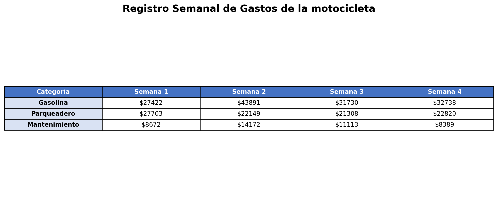

---
output:
  html_document: default
  word_document: default
  pdf_document:
    keep_tex: true
    extra_dependencies: ["graphicx", "float", "amsmath"]
icfes:
  competencia: interpretacion_representacion
  componente: aleatorio
  afirmacion: Interpreta información presentada en tablas y gráficos
  evidencia: Compara e interpreta datos presentados en gráficos de barras y circulares
  nivel: 2
  tematica: Interpretación de gráficos estadísticos
  contexto: laboral
# CONFIGURACIÓN DE TOLERANCIAS PARA EVALUACIÓN AUTOMÁTICA:
# - Tipo: cloze (5 respuestas numéricas + 1 schoice)
# - Tolerancias: 1 para numéricas (valores monetarios), 0 para schoice
# - Formato: Sin separador de miles, punto decimal, sin notación científica
---

```{r setup, include=FALSE}
# Configuración para todos los formatos de salida
Sys.setlocale(category = "LC_NUMERIC", locale = "C")
options(OutDec = ".")
options(scipen = 999)
options(digits = 10)

library(exams)
library(reticulate)
library(knitr)
library(testthat)
library(digest)

typ <- match_exams_device()
knitr::opts_chunk$set(
  warning = FALSE,
  message = FALSE,
  echo = FALSE,
  fig.showtext = FALSE,
  fig.cap = "",
  fig.keep = 'all',
  dev = c("png", "pdf"),
  dpi = 150,
  fig.pos = "H"
)

# Configuración para chunks de Python
knitr::knit_engines$set(python = function(options) {
  knitr::engine_output(options, options$code, '')
})

# Asegurar que Python esté correctamente configurado
use_python(Sys.which("python"), required = TRUE)
```

```{r DefinicionDeVariables, message=FALSE, warning=FALSE, results='asis'}
options(OutDec = ".")

# Función para formatear números enteros sin notación científica
formatear_entero <- function(numero) {
  formatC(numero, format = "d", big.mark = "")
}

# Función de formato estándar para números (sin separador de miles, punto decimal)
formato_estandar <- function(x, decimales = 0) {
  if (decimales == 0) {
    return(as.character(as.integer(x)))
  } else {
    resultado <- sprintf(paste0("%.", decimales, "f"), x)
    return(resultado)
  }
}

# Función de redondeo matemático correcto (hacia arriba para .5)
redondear_matematico <- function(x, digits = 0) {
  factor <- 10^digits
  return(floor(x * factor + 0.5) / factor)
}

# Establecer semilla aleatoria para diversidad
set.seed(as.numeric(Sys.time()) + sample(1:10000, 1))

# Aleatorización de contexto de gastos de vehículo
contextos_gastos <- list(
  list(vehiculo = "carro", categorias = c("Gasolina", "Parqueadero", "Peajes")),
  list(vehiculo = "motocicleta", categorias = c("Gasolina", "Parqueadero", "Mantenimiento")),
  list(vehiculo = "vehículo", categorias = c("Combustible", "Estacionamiento", "Peajes")),
  list(vehiculo = "automóvil", categorias = c("Gasolina", "Parqueo", "Peajes"))
)
contexto_seleccionado <- sample(contextos_gastos, 1)[[1]]
vehiculo <- contexto_seleccionado$vehiculo
categorias <- contexto_seleccionado$categorias

# Aleatorización de nombres para el contexto
nombres_masculinos <- c("Pedro", "Carlos", "Miguel", "Antonio", "Diego", "Sebastián")
nombres_femeninos <- c("María", "Ana", "Carmen", "Laura", "Sofía", "Valentina")

# Seleccionar género y nombre correspondiente
genero_propietario <- sample(c("m", "f"), 1)
if (genero_propietario == "m") {
  nombre_propietario <- sample(nombres_masculinos, 1)
  articulo_propietario <- "el"
} else {
  nombre_propietario <- sample(nombres_femeninos, 1)
  articulo_propietario <- "la"
}

# Generar gastos aleatorios para 4 semanas
# Rangos realistas para cada categoría
rangos_gastos <- list(
  gasolina = c(25000, 45000),
  parqueadero = c(15000, 30000),
  peajes = c(8000, 25000)
)

# Generar datos para 4 semanas
gastos_semanas <- list()
for(i in 1:4) {
  gastos_semanas[[i]] <- list(
    gasolina = sample(rangos_gastos$gasolina[1]:rangos_gastos$gasolina[2], 1),
    parqueadero = sample(rangos_gastos$parqueadero[1]:rangos_gastos$parqueadero[2], 1),
    peajes = sample(rangos_gastos$peajes[1]:rangos_gastos$peajes[2], 1)
  )
}

# Calcular totales por semana
totales_semana <- sapply(gastos_semanas, function(semana) {
  semana$gasolina + semana$parqueadero + semana$peajes
})

# Calcular totales por categoría
total_gasolina <- sum(sapply(gastos_semanas, function(x) x$gasolina))
total_parqueadero <- sum(sapply(gastos_semanas, function(x) x$parqueadero))
total_peajes <- sum(sapply(gastos_semanas, function(x) x$peajes))

# Calcular gran total
gran_total <- sum(totales_semana)

# Aleatorizar si se pregunta por mayor o menor gasto
tipo_pregunta <- sample(c("mayor", "menor"), 1)

if (tipo_pregunta == "mayor") {
  # Identificar semana con mayor gasto
  semana_objetivo <- which.max(totales_semana)
  valor_objetivo <- max(totales_semana)
  texto_pregunta <- "mayor"
  texto_analisis <- "mayor porcentaje"
} else {
  # Identificar semana con menor gasto
  semana_objetivo <- which.min(totales_semana)
  valor_objetivo <- min(totales_semana)
  texto_pregunta <- "menor"
  texto_analisis <- "menor porcentaje"
}

# Calcular porcentaje de la semana objetivo
porcentaje_objetivo <- redondear_matematico((valor_objetivo / gran_total) * 100, 1)

# Respuestas para el formato cloze
respuesta_1 <- valor_objetivo             # Paso 1: Valor del gasto objetivo (mayor o menor)
respuesta_2 <- gran_total                 # Paso 2: Total general
respuesta_3 <- valor_objetivo             # Paso 3: Numerador de la fórmula
respuesta_4 <- gran_total                 # Paso 4: Denominador de la fórmula
respuesta_5 <- porcentaje_objetivo        # Paso 5: Porcentaje final

# Definir los tipos de gráficas disponibles
tipos_graficas <- c(
  "circular_categoria",    # Gráfica circular por categoría
  "barras_apiladas",      # Gráfica de barras apiladas por semana
  "circular_semana",      # Gráfica circular por semana (CORRECTA)
  "barras_agrupadas"      # Gráfica de barras agrupadas por categoría
)

# Aleatorizar el orden en que se muestran las gráficas en el enunciado
orden_presentacion <- sample(1:4)
tipos_en_orden_mostrado <- tipos_graficas[orden_presentacion]

# Crear mapeo: cada letra A, B, C, D corresponde a una gráfica en el orden aleatorizado
mapeo_graficas <- data.frame(
  letra = LETTERS[1:4],  # A, B, C, D (fijo para Answerlist)
  tipo_grafica = tipos_en_orden_mostrado,  # Tipos en orden aleatorio
  posicion_mostrada = 1:4,  # Posición en el enunciado (1=primera, 2=segunda, etc.)
  stringsAsFactors = FALSE
)

# Para mostrar las gráficas, usamos el orden aleatorizado
mapeo_graficas_ordenado <- mapeo_graficas

# Generar opciones para Answerlist (siempre A, B, C, D)
opciones_graficas <- c("A", "B", "C", "D")

# Encontrar qué letra corresponde a la gráfica circular por semana
indice_respuesta_correcta <- which(mapeo_graficas$tipo_grafica == "circular_semana")

# La respuesta correcta es la letra correspondiente
respuesta_correcta_schoice <- LETTERS[indice_respuesta_correcta]

# Para schoice en cloze, necesitamos un vector lógico
solucion_schoice <- rep(FALSE, 4)
solucion_schoice[indice_respuesta_correcta] <- TRUE

# Las opciones mezcladas son las mismas que el orden mostrado (sin aleatorización adicional)
opciones_mezcladas <- opciones_graficas

# Vector de soluciones para formato cloze (5 numéricas + 1 schoice)
solucion_cloze <- list(
  respuesta_1,      # Paso 1: Valor mayor gasto
  respuesta_2,      # Paso 2: Total general
  respuesta_3,      # Paso 3: Numerador
  respuesta_4,      # Paso 4: Denominador
  respuesta_5       # Paso 5: Porcentaje final
)

# Tipos de respuesta: 5 numéricas + 1 schoice
tipos_respuesta <- c("num", "num", "num", "num", "num", "schoice")

# Tolerancias para respuestas numéricas
tolerancias <- c(1, 1, 1, 1, 0.1, 0)

# Detectar formato de salida para ajustes posteriores
formatos_moodle <- c("exams2moodle", "exams2qti12", "exams2qti21", "exams2openolat")
es_moodle <- (match_exams_call() %in% formatos_moodle)

# PRUEBAS DE VALIDACIÓN MATEMÁTICA
test_that("Validación de datos generados", {
  expect_true(all(totales_semana > 0))
  expect_equal(gran_total, sum(totales_semana))
  expect_equal(length(solucion_cloze), 5)
  expect_equal(length(tipos_respuesta), 6)
  expect_equal(length(tolerancias), 6)
  expect_equal(length(opciones_graficas), 4)
  expect_true(semana_objetivo >= 1 && semana_objetivo <= 4)
  expect_true(tipo_pregunta %in% c("mayor", "menor"))
})

test_that("Validación de coherencia matemática", {
  expect_equal(respuesta_1, valor_objetivo)
  expect_equal(respuesta_2, gran_total)
  expect_equal(respuesta_3, valor_objetivo)
  expect_equal(respuesta_4, gran_total)
  expect_equal(respuesta_5, porcentaje_objetivo)
  expect_true(respuesta_correcta_schoice %in% opciones_graficas)
  expect_true(all(sapply(solucion_cloze, is.numeric)))
  expect_true(indice_respuesta_correcta >= 1 && indice_respuesta_correcta <= 4)
})

test_that("Validación de aleatorización de gráficas", {
  expect_equal(nrow(mapeo_graficas), 4)
  expect_equal(length(opciones_graficas), 4)
  expect_true(respuesta_correcta_schoice %in% LETTERS[1:4])  # Respuesta correcta es una letra válida (A, B, C, o D)
  expect_true(all(opciones_graficas %in% c("A", "B", "C", "D")))  # Todas las opciones son letras válidas
  expect_true("circular_semana" %in% mapeo_graficas$tipo_grafica)  # La gráfica correcta está presente
  expect_equal(length(unique(mapeo_graficas$tipo_grafica)), 4)  # Todos los tipos son diferentes
})

test_that("Validación de aleatorización de posiciones", {
  expect_equal(length(orden_presentacion), 4)
  expect_equal(length(unique(orden_presentacion)), 4)  # Todas las posiciones diferentes
  expect_true(all(orden_presentacion %in% 1:4))  # Solo posiciones 1, 2, 3, 4
  expect_equal(nrow(mapeo_graficas_ordenado), 4)
  expect_true(all(mapeo_graficas_ordenado$letra %in% c("A", "B", "C", "D")))  # Todas las letras válidas
})
```

```{r generar_tabla_gastos, message=FALSE, warning=FALSE}
# Generar tabla de gastos usando Python
codigo_python_tabla <- paste0("
import matplotlib
matplotlib.use('Agg')
import matplotlib.pyplot as plt
import numpy as np

# Datos de la tabla
categorias = ['", paste(categorias, collapse="', '"), "']
semana1 = [", paste(c(gastos_semanas[[1]]$gasolina, gastos_semanas[[1]]$parqueadero, gastos_semanas[[1]]$peajes), collapse=", "), "]
semana2 = [", paste(c(gastos_semanas[[2]]$gasolina, gastos_semanas[[2]]$parqueadero, gastos_semanas[[2]]$peajes), collapse=", "), "]
semana3 = [", paste(c(gastos_semanas[[3]]$gasolina, gastos_semanas[[3]]$parqueadero, gastos_semanas[[3]]$peajes), collapse=", "), "]
semana4 = [", paste(c(gastos_semanas[[4]]$gasolina, gastos_semanas[[4]]$parqueadero, gastos_semanas[[4]]$peajes), collapse=", "), "]

# Crear figura para la tabla
fig, ax = plt.subplots(figsize=(12, 5))
ax.axis('tight')
ax.axis('off')

# Datos de la tabla (sin totales para que el estudiante los calcule)
# Formato sin separador de miles, solo punto decimal
datos_tabla = [
    ['Categoría', 'Semana 1', 'Semana 2', 'Semana 3', 'Semana 4'],
    [categorias[0], f'${semana1[0]}', f'${semana2[0]}', f'${semana3[0]}', f'${semana4[0]}'],
    [categorias[1], f'${semana1[1]}', f'${semana2[1]}', f'${semana3[1]}', f'${semana4[1]}'],
    [categorias[2], f'${semana1[2]}', f'${semana2[2]}', f'${semana3[2]}', f'${semana4[2]}']
]

# Crear tabla
tabla = ax.table(cellText=datos_tabla, cellLoc='center', loc='center')
tabla.auto_set_font_size(False)
tabla.set_fontsize(10)
tabla.scale(1.2, 1.5)

# Estilo de la tabla
for i in range(len(datos_tabla)):
    for j in range(len(datos_tabla[0])):
        cell = tabla[(i, j)]
        if i == 0:  # Encabezado
            cell.set_facecolor('#4472C4')
            cell.set_text_props(weight='bold', color='white')
        elif j == 0:  # Primera columna (categorías)
            cell.set_facecolor('#D9E2F3')
            cell.set_text_props(weight='bold')
        else:  # Datos de gastos
            cell.set_facecolor('white')

plt.title('Registro Semanal de Gastos del ", vehiculo, "', fontsize=16, fontweight='bold', pad=20)
plt.savefig('tabla_gastos.png', dpi=200, bbox_inches='tight', transparent=False)
plt.savefig('tabla_gastos.pdf', dpi=200, bbox_inches='tight', transparent=False)
plt.close()
")

# Ejecutar código Python para generar la tabla
py_run_string(codigo_python_tabla)
```

```{r generar_graficas_python, message=FALSE, warning=FALSE}
# Generar las 4 gráficas usando Python
codigo_python_graficas <- paste0("
import matplotlib
matplotlib.use('Agg')
import matplotlib.pyplot as plt
import numpy as np
import random

# Datos para las gráficas
categorias = ['", paste(categorias, collapse="', '"), "']
semanas = ['Semana 1', 'Semana 2', 'Semana 3', 'Semana 4']

# Datos de gastos por categoría y semana
gastos_por_categoria = {
    categorias[0]: [", paste(sapply(gastos_semanas, function(x) x$gasolina), collapse=", "), "],
    categorias[1]: [", paste(sapply(gastos_semanas, function(x) x$parqueadero), collapse=", "), "],
    categorias[2]: [", paste(sapply(gastos_semanas, function(x) x$peajes), collapse=", "), "]
}

# Totales por semana y por categoría
totales_semana = [", paste(totales_semana, collapse=", "), "]
totales_categoria = [", total_gasolina, ", ", total_parqueadero, ", ", total_peajes, "]

# Paleta de colores consistente
colores_categorias = ['#FF6B6B', '#4ECDC4', '#45B7D1']
colores_semanas = ['#E74C3C', '#3498DB', '#2ECC71', '#F39C12']

# Mapeo de tipos a letras aleatorizadas desde R
# No necesitamos mapeo complejo, solo generamos archivos con nombres fijos

# GRÁFICA 1: Circular por categoría
plt.figure(figsize=(7, 7))
plt.pie(totales_categoria, labels=categorias, autopct='%1.1f%%',
        colors=colores_categorias, startangle=90)
plt.title('Gastos del ", vehiculo, "', fontsize=14, fontweight='bold')
plt.axis('equal')
plt.savefig('grafica_circular_categoria.png', dpi=200, bbox_inches='tight', transparent=False)
plt.savefig('grafica_circular_categoria.pdf', dpi=200, bbox_inches='tight', transparent=False)
plt.close()

# GRÁFICA 2: Barras apiladas por semana
plt.figure(figsize=(9, 7))
bottom = np.zeros(4)
for i, categoria in enumerate(categorias):
    plt.bar(semanas, gastos_por_categoria[categoria], bottom=bottom,
            label=categoria, color=colores_categorias[i])
    bottom += gastos_por_categoria[categoria]

plt.xlabel('Semanas', fontweight='bold', fontsize=12)
plt.ylabel('Gastos (pesos)', fontweight='bold', fontsize=12)
plt.title('Gastos del ", vehiculo, "', fontsize=14, fontweight='bold')
plt.legend(fontsize=11)
plt.xticks(rotation=45)
plt.grid(True, axis='y', alpha=0.3)
plt.tight_layout()
plt.savefig('grafica_barras_apiladas.png', dpi=200, bbox_inches='tight', transparent=False)
plt.savefig('grafica_barras_apiladas.pdf', dpi=200, bbox_inches='tight', transparent=False)
plt.close()

# GRÁFICA 3: Circular por semana
plt.figure(figsize=(7, 7))
plt.pie(totales_semana, labels=semanas, autopct='%1.1f%%',
        colors=colores_semanas, startangle=90)
plt.title('Gastos del ", vehiculo, "', fontsize=14, fontweight='bold')
plt.axis('equal')
plt.savefig('grafica_circular_semana.png', dpi=200, bbox_inches='tight', transparent=False)
plt.savefig('grafica_circular_semana.pdf', dpi=200, bbox_inches='tight', transparent=False)
plt.close()

# GRÁFICA 4: Barras agrupadas por categoría
plt.figure(figsize=(9, 7))
x = np.arange(len(categorias))
width = 0.2

for i, semana in enumerate(semanas):
    valores = [gastos_por_categoria[cat][i] for cat in categorias]
    plt.bar(x + i*width, valores, width, label=semana, color=colores_semanas[i])

plt.xlabel('Categorías', fontweight='bold', fontsize=12)
plt.ylabel('Gastos (pesos)', fontweight='bold', fontsize=12)
plt.title('Gastos del ", vehiculo, "', fontsize=14, fontweight='bold')
plt.xticks(x + width*1.5, categorias)
plt.legend(fontsize=11)
plt.grid(True, axis='y', alpha=0.3)
plt.tight_layout()
plt.savefig('grafica_barras_agrupadas.png', dpi=200, bbox_inches='tight', transparent=False)
plt.savefig('grafica_barras_agrupadas.pdf', dpi=200, bbox_inches='tight', transparent=False)
plt.close()

print('Gráficas generadas exitosamente')
")

# Ejecutar código Python para generar las gráficas
py_run_string(codigo_python_graficas)
```

Question
========

`r nombre_propietario` lleva un registro detallado de los gastos relacionados con su `r vehiculo`. La tabla muestra los gastos semanales durante un mes completo, organizados por categorías.

```{r mostrar_tabla, echo=FALSE, results='asis', fig.align="center"}
# Mostrar la tabla generada con Python
if (es_moodle) {
  cat("{width=85%}")
} else {
  cat("{width=95%}")
}
```

<br><br>

## Gráficas de análisis

A continuación se presentan cuatro tipos diferentes de gráficas que representan los mismos datos de la tabla:

<br>

```{r mostrar_graficas, echo=FALSE, results='asis', fig.align="center"}
# Mostrar las 4 gráficas en orden aleatorizado (sin letras identificadoras)
for(i in 1:4) {
  tipo_grafica <- mapeo_graficas_ordenado$tipo_grafica[i]
  letra <- mapeo_graficas_ordenado$letra[i]

  # Determinar el archivo según el tipo de gráfica
  archivo_base <- switch(tipo_grafica,
    "circular_categoria" = "grafica_circular_categoria",
    "barras_apiladas" = "grafica_barras_apiladas",
    "circular_semana" = "grafica_circular_semana",
    "barras_agrupadas" = "grafica_barras_agrupadas"
  )
  archivo <- paste0(archivo_base, ".png")

  if (es_moodle) {
    cat(paste0("{width=60%}\n\n"))
  } else {
    cat(paste0("{width=65%}\n\n"))
  }
}
```

<br><br>

## Análisis paso a paso

Para analizar qué semana representó el `r texto_analisis` del gasto total mensual, resuelva paso a paso:

**IMPORTANTE - Formato de números:**

- **Valores monetarios**: Sin separador de miles, use punto para decimales
  - Ejemplo: $16850.32 (no $16.850,32 ni $16850,32)
- **Respuestas numéricas**: Sin separador de miles, use punto para decimales
  - Ejemplo: 1234.5678 (no 1.234,5678 ni 1234,5678)

### Paso 1: Identificación del `r texto_pregunta` gasto semanal
Observe la tabla y identifique cuál fue el `r texto_pregunta` gasto semanal (total por semana).

**Respuesta:** $##ANSWER1##

### Paso 2: Identificación del gasto total mensual
Según la tabla, ¿cuál es el gasto total del mes (suma de todas las semanas)?

**Respuesta:** $##ANSWER2##

### Paso 3: Configuración de la fórmula de porcentaje
Para calcular el porcentaje, complete la fórmula con los valores identificados:

Porcentaje = ( ##ANSWER3## ÷ ##ANSWER4## ) × 100%

### Paso 4: Verificación de valores
Confirme que los valores del numerador y denominador son correctos:

- Numerador (`r texto_pregunta` gasto semanal): $##ANSWER3##
- Denominador (gasto total mensual): $##ANSWER4##

### Paso 5: Cálculo del porcentaje final
Complete el cálculo del porcentaje:

Porcentaje = ( ##ANSWER3## ÷ ##ANSWER4## ) × 100% = ##ANSWER5##%

### Paso 6: Confirmación del tipo de gráfica (CON PUNTUACIÓN)
Basándose en su análisis anterior, **seleccione qué tipo de gráfica permite identificar más fácilmente qué semana representó el mayor porcentaje del gasto total mensual**:

##ANSWER6##

**Conclusión:** La semana con mayor gasto representó el ##ANSWER5##% del gasto total mensual.

Answerlist
----------
* `r opciones_mezcladas[1]`
* `r opciones_mezcladas[2]`
* `r opciones_mezcladas[3]`
* `r opciones_mezcladas[4]`

Solution
========

**NOTA IMPORTANTE - Configuración de evaluación automática:**

- **Tolerancias configuradas**: Tolerancia 1 para respuestas numéricas monetarias, tolerancia 0.1 para porcentajes, tolerancia 0 para respuestas schoice
- **Justificación**: Los valores monetarios son enteros grandes, tolerancia 1 evita rechazos incorrectos por diferencias mínimas de formato manteniendo precisión matemática
- **Formato numérico**: Sin separador de miles, punto como separador decimal

### Análisis paso a paso del problema de gastos de vehículo

Este problema de **interpretación de tablas** y **cálculo de porcentajes** requiere un análisis secuencial que demuestre el proceso de razonamiento matemático aplicado a contextos de gastos personales:

**NOTA IMPORTANTE - Formato de números estandarizado:**

- **Valores monetarios**: Sin separador de miles, use punto para decimales
  - Ejemplo: $16850.32 (no $16.850,32 ni $16850,32)
- **Respuestas numéricas**: Sin separador de miles, punto como separador decimal
  - Ejemplo: 1234.5678 (no 1.234,5678 ni 1234,5678)
- **Consistencia**: Mismo formato en enunciado, opciones y respuestas

### Paso 1: Identificación correcta del `r texto_pregunta` gasto semanal ✓

**Respuesta correcta:** $`r formato_estandar(valor_objetivo, 0)`

**Análisis de gastos semanales:**

- Semana 1: $`r formato_estandar(totales_semana[1], 0)`
- Semana 2: $`r formato_estandar(totales_semana[2], 0)`
- Semana 3: $`r formato_estandar(totales_semana[3], 0)`
- Semana 4: $`r formato_estandar(totales_semana[4], 0)`

La semana `r semana_objetivo` tuvo el `r texto_pregunta` gasto con $`r formato_estandar(valor_objetivo, 0)`.

### Paso 2: Identificación del gasto total mensual ✓

**Respuesta correcta:** $`r formato_estandar(gran_total, 0)`

El total mensual se calcula sumando todos los gastos semanales:

$$\text{Total mensual} = `r formato_estandar(totales_semana[1], 0)` + `r formato_estandar(totales_semana[2], 0)` + `r formato_estandar(totales_semana[3], 0)` + `r formato_estandar(totales_semana[4], 0)` = `r formato_estandar(gran_total, 0)`$$

### Paso 3: Configuración correcta de la fórmula ✓

**Respuestas correctas:** Numerador = `r formato_estandar(valor_objetivo, 0)`, Denominador = `r formato_estandar(gran_total, 0)`

La fórmula de porcentaje requiere:

- **Numerador:** El valor observado (`r formato_estandar(valor_objetivo, 0)` pesos)
- **Denominador:** El valor total (`r formato_estandar(gran_total, 0)` pesos)

### Paso 4: Verificación de valores ✓

Los valores son coherentes con los datos de la tabla y representan correctamente:

- El mayor gasto semanal individual
- El gasto total mensual (suma de todas las semanas)

### Paso 5: Cálculo del porcentaje final ✓

**Respuesta correcta:** `r formato_estandar(porcentaje_objetivo, 1)`%

$$\text{Porcentaje} = \frac{`r formato_estandar(valor_objetivo, 0)`}{`r formato_estandar(gran_total, 0)`} \times 100\% = `r formato_estandar(porcentaje_objetivo, 1)`\%$$

### Paso 6: Confirmación del tipo de gráfica ✓ (CON PUNTUACIÓN)

**Opciones presentadas:**

```{r mostrar_opciones_solucion, echo=FALSE, results='asis'}
for(i in 1:4) {
  correcto <- if(i == indice_respuesta_correcta) " ← **RESPUESTA CORRECTA**" else ""
  cat(paste0("- **", LETTERS[i], "**: ", opciones_mezcladas[i], correcto, "\n"))
}
```

**Análisis de la respuesta correcta:**

"`r respuesta_correcta_schoice`"

- Esta opción permite visualizar directamente qué semana representa el `r texto_analisis` del total mensual
- Muestra claramente las proporciones de cada semana respecto al total
- Facilita la identificación inmediata de la semana con `r texto_pregunta` participación porcentual
- Es el tipo de gráfica más adecuado para comparar partes de un todo

**Análisis de distractores:**

- **Gráfica circular por categoría**: Muestra proporciones de categorías, no de semanas
- **Gráfica de barras apiladas por semana**: Muestra composición pero no facilita comparación de totales
- **Gráfica de barras agrupadas por categoría**: Agrupa por categoría, no por semana

### Verificación del proceso de razonamiento completo

**Datos del problema:**

- `r stringr::str_to_title(texto_pregunta)` gasto semanal: $`r formato_estandar(valor_objetivo, 0)` (Semana `r semana_objetivo`)
- Gasto total mensual: $`r formato_estandar(gran_total, 0)`
- Porcentaje representado: `r formato_estandar(porcentaje_objetivo, 1)`%

**El formato híbrido con puntuación dual (cloze + schoice) garantiza que los estudiantes:**

**Parte Analítica (Pasos 1-5):**

- **Lean cuidadosamente** la tabla para extraer datos precisos
- **Identifiquen correctamente** el mayor valor semanal y el total mensual
- **Configuren correctamente** la fórmula de porcentaje paso a paso
- **Realicen cálculos** matemáticos sin saltar etapas del proceso

**Parte de Confirmación (Paso 6):**

- **Demuestren coherencia** entre su análisis numérico y la comprensión conceptual
- **Identifiquen el tipo de gráfica** más apropiado para el análisis requerido
- **Consoliden su aprendizaje** mediante validación de resultados

### Conclusión

La semana `r semana_objetivo` representó el **`r formato_estandar(porcentaje_objetivo, 1)`%** del gasto total mensual de `r nombre_propietario` en su `r vehiculo`.

Esta respuesta es coherente porque:

- Se basa en una lectura correcta de la tabla
- Aplica correctamente la fórmula de porcentaje
- El resultado está dentro del rango esperado (0% a 100%)
- La gráfica seleccionada es la más apropiada para este tipo de análisis

**Verificación adicional**: El total de gastos por categorías (`r categorias[1]`: $`r formato_estandar(total_gasolina, 0)`, `r categorias[2]`: $`r formato_estandar(total_parqueadero, 0)`, `r categorias[3]`: $`r formato_estandar(total_peajes, 0)`) suma exactamente $`r formato_estandar(gran_total, 0)`, confirmando la coherencia de los datos.

Meta-information
================
exname: Gastos Carro Gráficas Comparación - Análisis Secuencial Cloze
extype: cloze
exsolution: `r paste(c(solucion_cloze[1:5], mchoice2string(solucion_schoice)), collapse="|")`
exclozetype: `r paste(tipos_respuesta, collapse="|")`
extol: `r paste(tolerancias, collapse="|")`
exsection: Estadística|Interpretación de tablas|Porcentajes|Análisis de datos
exextra[Type]: Cálculo
exextra[Program]: R
exextra[Language]: es
exextra[Level]: 2
exextra[Competencia]: Interpretación y representación
exextra[Componente]: Aleatorio y sistemas de datos
exextra[Contexto]: Laboral
exextra[Dificultad]: Media
