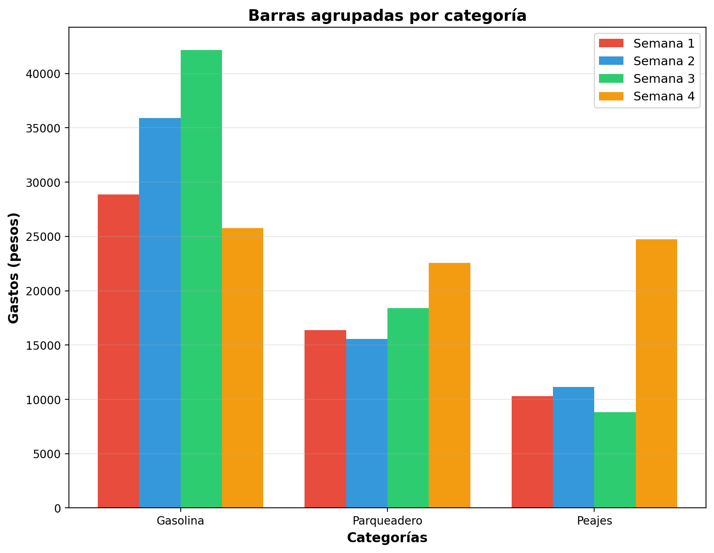
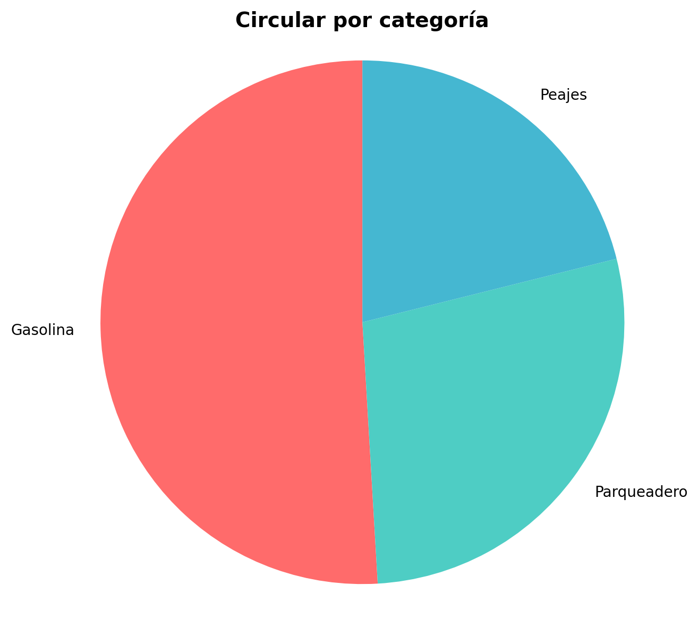

---
output:
  pdf_document:
    keep_tex: true
    extra_dependencies: ["graphicx", "float", "amsmath"]
  word_document: default
  html_document: default
icfes:
  competencia: interpretacion_representacion
  componente: aleatorio
  afirmacion: Interpreta información presentada en tablas y gráficos
  evidencia: Compara e interpreta datos presentados en gráficos de barras y circulares
  nivel: 2
  tematica: Interpretación de gráficos estadísticos
  contexto: laboral
# CONFIGURACIÓN DE TOLERANCIAS PARA EVALUACIÓN AUTOMÁTICA:
# - Tipo: cloze (5 respuestas numéricas + 1 schoice)
# - Tolerancias: 1 para numéricas (valores monetarios), 0 para schoice
# - Formato: Sin separador de miles, punto decimal, sin notación científica
---


Test passed 🎉
Test passed 🥇
Test passed 😀
Test passed 🎊
Test passed 🥳
Test passed 😀


```
## Gráficas generadas exitosamente
```

Question
========

Valentina lleva un registro detallado de los gastos relacionados con su carro. La tabla muestra los gastos semanales durante un mes completo, organizados por categorías.

{width=95%}

<br><br>

## Gráficas de análisis

A continuación se presentan cuatro tipos diferentes de gráficas que representan los mismos datos de la tabla:

<br>

**Barras agrupadas por categoría**

{width=65%}

**Circular por categoría**

{width=65%}

**Circular por semana**

{width=65%}

**Barras apiladas por semana**

{width=65%}

<br><br>

## Análisis paso a paso

Para analizar qué semana representó el menor porcentaje del gasto total mensual, resuelva paso a paso:

**IMPORTANTE - Formato de números:**

- **Valores monetarios**: Sin separador de miles, use punto para decimales
  - Ejemplo: $16850.32 (no $16.850,32 ni $16850,32)
- **Respuestas numéricas**: Sin separador de miles, use punto para decimales
  - Ejemplo: 1234.5678 (no 1.234,5678 ni 1234,5678)

### Paso 1: Identificación del menor gasto semanal
Observe la tabla y identifique cuál fue el menor gasto semanal (total por semana).

**Respuesta:** $##ANSWER1##

### Paso 2: Identificación del gasto total mensual
Según la tabla, ¿cuál es el gasto total del mes (suma de todas las semanas)?

**Respuesta:** $##ANSWER2##

### Paso 3: Configuración de la fórmula de porcentaje
Para calcular el porcentaje, complete la fórmula con los valores identificados:

Porcentaje = ( ##ANSWER3## ÷ ##ANSWER4## ) × 100%

### Paso 4: Verificación de valores
Confirme que los valores del numerador y denominador son correctos:

- Numerador (menor gasto semanal): $##ANSWER3##
- Denominador (gasto total mensual): $##ANSWER4##

### Paso 5: Cálculo del porcentaje final
Complete el cálculo del porcentaje:

Porcentaje = ( ##ANSWER3## ÷ ##ANSWER4## ) × 100% = ##ANSWER5##%

### Paso 6: Confirmación del tipo de gráfica (CON PUNTUACIÓN)
Basándose en su análisis anterior, **seleccione qué tipo de gráfica muestra DIRECTAMENTE las proporciones porcentuales de cada semana respecto al total mensual, facilitando la identificación inmediata de qué semana representó el menor porcentaje**:

##ANSWER6##

**Conclusión:** La semana con menor gasto representó el ##ANSWER5##% del gasto total mensual.

Answerlist
----------
* Barras agrupadas por categoría
* Circular por categoría
* Circular por semana
* Barras apiladas por semana

Solution
========

**NOTA IMPORTANTE - Configuración de evaluación automática:**

- **Tolerancias configuradas**: Tolerancia 1 para respuestas numéricas monetarias, tolerancia 0.1 para porcentajes, tolerancia 0 para respuestas schoice
- **Justificación**: Los valores monetarios son enteros grandes, tolerancia 1 evita rechazos incorrectos por diferencias mínimas de formato manteniendo precisión matemática
- **Formato numérico**: Sin separador de miles, punto como separador decimal

### Análisis paso a paso del problema de gastos de vehículo

Este problema de **interpretación de tablas** y **cálculo de porcentajes** requiere un análisis secuencial que demuestre el proceso de razonamiento matemático aplicado a contextos de gastos personales:

**NOTA IMPORTANTE - Formato de números estandarizado:**

- **Valores monetarios**: Sin separador de miles, use punto para decimales
  - Ejemplo: $16850.32 (no $16.850,32 ni $16850,32)
- **Respuestas numéricas**: Sin separador de miles, punto como separador decimal
  - Ejemplo: 1234.5678 (no 1.234,5678 ni 1234,5678)
- **Consistencia**: Mismo formato en enunciado, opciones y respuestas

### Paso 1: Identificación correcta del menor gasto semanal ✓

**Respuesta correcta:** $69367

**Análisis de gastos semanales:**

- Semana 1: $88418
- Semana 2: $75471
- Semana 3: $69367
- Semana 4: $71163

La semana 3 tuvo el menor gasto con $69367.

### Paso 2: Identificación del gasto total mensual ✓

**Respuesta correcta:** $304419

El total mensual se calcula sumando todos los gastos semanales:

$$\text{Total mensual} = 88418 + 75471 + 69367 + 71163 = 304419$$

### Paso 3: Configuración correcta de la fórmula ✓

**Respuestas correctas:** Numerador = 69367, Denominador = 304419

La fórmula de porcentaje requiere:

- **Numerador:** El valor observado (69367 pesos)
- **Denominador:** El valor total (304419 pesos)

### Paso 4: Verificación de valores ✓

Los valores son coherentes con los datos de la tabla y representan correctamente:

- El mayor gasto semanal individual
- El gasto total mensual (suma de todas las semanas)

### Paso 5: Cálculo del porcentaje final ✓

**Respuesta correcta:** 22.8%

$$\text{Porcentaje} = \frac{69367}{304419} \times 100\% = 22.8\%$$

### Paso 6: Confirmación del tipo de gráfica ✓ (CON PUNTUACIÓN)

**Opciones presentadas:**

- **A**: Barras agrupadas por categoría
- **B**: Circular por categoría
- **C**: Circular por semana ← **RESPUESTA CORRECTA**
- **D**: Barras apiladas por semana

**Análisis de la respuesta correcta:**

"Circular por semana"

- **ÚNICA gráfica que muestra porcentajes automáticamente**: Cada sector muestra directamente el porcentaje que representa cada semana del total mensual
- **Visualización inmediata de proporciones**: No requiere cálculos adicionales para identificar qué semana representa el menor porcentaje
- **Comparación visual directa**: El tamaño de cada sector es proporcional al porcentaje, facilitando la identificación de extremos
- **Diseño específico para análisis de partes del todo**: Es la representación gráfica estándar para mostrar cómo se distribuye un total entre sus componentes

**Análisis detallado de distractores:**

- **Gráfica circular por categoría**: Muestra proporciones de categorías (gasolina, parqueadero, peajes), NO de semanas. No permite identificar qué semana tuvo mayor/menor gasto total.
- **Gráfica de barras apiladas por semana**: Aunque muestra totales por semana, NO muestra porcentajes automáticamente. Requiere cálculo mental para determinar proporciones respecto al total.
- **Gráfica de barras agrupadas por categoría**: Agrupa por categoría, no por semana. No permite comparar totales semanales.

### Verificación del proceso de razonamiento completo

**Datos del problema:**

- Menor gasto semanal: $69367 (Semana 3)
- Gasto total mensual: $304419
- Porcentaje representado: 22.8%
- Tipo de análisis: Identificación del menor valor

**Justificación pedagógica detallada de por qué "Circular por semana" es la ÚNICA respuesta correcta:**

1. **Criterio de evaluación específico**: La pregunta solicita la gráfica que muestra "DIRECTAMENTE las proporciones porcentuales"
2. **Diferenciación técnica**: Solo la gráfica circular muestra automáticamente los porcentajes (autopct='%1.1f%%' en el código Python)
3. **Análisis comparativo de opciones**:
   - **Barras apiladas por semana**: Muestra totales pero NO porcentajes automáticos
   - **Circular por categoría**: Muestra porcentajes pero de categorías, NO de semanas
   - **Barras agrupadas por categoría**: No muestra totales por semana

**El formato híbrido con puntuación dual (cloze + schoice) garantiza que los estudiantes:**

**Parte Analítica (Pasos 1-5):**

- **Lean cuidadosamente** la tabla para extraer datos precisos
- **Identifiquen correctamente** el mayor valor semanal y el total mensual
- **Configuren correctamente** la fórmula de porcentaje paso a paso
- **Realicen cálculos** matemáticos sin saltar etapas del proceso

**Parte de Confirmación (Paso 6):**

- **Demuestren coherencia** entre su análisis numérico y la comprensión conceptual
- **Identifiquen el tipo de gráfica** que muestra DIRECTAMENTE los porcentajes calculados
- **Consoliden su aprendizaje** mediante validación de resultados con representación gráfica apropiada

### Conclusión

La semana 3 representó el **22.8%** del gasto total mensual de Valentina en su carro.

Esta respuesta es coherente porque:

- Se basa en una lectura correcta de la tabla
- Aplica correctamente la fórmula de porcentaje
- El resultado está dentro del rango esperado (0% a 100%)
- La gráfica seleccionada es la más apropiada para este tipo de análisis

**Verificación adicional**: El total de gastos por categorías (Gasolina: $138653, Parqueadero: $99960, Peajes: $65806) suma exactamente $304419, confirmando la coherencia de los datos.

Meta-information
================
exname: Gastos Vehículo Gráficas Comparación - Análisis Secuencial Cloze
extype: cloze
exsolution: 69367|304419|69367|304419|22.8|0010
exclozetype: num|num|num|num|num|schoice
extol: 1|1|1|1|0.1|0
exsection: Estadística|Interpretación de tablas|Porcentajes|Análisis de datos
exextra[Type]: Cálculo
exextra[Program]: R
exextra[Language]: es
exextra[Level]: 2
exextra[Competencia]: Interpretación y representación
exextra[Componente]: Aleatorio y sistemas de datos
exextra[Contexto]: Laboral
exextra[Dificultad]: Media
