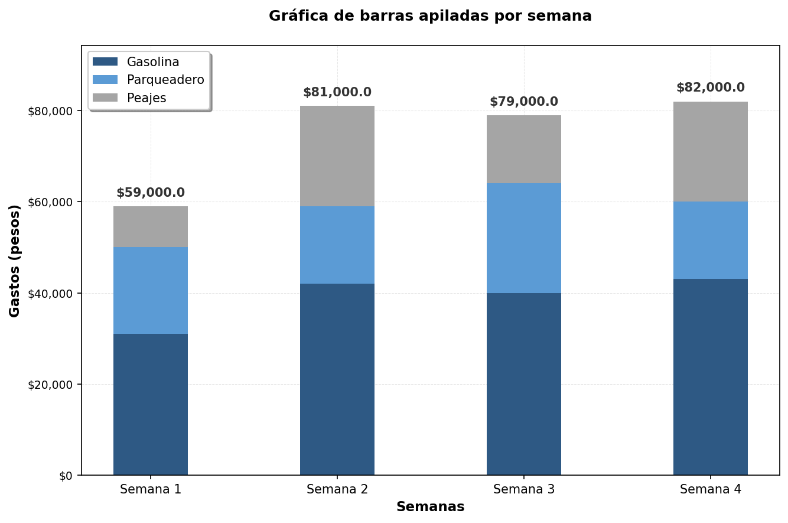
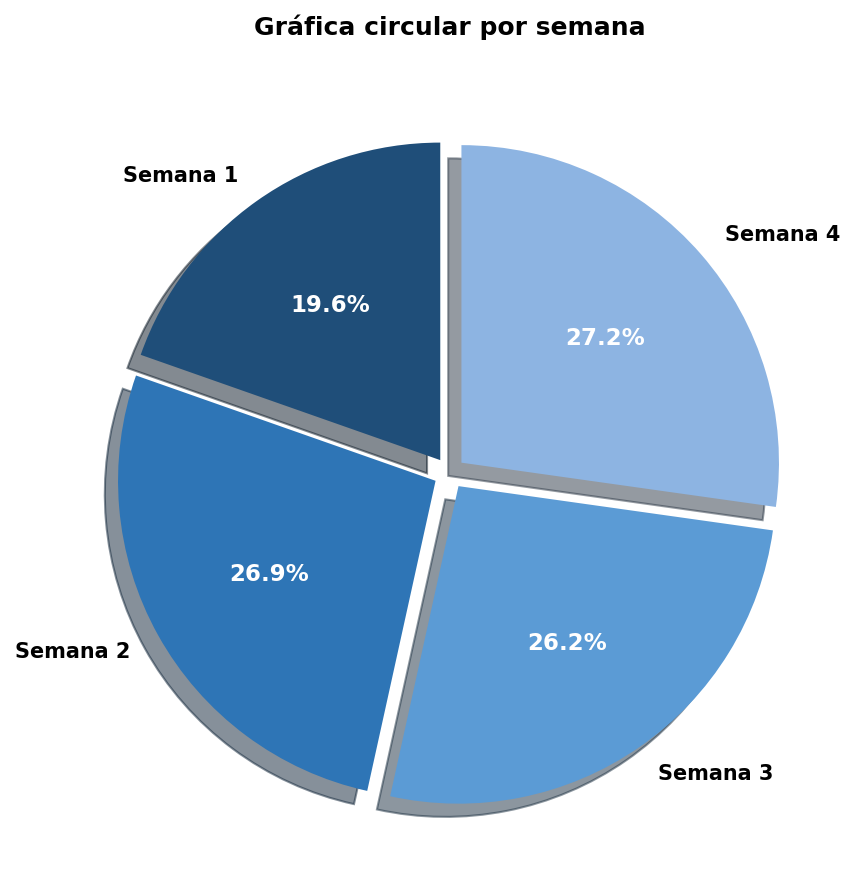

---
output:
  html_document: default
  word_document: default
  pdf_document:
    keep_tex: true
    extra_dependencies: ["graphicx", "float", "tikz", "xcolor", "colortbl", "array"]

# Metadatos ICFES
icfes:
  competencia: interpretacion_representacion
  nivel_dificultad: 2
  contenido:
    categoria: estadistica
    tipo: generico
  contexto: familiar
  eje_axial: eje3
  componente: aleatorio
---

```{r setup, include=FALSE}
# Configuración para todos los formatos de salida
Sys.setlocale(category = "LC_NUMERIC", locale = "C")
options(OutDec = ".")

# Configurar el motor LaTeX globalmente
options(tikzLatex = "pdflatex")
options(tikzXelatex = FALSE)
options(tikzLatexPackages = c(
  "\\usepackage{tikz}",
  "\\usepackage{colortbl}",
  "\\usepackage{xcolor}",
  "\\usepackage{graphicx}",
  "\\usepackage{float}",
  "\\usepackage{array}"
))

library(exams)
library(reticulate)
library(digest)
library(testthat)
library(knitr)

typ <- match_exams_device()
options(scipen = 999)
knitr::opts_chunk$set(
  warning = FALSE,
  message = FALSE,
  fig.showtext = FALSE,
  fig.cap = "",
  fig.keep = 'all',
  dev = c("png", "pdf"),
  dpi = 150,
  fig.pos = "H"
)

# Establecer semilla aleatoria
set.seed(sample(1:100000, 1))
```

```{r generar_datos, message=FALSE, warning=FALSE, results='asis'}
options(OutDec = ".")

# Función para generar datos aleatorios del ejercicio
generar_datos <- function() {
  # Aleatorización de contextos de gastos
  contextos_gastos <- list(
    list(vehiculo = "carro", categorias = c("Gasolina", "Parqueadero", "Peajes")),
    list(vehiculo = "motocicleta", categorias = c("Gasolina", "Parqueadero", "Mantenimiento")),
    list(vehiculo = "vehículo", categorias = c("Combustible", "Estacionamiento", "Peajes")),
    list(vehiculo = "automóvil", categorias = c("Gasolina", "Parqueo", "Peajes"))
  )
  contexto_sel <- sample(contextos_gastos, 1)[[1]]
  
  # Generar gastos aleatorios para 4 semanas
  # Rangos realistas para cada categoría
  rangos_gastos <- list(
    gasolina = c(25000, 45000),
    parqueadero = c(15000, 30000),
    peajes = c(8000, 25000)
  )
  
  gastos_semanas <- list()
  for(semana in 1:4) {
    gastos_semanas[[semana]] <- list(
      gasolina = sample(seq(rangos_gastos$gasolina[1], rangos_gastos$gasolina[2], 1000), 1),
      parqueadero = sample(seq(rangos_gastos$parqueadero[1], rangos_gastos$parqueadero[2], 1000), 1),
      peajes = sample(seq(rangos_gastos$peajes[1], rangos_gastos$peajes[2], 1000), 1)
    )
  }
  
  # Calcular totales por semana y por categoría
  totales_semana <- sapply(gastos_semanas, function(s) sum(unlist(s)))
  totales_categoria <- list(
    gasolina = sum(sapply(gastos_semanas, function(s) s$gasolina)),
    parqueadero = sum(sapply(gastos_semanas, function(s) s$parqueadero)),
    peajes = sum(sapply(gastos_semanas, function(s) s$peajes))
  )
  
  return(list(
    contexto = contexto_sel,
    gastos_semanas = gastos_semanas,
    totales_semana = totales_semana,
    totales_categoria = totales_categoria
  ))
}

# Generar datos para este ejercicio
datos <- generar_datos()

# Formatear números sin notación científica
formatear_numero <- function(num) {
  formatC(num, format = "d", big.mark = ".", decimal.mark = ",")
}

# Validaciones matemáticas
test_that("Los datos generados son coherentes", {
  expect_true(length(datos$gastos_semanas) == 4)
  expect_true(all(datos$totales_semana > 0))
  expect_true(sum(unlist(datos$totales_categoria)) == sum(datos$totales_semana))
})

# Test de diversidad de versiones
test_that("Prueba de diversidad de versiones", {
  versiones <- list()
  for(i in 1:1000) {
    datos_test <- generar_datos()
    versiones[[i]] <- digest::digest(datos_test)
  }
  
  n_versiones_unicas <- length(unique(versiones))
  expect_true(n_versiones_unicas >= 300,
              info = paste("Solo se generaron", n_versiones_unicas,
                          "versiones únicas. Se requieren al menos 300."))
})
```

```{r crear_tabla_datos, message=FALSE, warning=FALSE, results='asis'}
# Crear tabla de datos usando TikZ simplificado
tabla_gastos <- c(
  "\\begin{tikzpicture}",
  "\\node[inner sep=0pt] {",
  "  \\begin{tabular}{|c|c|c|c|}",
  "    \\hline",
  "    \\textbf{} & \\textbf{Gasolina} & \\textbf{Parqueadero} & \\textbf{Peajes} \\\\",
  "    \\hline",
  paste0("    \\textbf{Semana 1} & \\$", formatear_numero(datos$gastos_semanas[[1]]$gasolina), " & \\$", formatear_numero(datos$gastos_semanas[[1]]$parqueadero), " & \\$", formatear_numero(datos$gastos_semanas[[1]]$peajes), " \\\\"),
  "    \\hline",
  paste0("    \\textbf{Semana 2} & \\$", formatear_numero(datos$gastos_semanas[[2]]$gasolina), " & \\$", formatear_numero(datos$gastos_semanas[[2]]$parqueadero), " & \\$", formatear_numero(datos$gastos_semanas[[2]]$peajes), " \\\\"),
  "    \\hline",
  paste0("    \\textbf{Semana 3} & \\$", formatear_numero(datos$gastos_semanas[[3]]$gasolina), " & \\$", formatear_numero(datos$gastos_semanas[[3]]$parqueadero), " & \\$", formatear_numero(datos$gastos_semanas[[3]]$peajes), " \\\\"),
  "    \\hline",
  paste0("    \\textbf{Semana 4} & \\$", formatear_numero(datos$gastos_semanas[[4]]$gasolina), " & \\$", formatear_numero(datos$gastos_semanas[[4]]$parqueadero), " & \\$", formatear_numero(datos$gastos_semanas[[4]]$peajes), " \\\\"),
  "    \\hline",
  "  \\end{tabular}",
  "};",
  "\\end{tikzpicture}"
)
```

```{r preparar_datos_graficas, message=FALSE, warning=FALSE}
# Preparar datos para las gráficas con Python

# Opción A: Gráfica circular por categoría (porcentajes del total)
total_general <- sum(unlist(datos$totales_categoria))
porc_gasolina <- round((datos$totales_categoria$gasolina / total_general) * 100, 1)
porc_parqueadero <- round((datos$totales_categoria$parqueadero / total_general) * 100, 1)
porc_peajes <- round((datos$totales_categoria$peajes / total_general) * 100, 1)

# Opción C: Gráfica circular por semana (porcentajes por semana)
porc_semanas <- round((datos$totales_semana / sum(datos$totales_semana)) * 100, 1)

# Determinar cuál opción es la correcta (B - barras apiladas por semana)
respuesta_correcta <- 2  # Opción B
solucion <- c(0, 1, 0, 0)

# Detectar formato de salida para gráficas
typ <- match_exams_device()
es_pdf <- (typ == "pdf")

# Detectar formatos que requieren archivos PNG
formatos_png <- c("pdf", "pandoc", "docx", "odt")
usar_png <- (typ %in% formatos_png)

# Detectar formatos HTML/Moodle que usan plt.show()
formatos_moodle <- c("exams2moodle", "exams2qti12", "exams2qti21", "exams2openolat")
es_html_moodle <- (match_exams_call() %in% formatos_moodle) || (typ == "html")
```

```{python generar_graficas_hibridas, echo=FALSE, results='hide'}
import matplotlib.pyplot as plt
import numpy as np
import os

# Configurar matplotlib según el formato
es_pdf_py = r.es_pdf
if es_pdf_py:
    plt.ioff()  # Modo no interactivo para PDF
    plt.rcParams['font.size'] = 10
else:
    plt.ion()   # Modo interactivo para HTML

# Obtener datos de R
gastos_semanas = r.datos['gastos_semanas']
totales_semana = r.datos['totales_semana']
porc_gasolina = r.porc_gasolina
porc_parqueadero = r.porc_parqueadero
porc_peajes = r.porc_peajes
porc_semanas = r.porc_semanas

# Preparar datos
categorias = ['Gasolina', 'Parqueadero', 'Peajes']
semanas = ['Semana 1', 'Semana 2', 'Semana 3', 'Semana 4']
gasolina_por_semana = [gastos_semanas[i]['gasolina'] for i in range(4)]
parqueadero_por_semana = [gastos_semanas[i]['parqueadero'] for i in range(4)]
peajes_por_semana = [gastos_semanas[i]['peajes'] for i in range(4)]

# Paletas de colores profesionales
colores_categorias = ['#2E5984', '#5B9BD5', '#A5A5A5']
colores_semanas = ['#1F4E79', '#2E75B6', '#5B9BD5', '#8DB4E2']

# Generar archivos PNG para PDF, pandoc, docx, etc.
usar_png_py = r.usar_png
if usar_png_py:
    # GRÁFICA A: Circular por categoría
    fig_a, ax_a = plt.subplots(figsize=(7, 6))
    porcentajes_cat = [porc_gasolina, porc_parqueadero, porc_peajes]
    wedges, texts, autotexts = ax_a.pie(porcentajes_cat, labels=categorias, autopct='%1.1f%%',
                                       colors=colores_categorias, startangle=90,
                                       explode=(0.05, 0.05, 0.05), shadow=True,
                                       textprops={'fontsize': 10, 'fontweight': 'bold'})
    for autotext in autotexts:
        autotext.set_color('white')
        autotext.set_fontweight('bold')
        autotext.set_fontsize(11)
    ax_a.set_title('Gráfica circular por categoría', fontsize=12, fontweight='bold', pad=20)
    plt.tight_layout()
    plt.savefig('grafica_a.png', dpi=150, bbox_inches='tight', facecolor='white')
    plt.close()

    # GRÁFICA B: Barras apiladas por semana
    fig_b, ax_b = plt.subplots(figsize=(9, 6))
    x = np.arange(len(semanas))
    width = 0.4
    p1 = ax_b.bar(x, gasolina_por_semana, width, label='Gasolina', color=colores_categorias[0])
    p2 = ax_b.bar(x, parqueadero_por_semana, width, bottom=gasolina_por_semana,
                  label='Parqueadero', color=colores_categorias[1])
    p3 = ax_b.bar(x, peajes_por_semana, width,
                  bottom=np.array(gasolina_por_semana) + np.array(parqueadero_por_semana),
                  label='Peajes', color=colores_categorias[2])
    max_total = max(totales_semana)
    for i, total in enumerate(totales_semana):
        ax_b.text(i, total + max_total * 0.02, f'${total:,}', ha='center', va='bottom',
                  fontweight='bold', fontsize=10, color='#333333')
    ax_b.set_xlabel('Semanas', fontsize=11, fontweight='bold')
    ax_b.set_ylabel('Gastos (pesos)', fontsize=11, fontweight='bold')
    ax_b.set_title('Gráfica de barras apiladas por semana', fontsize=12, fontweight='bold', pad=20)
    ax_b.set_xticks(x)
    ax_b.set_xticklabels(semanas, fontsize=10)
    ax_b.legend(loc='upper left', frameon=True, fancybox=True, shadow=True, fontsize=10)
    ax_b.yaxis.set_major_formatter(plt.FuncFormatter(lambda x, p: f'${x:,.0f}'))
    ax_b.tick_params(axis='y', labelsize=9)
    ax_b.grid(True, alpha=0.3, linestyle='--', linewidth=0.5)
    ax_b.set_axisbelow(True)
    ax_b.set_ylim(0, max_total * 1.15)
    plt.tight_layout()
    plt.savefig('grafica_b.png', dpi=150, bbox_inches='tight', facecolor='white')
    plt.close()

    # GRÁFICA C: Circular por semana
    fig_c, ax_c = plt.subplots(figsize=(7, 6))
    wedges, texts, autotexts = ax_c.pie(porc_semanas, labels=semanas, autopct='%1.1f%%',
                                       colors=colores_semanas, startangle=90,
                                       explode=(0.05, 0.05, 0.05, 0.05), shadow=True,
                                       textprops={'fontsize': 10, 'fontweight': 'bold'})
    for autotext in autotexts:
        autotext.set_color('white')
        autotext.set_fontweight('bold')
        autotext.set_fontsize(11)
    ax_c.set_title('Gráfica circular por semana', fontsize=12, fontweight='bold', pad=20)
    plt.tight_layout()
    plt.savefig('grafica_c.png', dpi=150, bbox_inches='tight', facecolor='white')
    plt.close()

    # GRÁFICA D: Barras agrupadas por categoría
    fig_d, ax_d = plt.subplots(figsize=(10, 6))
    x = np.arange(len(categorias))
    width = 0.15
    rects1 = ax_d.bar(x - 1.5*width, [gasolina_por_semana[0], parqueadero_por_semana[0], peajes_por_semana[0]],
                      width, label='Semana 1', color=colores_semanas[0], edgecolor='white', linewidth=0.5)
    rects2 = ax_d.bar(x - 0.5*width, [gasolina_por_semana[1], parqueadero_por_semana[1], peajes_por_semana[1]],
                      width, label='Semana 2', color=colores_semanas[1], edgecolor='white', linewidth=0.5)
    rects3 = ax_d.bar(x + 0.5*width, [gasolina_por_semana[2], parqueadero_por_semana[2], peajes_por_semana[2]],
                      width, label='Semana 3', color=colores_semanas[2], edgecolor='white', linewidth=0.5)
    rects4 = ax_d.bar(x + 1.5*width, [gasolina_por_semana[3], parqueadero_por_semana[3], peajes_por_semana[3]],
                      width, label='Semana 4', color=colores_semanas[3], edgecolor='white', linewidth=0.5)
    ax_d.set_xlabel('Categorías de Gasto', fontsize=11, fontweight='bold')
    ax_d.set_ylabel('Gastos (pesos)', fontsize=11, fontweight='bold')
    ax_d.set_title('Gráfica de barras agrupadas por categoría', fontsize=12, fontweight='bold', pad=20)
    ax_d.set_xticks(x)
    ax_d.set_xticklabels(categorias, fontsize=10)
    ax_d.legend(loc='upper right', frameon=True, fancybox=True, shadow=True, fontsize=10)
    ax_d.yaxis.set_major_formatter(plt.FuncFormatter(lambda x, p: f'${x:,.0f}'))
    ax_d.tick_params(axis='y', labelsize=9)
    ax_d.grid(True, alpha=0.3, linestyle='--', linewidth=0.5, axis='y')
    ax_d.set_axisbelow(True)
    max_value = max([max(gasolina_por_semana), max(parqueadero_por_semana), max(peajes_por_semana)])
    ax_d.set_ylim(0, max_value * 1.1)
    plt.tight_layout()
    plt.savefig('grafica_d.png', dpi=150, bbox_inches='tight', facecolor='white')
    plt.close()

    print("Gráficas PNG generadas para PDF/Pandoc/DOCX")
else:
    print("Modo HTML/Moodle - gráficas se mostrarán con plt.show()")
```


Question
========

La tabla muestra el registro semanal que lleva una persona de los gastos relacionados con su `r datos$contexto$vehiculo`.

```{r mostrar_tabla, echo=FALSE, results='asis'}
# Detectar formato de salida
formatos_moodle <- c("exams2moodle", "exams2qti12", "exams2qti21", "exams2openolat")
es_moodle <- (match_exams_call() %in% formatos_moodle)

if (es_moodle) {
  # Para Moodle, usar tabla HTML simple
  cat("<table border='1' style='border-collapse: collapse; margin: 0 auto;'>")
  cat("<tr><th style='padding: 8px; text-align: center; background-color: #f0f0f0;'></th>")
  cat("<th style='padding: 8px; text-align: center; background-color: #f0f0f0;'>Gasolina</th>")
  cat("<th style='padding: 8px; text-align: center; background-color: #f0f0f0;'>Parqueadero</th>")
  cat("<th style='padding: 8px; text-align: center; background-color: #f0f0f0;'>Peajes</th></tr>")
  
  for (i in 1:4) {
    cat("<tr>")
    cat("<td style='padding: 8px; text-align: center; font-weight: bold;'>Semana ", i, "</td>")
    cat("<td style='padding: 8px; text-align: center;'>$", formatear_numero(datos$gastos_semanas[[i]]$gasolina), "</td>")
    cat("<td style='padding: 8px; text-align: center;'>$", formatear_numero(datos$gastos_semanas[[i]]$parqueadero), "</td>")
    cat("<td style='padding: 8px; text-align: center;'>$", formatear_numero(datos$gastos_semanas[[i]]$peajes), "</td>")
    cat("</tr>")
  }
  cat("</table>")
} else {
  # Para PDF/Word, usar TikZ
  include_tikz(tabla_gastos,
               name = "tabla_gastos",
               markup = "markdown",
               format = typ,
               packages = c("tikz", "colortbl", "xcolor"),
               width = "10cm")
}
```

Si la persona quiere realizar una comparación entre los gastos totales por semana, ¿cuál de las siguientes gráficas le permite hacer esto directamente?

Answerlist
----------

```{r opcion_a, echo=FALSE, results='asis'}
if (usar_png) {
  # Para PDF, pandoc, docx - usar PNG con justificación izquierda
  if (es_html_moodle) {
    cat("- **Gráfica circular por categoría:** ")
  } else {
    cat("- **Gráfica circular por categoría:** \\begin{flushleft}\\includegraphics[width=0.7\\textwidth]{grafica_a.png}\\end{flushleft}")
  }
} else {
  # Para HTML - usar plt.show()
  cat("- <br/>")
}
```

```{python grafica_a_show, echo=FALSE, results='hide'}
import matplotlib.pyplot as plt
import numpy as np

# Solo mostrar si no usa PNG (solo para HTML puro)
usar_png_py = r.usar_png
if not usar_png_py:
    # Obtener datos de R
    porc_gasolina = r.porc_gasolina
    porc_parqueadero = r.porc_parqueadero
    porc_peajes = r.porc_peajes

    # Gráfica circular por categoría
    fig, ax = plt.subplots(figsize=(7, 6))
    porcentajes_cat = [porc_gasolina, porc_parqueadero, porc_peajes]
    categorias = ['Gasolina', 'Parqueadero', 'Peajes']
    colores_cat = ['#2E5984', '#5B9BD5', '#A5A5A5']

    wedges, texts, autotexts = ax.pie(porcentajes_cat, labels=categorias, autopct='%1.1f%%',
                                     colors=colores_cat, startangle=90,
                                     explode=(0.05, 0.05, 0.05), shadow=True,
                                     textprops={'fontsize': 10, 'fontweight': 'bold'})

    for autotext in autotexts:
        autotext.set_color('white')
        autotext.set_fontweight('bold')
        autotext.set_fontsize(11)

    ax.set_title('Gráfica circular por categoría', fontsize=12, fontweight='bold', pad=20)
    plt.tight_layout()
    plt.show()
```

```{r opcion_b, echo=FALSE, results='asis'}
if (usar_png) {
  # Para PDF, pandoc, docx - usar PNG con justificación izquierda
  if (es_html_moodle) {
    cat("- **Gráfica de barras apiladas por semana:** ")
  } else {
    cat("- **Gráfica de barras apiladas por semana:** \\begin{flushleft}\\includegraphics[width=0.8\\textwidth]{grafica_b.png}\\end{flushleft}")
  }
} else {
  # Para HTML - usar plt.show()
  cat("- <br/>")
}
```

```{python grafica_b_show, echo=FALSE, results='hide'}
import matplotlib.pyplot as plt
import numpy as np

# Solo mostrar si no usa PNG (solo para HTML puro)
usar_png_py = r.usar_png
if not usar_png_py:
    # Obtener datos de R
    gastos_semanas = r.datos['gastos_semanas']
    totales_semana = r.datos['totales_semana']

    # Preparar datos
    semanas = ['Semana 1', 'Semana 2', 'Semana 3', 'Semana 4']
    gasolina_por_semana = [gastos_semanas[i]['gasolina'] for i in range(4)]
    parqueadero_por_semana = [gastos_semanas[i]['parqueadero'] for i in range(4)]
    peajes_por_semana = [gastos_semanas[i]['peajes'] for i in range(4)]

    # Gráfica de barras apiladas por semana
    fig, ax = plt.subplots(figsize=(9, 6))
    x = np.arange(len(semanas))
    width = 0.4
    colores_profesionales = ['#2E5984', '#5B9BD5', '#A5A5A5']

    p1 = ax.bar(x, gasolina_por_semana, width, label='Gasolina', color=colores_profesionales[0])
    p2 = ax.bar(x, parqueadero_por_semana, width, bottom=gasolina_por_semana,
                label='Parqueadero', color=colores_profesionales[1])
    p3 = ax.bar(x, peajes_por_semana, width,
                bottom=np.array(gasolina_por_semana) + np.array(parqueadero_por_semana),
                label='Peajes', color=colores_profesionales[2])

    max_total = max(totales_semana)
    for i, total in enumerate(totales_semana):
        ax.text(i, total + max_total * 0.02, f'${total:,}', ha='center', va='bottom',
                fontweight='bold', fontsize=10, color='#333333')

    ax.set_xlabel('Semanas', fontsize=11, fontweight='bold')
    ax.set_ylabel('Gastos (pesos)', fontsize=11, fontweight='bold')
    ax.set_title('Gráfica de barras apiladas por semana', fontsize=12, fontweight='bold', pad=20)
    ax.set_xticks(x)
    ax.set_xticklabels(semanas, fontsize=10)
    ax.legend(loc='upper left', frameon=True, fancybox=True, shadow=True, fontsize=10)
    ax.yaxis.set_major_formatter(plt.FuncFormatter(lambda x, p: f'${x:,.0f}'))
    ax.tick_params(axis='y', labelsize=9)
    ax.grid(True, alpha=0.3, linestyle='--', linewidth=0.5)
    ax.set_axisbelow(True)
    ax.set_ylim(0, max_total * 1.15)
    plt.tight_layout()
    plt.show()
```

```{r opcion_c, echo=FALSE, results='asis'}
if (usar_png) {
  # Para PDF, pandoc, docx - usar PNG con justificación izquierda
  if (es_html_moodle) {
    cat("- **Gráfica circular por semana:** ")
  } else {
    cat("- **Gráfica circular por semana:** \\begin{flushleft}\\includegraphics[width=0.7\\textwidth]{grafica_c.png}\\end{flushleft}")
  }
} else {
  # Para HTML - usar plt.show()
  cat("- <br/>")
}
```

```{python grafica_c_show, echo=FALSE, results='hide'}
import matplotlib.pyplot as plt

# Solo mostrar si no usa PNG (solo para HTML puro)
usar_png_py = r.usar_png
if not usar_png_py:
    # Obtener datos de R
    porc_semanas = r.porc_semanas

    # Gráfica circular por semana
    fig, ax = plt.subplots(figsize=(7, 6))
    semanas = ['Semana 1', 'Semana 2', 'Semana 3', 'Semana 4']
    colores_sem = ['#1F4E79', '#2E75B6', '#5B9BD5', '#8DB4E2']

    wedges, texts, autotexts = ax.pie(porc_semanas, labels=semanas, autopct='%1.1f%%',
                                     colors=colores_sem, startangle=90,
                                     explode=(0.05, 0.05, 0.05, 0.05), shadow=True,
                                     textprops={'fontsize': 10, 'fontweight': 'bold'})

    for autotext in autotexts:
        autotext.set_color('white')
        autotext.set_fontweight('bold')
        autotext.set_fontsize(11)

    ax.set_title('Gráfica circular por semana', fontsize=12, fontweight='bold', pad=20)
    plt.tight_layout()
    plt.show()
```

```{r opcion_d, echo=FALSE, results='asis'}
if (usar_png) {
  # Para PDF, pandoc, docx - usar PNG con justificación izquierda
  if (es_html_moodle) {
    cat("- **Gráfica de barras agrupadas por categoría:** ")
  } else {
    cat("- **Gráfica de barras agrupadas por categoría:** \\begin{flushleft}\\includegraphics[width=0.9\\textwidth]{grafica_d.png}\\end{flushleft}")
  }
} else {
  # Para HTML - usar plt.show()
  cat("- <br/>")
}
```

```{python grafica_d_show, echo=FALSE, results='hide'}
import matplotlib.pyplot as plt
import numpy as np

# Solo mostrar si no usa PNG (solo para HTML puro)
usar_png_py = r.usar_png
if not usar_png_py:
    # Obtener datos de R
    gastos_semanas = r.datos['gastos_semanas']

    # Preparar datos
    categorias = ['Gasolina', 'Parqueadero', 'Peajes']
    gasolina_por_semana = [gastos_semanas[i]['gasolina'] for i in range(4)]
    parqueadero_por_semana = [gastos_semanas[i]['parqueadero'] for i in range(4)]
    peajes_por_semana = [gastos_semanas[i]['peajes'] for i in range(4)]

    # Gráfica de barras agrupadas por categoría
    fig, ax = plt.subplots(figsize=(10, 6))
    x = np.arange(len(categorias))
    width = 0.15
    colores_semanas = ['#1F4E79', '#2E75B6', '#5B9BD5', '#8DB4E2']

    rects1 = ax.bar(x - 1.5*width, [gasolina_por_semana[0], parqueadero_por_semana[0], peajes_por_semana[0]],
                    width, label='Semana 1', color=colores_semanas[0], edgecolor='white', linewidth=0.5)
    rects2 = ax.bar(x - 0.5*width, [gasolina_por_semana[1], parqueadero_por_semana[1], peajes_por_semana[1]],
                    width, label='Semana 2', color=colores_semanas[1], edgecolor='white', linewidth=0.5)
    rects3 = ax.bar(x + 0.5*width, [gasolina_por_semana[2], parqueadero_por_semana[2], peajes_por_semana[2]],
                    width, label='Semana 3', color=colores_semanas[2], edgecolor='white', linewidth=0.5)
    rects4 = ax.bar(x + 1.5*width, [gasolina_por_semana[3], parqueadero_por_semana[3], peajes_por_semana[3]],
                    width, label='Semana 4', color=colores_semanas[3], edgecolor='white', linewidth=0.5)

    ax.set_xlabel('Categorías de Gasto', fontsize=11, fontweight='bold')
    ax.set_ylabel('Gastos (pesos)', fontsize=11, fontweight='bold')
    ax.set_title('Gráfica de barras agrupadas por categoría', fontsize=12, fontweight='bold', pad=20)
    ax.set_xticks(x)
    ax.set_xticklabels(categorias, fontsize=10)
    ax.legend(loc='upper right', frameon=True, fancybox=True, shadow=True, fontsize=10)
    ax.yaxis.set_major_formatter(plt.FuncFormatter(lambda x, p: f'${x:,.0f}'))
    ax.tick_params(axis='y', labelsize=9)
    ax.grid(True, alpha=0.3, linestyle='--', linewidth=0.5, axis='y')
    ax.set_axisbelow(True)
    max_value = max([max(gasolina_por_semana), max(parqueadero_por_semana), max(peajes_por_semana)])
    ax.set_ylim(0, max_value * 1.1)
    plt.tight_layout()
    plt.show()
```

Solution
========

Para resolver este problema, necesitamos identificar qué tipo de gráfica permite comparar directamente los **gastos totales por semana**.

### Análisis de los datos

Primero, calculemos los gastos totales por semana:

* **Semana 1:** $`r formatear_numero(datos$gastos_semanas[[1]]$gasolina)` + $`r formatear_numero(datos$gastos_semanas[[1]]$parqueadero)` + $`r formatear_numero(datos$gastos_semanas[[1]]$peajes)` = $`r formatear_numero(datos$totales_semana[1])`
* **Semana 2:** $`r formatear_numero(datos$gastos_semanas[[2]]$gasolina)` + $`r formatear_numero(datos$gastos_semanas[[2]]$parqueadero)` + $`r formatear_numero(datos$gastos_semanas[[2]]$peajes)` = $`r formatear_numero(datos$totales_semana[2])`
* **Semana 3:** $`r formatear_numero(datos$gastos_semanas[[3]]$gasolina)` + $`r formatear_numero(datos$gastos_semanas[[3]]$parqueadero)` + $`r formatear_numero(datos$gastos_semanas[[3]]$peajes)` = $`r formatear_numero(datos$totales_semana[3])`
* **Semana 4:** $`r formatear_numero(datos$gastos_semanas[[4]]$gasolina)` + $`r formatear_numero(datos$gastos_semanas[[4]]$parqueadero)` + $`r formatear_numero(datos$gastos_semanas[[4]]$peajes)` = $`r formatear_numero(datos$totales_semana[4])`

### Análisis de cada opción

**Gráfica circular por categoría:** 

* Muestra la proporción de cada tipo de gasto en el total general
* NO permite comparar gastos totales por semana

**Gráfica de barras apiladas por semana:** 

* Cada barra representa una semana
* La altura total de cada barra muestra el gasto total de esa semana
* Permite comparar directamente los gastos totales entre semanas
* **Esta es la respuesta correcta**

**Gráfica circular por semana:** 

* Muestra la proporción de gastos de cada semana respecto al total del mes
* No muestra los valores absolutos de cada semana claramente

**Gráfica de barras agrupadas por categoría:** 

* Agrupa las barras por tipo de gasto (gasolina, parqueadero, peajes)
* Dificulta la comparación de gastos totales por semana

### Conclusión

La **Opción "gráfica de barras apiladas por semana"** es la única que permite comparar directamente los gastos totales por semana, ya que la altura de cada barra representa el gasto total de cada semana.

Answerlist
----------
- Falso
- Verdadero
- Falso
- Falso

Meta-information
================
exname: gastos_carro_graficas_comparacion
extype: schoice
exsolution: 0100
exshuffle: TRUE
exsection: Estadística|Gráficas|Interpretación|Comparación de datos
exextra[Type]: Interpretación y representación
exextra[Level]: 2
exextra[Language]: es
exextra[Course]: Matemáticas ICFES
