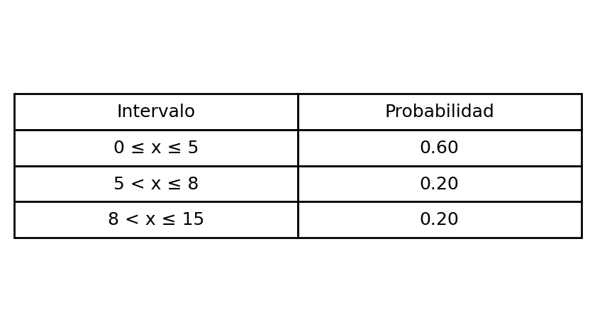
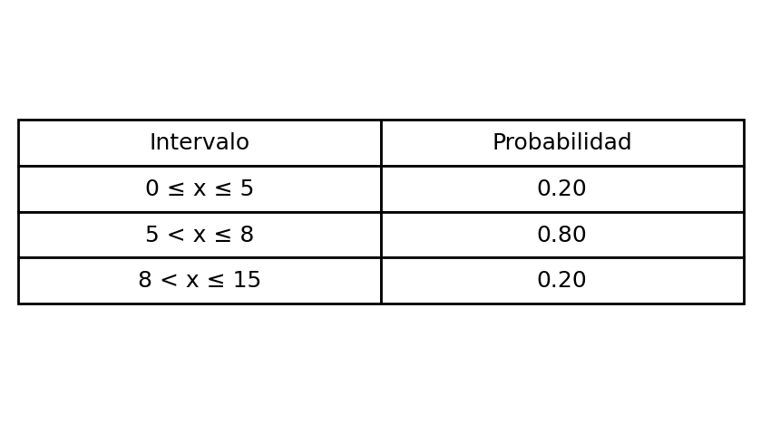

---
output:
  html_document: default
  word_document: default
  pdf_document:
    keep_tex: true
    extra_dependencies: ["graphicx", "float", "booktabs", "array", "tikz", "pgfplots"]
# Metadatos ICFES
icfes:
  competencia: [interpretacion_representacion]
  nivel_dificultad: 2
  contenido:
    categoria: estadistica
    tipo: generico
  contexto: matematico
  eje_axial: eje3
  componente: aleatorio
---

```{r setup, include=FALSE}
# Configuración global siguiendo ejemplos funcionales
Sys.setlocale(category = "LC_NUMERIC", locale = "C")
options(OutDec = "."); options(scipen = 999); options(digits = 10)

# Motor LaTeX/TikZ validado
options(tikzLatex = "pdflatex")
options(tikzLatexPackages = c(
  "\\usepackage{tikz}",
  "\\usepackage{colortbl}",
  "\\usepackage{pgfplots}",
  "\\usepackage{booktabs}",
  "\\usepackage{array}"
))

library(exams); library(knitr); library(testthat); library(digest); library(reticulate)
typ <- match_exams_device()
knitr::opts_chunk$set(warning=FALSE, message=FALSE, fig.keep='all', dev=c("png","pdf"), dpi=150)

# Semilla aleatoria no fija (estándar del proyecto)
set.seed(sample(1:100000, 1))
```

```{r datos, echo=FALSE, results='hide'}
# Generación de parámetros aleatorios (diversidad relevante)
# Intervalos enteros no solapados
izq_ancho <- sample(4:6, 1)
centro_ancho <- sample(3:5, 1)
a <- 0
b <- a + izq_ancho
c <- b + centro_ancho
d <- c + sample(4:7, 1)

# Probabilidades en tres regiones: p, q, p con p = (1-q)/2
p_opciones <- c(0.20, 0.22, 0.24, 0.26, 0.27, 0.28, 0.30)
p <- sample(p_opciones, 1)
q <- 1 - 2*p

# Formato con 2 decimales para impresión (manteniendo cálculo exacto en pruebas)
fmt <- function(x) sprintf("%.2f", x)

# Construcción de intervalos en LaTeX (sin Unicode)
int1 <- paste0("$", a, " \\le x \\le ", b, "$")
int2 <- paste0("$", b, " < x \\le ", c, "$")
int3 <- paste0("$", c, " < x \\le ", d, "$")

# Versiones de los intervalos para HTML plano (sin LaTeX) — útil en Moodle/HTML
int1_txt <- paste0(a, " \u2264 x \u2264 ", b)
int2_txt <- paste0(b, " < x \u2264 ", c)
int3_txt <- paste0(c, " < x \u2264 ", d)

# Tablas de opciones (cada opción es una lista con probabilidades numéricas)
op_corr <- list(vals = c(p, q, p), etiqueta = "correcta")
# Distractor 1: acumuladas (error de interpretación)
op_d1 <- list(vals = c(p, p+q, 1.00), etiqueta = "acumuladas")
# Distractor 2: intercambiar central e izquierda
op_d2 <- list(vals = c(q, p, p), etiqueta = "swap_izq_centro")
# Distractor 3: central como 1 - p (confundir suma de colas)
op_d3 <- list(vals = c(p, 1-p, p), etiqueta = "central_mal")

# Armar y mezclar opciones asegurando unicidad textual
opciones <- list(op_corr, op_d1, op_d2, op_d3)
# Convertir a cadenas para comprobar unicidad
as_key <- function(v) paste(sprintf("%.2f", v), collapse="|")
stopifnot(length(unique(vapply(opciones, function(o) as_key(o$vals), ""))) == 4)

# Mezcla aleatoria
set.seed(sample(1:100000,1))
idx <- sample(1:4)
opciones_mezcladas <- opciones[idx]
indice_correcto <- which(vapply(opciones_mezcladas, function(o) o$etiqueta, "") == "correcta")
solucion_vec <- rep(0, 4); solucion_vec[indice_correcto] <- 1

# Función para generar tabla Markdown por opción (patrón simple, robusto en todos los formatos)
md_table <- function(vals){
  filas <- c(
    paste0("| Intervalo | Probabilidad |"),
    "|---|---|",
    paste0("| ", int1, " | ", fmt(vals[1]), " |"),
    paste0("| ", int2, " | ", fmt(vals[2]), " |"),
    paste0("| ", int3, " | ", fmt(vals[3]), " |")
  )
  paste(filas, collapse = "\n")
}

# Tablas HTML y LaTeX como strings (para control fino por formato de salida)
html_table <- function(vals){
  sprintf('<table><thead><tr><th>Intervalo</th><th>Probabilidad</th></tr></thead><tbody><tr><td>%s</td><td>%s</td></tr><tr><td>%s</td><td>%s</td></tr><tr><td>%s</td><td>%s</td></tr></tbody></table>',
          int1_txt, fmt(vals[1]), int2_txt, fmt(vals[2]), int3_txt, fmt(vals[3]))
}

# latex_table <- function(vals){
#   c("\\begin{tabular}{l c}",
#     "\\hline",
#     "Intervalo & Probabilidad \\\",
#     "\\hline",
#     sprintf("%s & %s \\\", int1, fmt(vals[1])),
#     sprintf("%s & %s \\\", int2, fmt(vals[2])),
#     sprintf("%s & %s \\\", int3, fmt(vals[3])),
#     "\\hline",
#     "\\end{tabular}")
# }


# Render de tablas a strings (para Answerlist)
op_md <- lapply(opciones_mezcladas, function(o) md_table(o$vals))

# Tests básicos (siguiendo reglas del proyecto)
# 1) La opción correcta suma 1 (con tolerancia de redondeo)
test_that("Suma de probabilidades correcta", {
  expect_true(abs(sum(op_corr$vals) - 1) < 1e-9)
})
# 2) Los intervalos están ordenados y no se solapan
test_that("Orden de intervalos válido", {
  expect_true(a < b && b < c && c < d)
})
# 3) Diversidad mínima de versiones (smoke test rápido)
test_that("Diversidad mínima (smoke)", {
  # Generar 50 versiones y verificar al menos 6 únicas (p cambia entre 7 valores)
  vers <- replicate(50, {
    set.seed(sample(1:100000,1))
    p <- sample(p_opciones, 1); q <- 1 - 2*p
    paste(sprintf("%.2f", c(p,q,p)), collapse = "|")
  })
  expect_true(length(unique(vers)) >= 6)
})
```
```{python tablas_python}
# Generación de tablas como imágenes PNG usando matplotlib (reticulate)
import matplotlib
matplotlib.use("Agg")
import matplotlib.pyplot as plt

# Acceder a variables de R con reticulate: r.<nombre>
intervals = [r.int1_txt, r.int2_txt, r.int3_txt]

# Helpers
def save_table_png(filename, intervals, probs):
    fig, ax = plt.subplots(figsize=(4.0, 2.2), dpi=200)
    ax.axis('off')
    cell_text = [
        [intervals[0], f"{probs[0]:.2f}"],
        [intervals[1], f"{probs[1]:.2f}"],
        [intervals[2], f"{probs[2]:.2f}"],
    ]
    table = ax.table(cellText=cell_text,
                     colLabels=["Intervalo", "Probabilidad"],
                     loc='center', cellLoc='center')
    table.auto_set_font_size(False)
    table.set_fontsize(9)
    table.scale(1.1, 1.2)
    fig.tight_layout(pad=0.2)
    fig.savefig(filename, transparent=True, bbox_inches='tight')
    plt.close(fig)

# Opción A (correcta)
save_table_png("tabla_opcion_a.png", intervals, [r.p, r.q, r.p])
# Distractores
save_table_png("tabla_opcion_b.png", intervals, [r.p, r.p + r.q, 1.0])
save_table_png("tabla_opcion_c.png", intervals, [r.q, r.p, r.p])
save_table_png("tabla_opcion_d.png", intervals, [r.p, 1.0 - r.p, r.p])
```


```{r tikz_bell, echo=FALSE, results='asis'}
# Curva tipo campana con sombreado de intervalos (TikZ puro, compatible)
mu <- (b + c)/2
sigma <- max((c - b)/2, 0.8)

f <- function(x) exp(-((x - mu)^2) / (2 * sigma^2))
x_all <- seq(a, d, length.out = 120)
y_all <- f(x_all)

seg_left  <- x_all[x_all <= b];               y_left  <- f(seg_left)
seg_mid   <- x_all[x_all >= b & x_all <= c];  y_mid   <- f(seg_mid)
seg_right <- x_all[x_all >= c];               y_right <- f(seg_right)

fmt_coords <- function(xs, ys) paste(sprintf("(%.3f,%.3f)", xs, ys), collapse = " ")
curve_coords_all <- fmt_coords(x_all, y_all)
coords_left  <- fmt_coords(seg_left,  y_left)
coords_mid   <- fmt_coords(seg_mid,   y_mid)
coords_right <- fmt_coords(seg_right, y_right)

m1 <- (a + b)/2; m2 <- (b + c)/2; m3 <- (c + d)/2

# Construir TikZ
etik <- function(x) sprintf("%.2f", x)
tikz_code <- sprintf("\n\\begin{tikzpicture}[x=0.5cm,y=2cm]\n  \\draw[thick, blue] plot[smooth] coordinates { %s };\n  \\fill[blue!20] (%.3f,0) -- plot[smooth] coordinates { %s } -- (%.3f,0) -- cycle;\n  \\fill[blue!40] (%.3f,0) -- plot[smooth] coordinates { %s } -- (%.3f,0) -- cycle;\n  \\fill[blue!20] (%.3f,0) -- plot[smooth] coordinates { %s } -- (%.3f,0) -- cycle;\n  \\node at (%.3f,-0.08) {\\small $\\boldsymbol{%s}$};\n  \\node at (%.3f,-0.08) {\\small $\\boldsymbol{%s}$};\n  \\node at (%.3f,-0.08) {\\small $\\boldsymbol{%s}$};\n\\end{tikzpicture}\n",
  curve_coords_all,
  a, coords_left,  b,
  b, coords_mid,   c,
  c, coords_right, d,
  m1, etik(p), m2, etik(q), m3, etik(p)
)

include_tikz(tikz_code, name = "bell_intervals", format = typ, markup = "markdown", width = "8cm")
```


Question
========

En la siguiente curva de probabilidad (distribución unimodal tipo campana) se han señalado tres intervalos consecutivos del eje x y la probabilidad de que la variable aleatoria $x$ tome valores en cada intervalo.

Con base en esa información, ¿cuál de las siguientes tablas representa correctamente la probabilidad de que $x$ tome valores en el intervalo indicado?

Para este ejercicio, los intervalos considerados son: `r int1`, `r int2` y `r int3`.

Answerlist
----------

- {width=70%}
- {width=70%}
- {width=70%}
- {width=70%}

Solution
========

La curva está dividida en tres regiones: dos colas con la misma probabilidad y una región central. Si la región central tiene probabilidad `r fmt(q)` y cada cola tiene probabilidad `r fmt(p)`, entonces la tabla correcta debe asignar:

- `r int1` → `r fmt(p)`
- `r int2` → `r fmt(q)`
- `r int3` → `r fmt(p)`

Las demás opciones son errores típicos de interpretación:

- Sumar de forma acumulada (primera fila $p$, segunda $p+q$, tercera $1$).
- Intercambiar la probabilidad central con la de un extremo.
- Suponer que la probabilidad central es $1-p$ (confundiendo la suma de ambas colas).

Answerlist
----------
- Verdadero
- Falso
- Falso
- Falso

Meta-information
================
exname: probabilidad_intervalos_curva
extype: schoice
exsolution: 1000
exshuffle: TRUE
exsection: Probabilidad|Interpretación de representaciones|Áreas bajo la curva
exextra[Type]: Interpretación y representación
exextra[Level]: 2
exextra[Language]: es
exextra[Course]: Matemáticas ICFES

