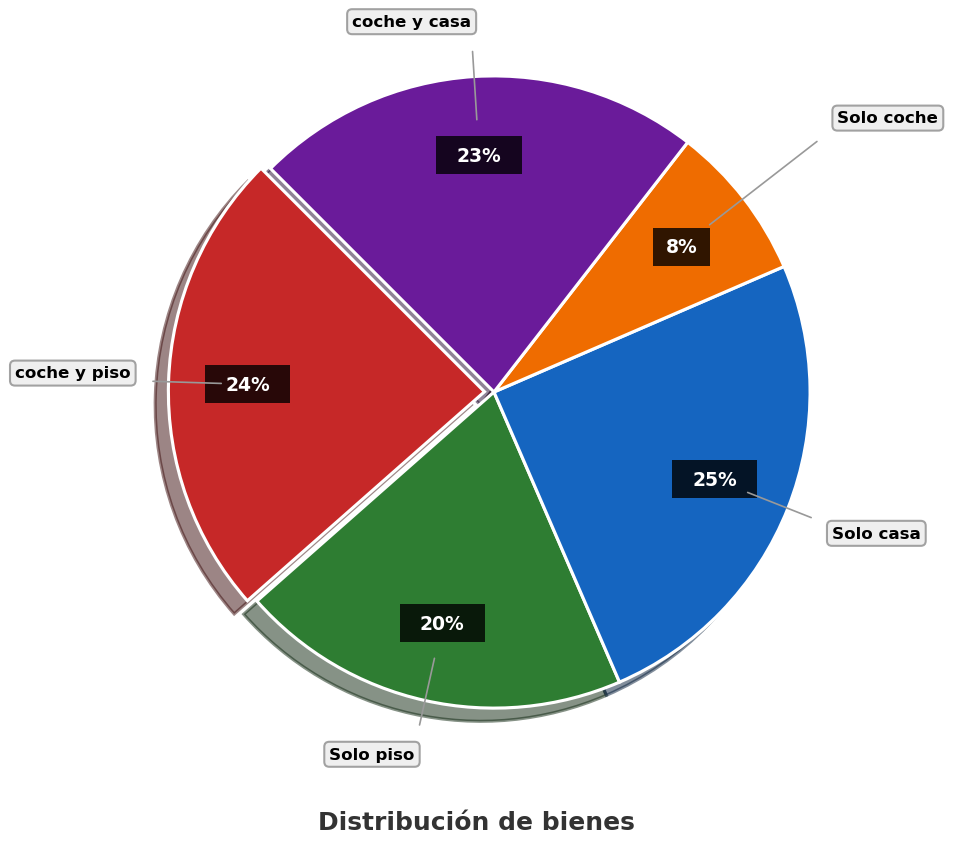

---
output:
  html_document: default
  word_document: default
  pdf_document:
    keep_tex: true
    extra_dependencies: ["graphicx", "float"]
---
```{r setup, include=FALSE}
# Configuración para todos los formatos de salida
Sys.setlocale(category = "LC_NUMERIC", locale = "C")
options(OutDec = ".")

# Configurar el motor LaTeX globalmente
options(tikzLatex = "pdflatex")
options(tikzXelatex = FALSE)
options(tikzLatexPackages = c(
  "\\usepackage{tikz}",
  "\\usepackage{colortbl}",
  "\\usepackage{graphicx}",
  "\\usepackage{float}"
))

library(exams)
library(reticulate)
library(digest)
library(testthat)
library(knitr)

typ <- match_exams_device()
options(scipen = 999)
knitr::opts_chunk$set(
  warning = FALSE,
  message = FALSE,
  fig.showtext = FALSE,
  fig.cap = "",
  fig.keep = 'all',
  dev = c("png", "pdf"),
  dpi = 150,
  fig.pos = "H"
)

# Configuración para chunks de Python
knitr::knit_engines$set(python = function(options) {
  knitr::engine_output(options, options$code, '')
})

# Asegurar que Python esté correctamente configurado
use_python(Sys.which("python"), required = TRUE)
```

```{r DefinicionDeVariables, message=FALSE, warning=FALSE, results='asis'}
options(OutDec = ".")  # Asegurar punto decimal en este chunk

# Establecer semilla aleatoria
set.seed(sample(1:10000, 1))

# Aleatorización del contexto del problema
contextos <- c(
  "empresa", "organización", "compañía", "institución", "corporación",
  "entidad", "firma", "negocio", "sociedad", "grupo empresarial"
)
contexto <- sample(contextos, 1)

# Aleatorización de los tipos de bienes
tipos_bien1 <- c("carro", "auto", "vehículo", "automóvil", "coche")
tipos_bien2 <- c("casa", "vivienda", "residencia", "hogar", "domicilio")
tipos_bien3 <- c("apartamento", "departamento", "piso", "condominio")

bien1 <- sample(tipos_bien1, 1)
bien2 <- sample(tipos_bien2, 1)
bien3 <- sample(tipos_bien3, 1)

# Aleatorización de términos para el enunciado
terminos_encuesta <- c("encuesta", "sondeo", "estudio", "investigación", "consulta")
termino_encuesta <- sample(terminos_encuesta, 1)

terminos_personas <- c("personas", "empleados", "trabajadores", "colaboradores", "miembros")
termino_personas <- sample(terminos_personas, 1)

terminos_bienes <- c("bienes", "posesiones", "propiedades", "activos", "patrimonios")
termino_bienes <- sample(terminos_bienes, 1)

terminos_resultados <- c("resultados", "datos", "estadísticas", "cifras")
termino_resultados <- sample(terminos_resultados, 1)

# Aleatorización de colores para el gráfico circular (paletas oscuras)
paleta_colores <- list(
  c("#C62828", "#2E7D32", "#1565C0", "#EF6C00", "#6A1B9A"),  # Paleta oscura 1
  c("#D32F2F", "#388E3C", "#1976D2", "#F57C00", "#7B1FA2"),  # Paleta saturada
  c("#B71C1C", "#1B5E20", "#0D47A1", "#E65100", "#4A148C"),  # Paleta oscura 2
  c("#AD1457", "#00695C", "#283593", "#FF6F00", "#4A148C"),  # Paleta oscura 3
  c("#880E4F", "#1B5E20", "#0D47A1", "#BF360C", "#4A148C")   # Paleta oscura 4
)
paleta_seleccionada <- sample(paleta_colores, 1)[[1]]

# Aleatorización de los porcentajes manteniendo coherencia matemática
# Generación de porcentajes iniciales para cada categoría
set_porcentajes <- function() {
  repeat {
    # Generar valores base aleatorios
    p_bien1_bien3 <- sample(15:35, 1)  # Porcentaje de bien1 y bien3
    p_solo_bien3 <- sample(15:30, 1)   # Porcentaje solo bien3
    p_solo_bien2 <- sample(25:40, 1)   # Porcentaje solo bien2
    p_solo_bien1 <- sample(5:10, 1)    # Porcentaje solo bien1

    # Calcular el porcentaje restante para bien1 y bien2
    p_bien1_bien2 <- 100 - (p_bien1_bien3 + p_solo_bien3 + p_solo_bien2 + p_solo_bien1)

    # Validar que el porcentaje restante sea positivo y razonable
    if (p_bien1_bien2 >= 10 && p_bien1_bien2 <= 25) {
      return(c(p_bien1_bien3, p_solo_bien3, p_solo_bien2, p_solo_bien1, p_bien1_bien2))
    }
  }
}

# Obtener porcentajes válidos
porcentajes <- set_porcentajes()

p_bien1_bien3 <- porcentajes[1]  # Porcentaje de bien1 y bien3
p_solo_bien3 <- porcentajes[2]   # Porcentaje solo bien3
p_solo_bien2 <- porcentajes[3]   # Porcentaje solo bien2
p_solo_bien1 <- porcentajes[4]   # Porcentaje solo bien1
p_bien1_bien2 <- porcentajes[5]  # Porcentaje de bien1 y bien2

# Verificar que suman 100%
test_that("Los porcentajes suman 100%", {
  expect_equal(sum(porcentajes), 100)
})

# Valor conocido para el cálculo: Número de personas con bien1 y bien3
personas_bien1_bien3 <- sample(c(72, 96, 120, 144, 168, 192, 216, 240), 1)

# Calcular el total de personas
total_personas <- round(personas_bien1_bien3 * 100 / p_bien1_bien3)

# Calcular el número de personas en cada categoría
personas_solo_bien3 <- round(total_personas * p_solo_bien3 / 100)
personas_solo_bien2 <- round(total_personas * p_solo_bien2 / 100)
personas_solo_bien1 <- round(total_personas * p_solo_bien1 / 100)
personas_bien1_bien2 <- round(total_personas * p_bien1_bien2 / 100)

# Recalcular personas_bien1_bien3 para asegurar que el total sea correcto
personas_bien1_bien3 <- total_personas - (personas_solo_bien3 + personas_solo_bien2 + personas_solo_bien1 + personas_bien1_bien2)

# Asegurar que todos los valores son positivos y razonables
personas <- c(personas_bien1_bien3, personas_solo_bien3, personas_solo_bien2, personas_solo_bien1, personas_bien1_bien2)
test_that("Todas las categorías tienen al menos una persona", {
  expect_true(all(personas > 0))
})

# Asegurar que la suma de todas las categorías es igual al total
test_that("La suma de todas las categorías es igual al total", {
  expect_equal(sum(personas), total_personas)
})

# Recalcular los porcentajes reales basados en los números de personas (para mantener coherencia)
p_bien1_bien3 <- round(personas_bien1_bien3 / total_personas * 100)
p_solo_bien3 <- round(personas_solo_bien3 / total_personas * 100)
p_solo_bien2 <- round(personas_solo_bien2 / total_personas * 100)
p_solo_bien1 <- round(personas_solo_bien1 / total_personas * 100)
p_bien1_bien2 <- round(personas_bien1_bien2 / total_personas * 100)

# Ajustar para asegurar que suman 100%
total_porcentaje <- p_bien1_bien3 + p_solo_bien3 + p_solo_bien2 + p_solo_bien1 + p_bien1_bien2
if (total_porcentaje > 100) {
  # Si suman más de 100, restar la diferencia de la categoría más grande
  max_idx <- which.max(porcentajes)
  porcentajes[max_idx] <- porcentajes[max_idx] - (total_porcentaje - 100)
} else if (total_porcentaje < 100) {
  # Si suman menos de 100, añadir la diferencia a la categoría más pequeña
  min_idx <- which.min(porcentajes)
  porcentajes[min_idx] <- porcentajes[min_idx] + (100 - total_porcentaje)
}

p_bien1_bien3 <- porcentajes[1]
p_solo_bien3 <- porcentajes[2]
p_solo_bien2 <- porcentajes[3]
p_solo_bien1 <- porcentajes[4]
p_bien1_bien2 <- porcentajes[5]

# Asegurar que los porcentajes suman exactamente 100%
test_that("Los porcentajes ajustados suman 100%", {
  expect_equal(sum(porcentajes), 100)
})

# Aleatorizar el tipo de pregunta y la condición inicial
tipos_pregunta <- c(
  "solo_bien1",
  "solo_bien2",
  "solo_bien3",
  "bien1_bien2",
  "bien1_bien3"
)

# Aleatorizar la condición inicial (dato conocido)
tipos_condicion <- c(
  "bien1_bien3",
  "solo_bien3",
  "solo_bien2",
  "solo_bien1",
  "bien1_bien2"
)

# Seleccionar aleatoriamente el tipo de pregunta y condición
tipo_pregunta <- sample(tipos_pregunta, 1)
tipo_condicion <- sample(tipos_condicion, 1)

# Determinar la respuesta correcta según el tipo de pregunta
if (tipo_pregunta == "solo_bien1") {
  respuesta_correcta <- personas_solo_bien1
  texto_pregunta <- paste0("solo ", bien1)
} else if (tipo_pregunta == "solo_bien2") {
  respuesta_correcta <- personas_solo_bien2
  texto_pregunta <- paste0("solo ", bien2)
} else if (tipo_pregunta == "solo_bien3") {
  respuesta_correcta <- personas_solo_bien3
  texto_pregunta <- paste0("solo ", bien3)
} else if (tipo_pregunta == "bien1_bien2") {
  respuesta_correcta <- personas_bien1_bien2
  texto_pregunta <- paste0(bien1, " y ", bien2)
} else if (tipo_pregunta == "bien1_bien3") {
  respuesta_correcta <- personas_bien1_bien3
  texto_pregunta <- paste0(bien1, " y ", bien3)
}

# Determinar el valor y texto de la condición inicial
if (tipo_condicion == "bien1_bien3") {
  valor_condicion <- personas_bien1_bien3
  texto_condicion <- paste0(bien1, " y ", bien3)
} else if (tipo_condicion == "solo_bien3") {
  valor_condicion <- personas_solo_bien3
  texto_condicion <- paste0("solo ", bien3)
} else if (tipo_condicion == "solo_bien2") {
  valor_condicion <- personas_solo_bien2
  texto_condicion <- paste0("solo ", bien2)
} else if (tipo_condicion == "solo_bien1") {
  valor_condicion <- personas_solo_bien1
  texto_condicion <- paste0("solo ", bien1)
} else if (tipo_condicion == "bien1_bien2") {
  valor_condicion <- personas_bien1_bien2
  texto_condicion <- paste0(bien1, " y ", bien2)
}

# Generar distractores plausibles según el tipo de pregunta
# Usamos diferentes valores para crear distractores convincentes
distractor1 <- round(respuesta_correcta * sample(c(0.7, 0.8, 1.2, 1.3), 1))  # Variación porcentual
distractor2 <- round(total_personas * sample(c(0.15, 0.2, 0.25, 0.3), 1))    # Porcentaje arbitrario del total
distractor3 <- valor_condicion  # El valor dado en la condición inicial

# Asegurarse de que todos los distractores son diferentes de la respuesta correcta
if (distractor1 == respuesta_correcta) distractor1 <- distractor1 + sample(5:15, 1)
if (distractor2 == respuesta_correcta) distractor2 <- distractor2 - sample(5:15, 1)
if (distractor3 == respuesta_correcta) distractor3 <- distractor3 + sample(5:15, 1)

# Asegurarse de que todos los distractores son diferentes entre sí
while (length(unique(c(distractor1, distractor2, distractor3))) < 3) {
  if (distractor1 == distractor2) distractor1 <- distractor1 + sample(5:10, 1)
  if (distractor2 == distractor3) distractor2 <- distractor2 - sample(5:10, 1)
  if (distractor1 == distractor3) distractor3 <- distractor3 + sample(5:10, 1)
}

# Crear un vector con todas las opciones y mezclarlas
opciones <- c(respuesta_correcta, distractor1, distractor2, distractor3)
names(opciones) <- c("correcta", "distractor1", "distractor2", "distractor3")
opciones_mezcladas <- sample(opciones)

# Identificar la posición de la respuesta correcta en las opciones mezcladas
indice_correcto <- which(opciones_mezcladas == respuesta_correcta)

# Crear el vector de solución para r-exams
solucion <- rep(0, 4)
solucion[indice_correcto] <- 1
```

```{r generar_grafico_circular, message=FALSE, warning=FALSE}
options(OutDec = ".")  # Asegurar punto decimal en este chunk

# Código Python para generar el gráfico circular
codigo_python <- paste0("
import matplotlib
matplotlib.use('Agg')  # Usar backend no interactivo
import matplotlib.pyplot as plt
import numpy as np

# Datos para el gráfico
labels = ['", bien1, " y ", bien3, "', 'Solo ", bien3, "', 'Solo ", bien2, "',
          'Solo ", bien1, "', '", bien1, " y ", bien2, "']
sizes = [", p_bien1_bien3, ", ", p_solo_bien3, ", ", p_solo_bien2, ",
         ", p_solo_bien1, ", ", p_bien1_bien2, "]
colors = ['", paleta_seleccionada[1], "', '", paleta_seleccionada[2], "',
          '", paleta_seleccionada[3], "', '", paleta_seleccionada[4], "',
          '", paleta_seleccionada[5], "']

# Explode para destacar ligeramente el sector con bien1 y bien3
explode = (0.03, 0, 0, 0, 0)

# Crear figura con más espacio para acomodar las etiquetas externas
plt.figure(figsize=(7, 6))  # Aumentar tamaño para dar espacio a las etiquetas

# Crear gráfico circular con bordes blancos
wedges, texts, autotexts = plt.pie(
    sizes,
    explode=explode,
    colors=colors,
    shadow=True,
    startangle=45,  # Cambiar ángulo para mejor distribución
    autopct='%d%%',
    pctdistance=0.75,  # Ubicar porcentajes más cerca del borde exterior
    wedgeprops={'edgecolor': 'white', 'linewidth': 1},
    textprops={'fontsize': 10, 'fontweight': 'bold', 'color': 'white'}
)

# Configuración estética de los textos de porcentaje con recuadros
for autotext in autotexts:
    autotext.set_fontsize(9)  # Tamaño de fuente para porcentajes
    autotext.set_weight('bold')
    # Crear un recuadro semitransparente para los porcentajes
    bbox_props = {'boxstyle': 'round,pad=0.2',
                 'facecolor': 'black',
                 'alpha': 0.7,
                 'edgecolor': 'none'}
    autotext.set_bbox(bbox_props)

# Eliminar los textos del pie (los reemplazaremos con etiquetas externas)
for text in texts:
    text.set_visible(False)

# Crear etiquetas externas con líneas conectoras
bbox_props = {'boxstyle': 'round,pad=0.3',
             'facecolor': 'white',
             'edgecolor': 'gray',
             'alpha': 0.9}

# Calcular posiciones de etiquetas externas optimizadas para evitar solapamiento
def get_label_position(angle_rad, wedge_size):
    # Ajustar distancia basada en el tamaño del sector
    # Sectores más pequeños tienen etiquetas más alejadas para evitar solapamiento
    distance_factor = 1.25 if wedge_size < 15 else 1.15

    # Determinar coordenadas
    x = distance_factor * np.cos(angle_rad)
    y = distance_factor * np.sin(angle_rad)

    # Ajustar alineación basada en cuadrante
    if x < 0:
        ha = 'right'
    else:
        ha = 'left'

    if y < 0:
        va = 'top'
    else:
        va = 'bottom'

    # Para sectores muy pequeños, ajustar más la posición para evitar solapamiento
    if wedge_size < 10:
        x *= 1.1
        y *= 1.1

    return x, y, ha, va

# Colocar etiquetas externas con líneas conectoras
for i, wedge in enumerate(wedges):
    # Calcular ángulo medio del sector
    ang = (wedge.theta1 + wedge.theta2) / 2
    ang_rad = np.radians(ang)

    # Calcular coordenadas para el inicio de la línea conectora (en el borde del sector)
    # El factor 0.85 asegura que la línea empiece cerca del borde del sector
    x_edge = 0.85 * np.cos(ang_rad)
    y_edge = 0.85 * np.sin(ang_rad)

    # Obtener posición optimizada para la etiqueta
    x_label, y_label, ha, va = get_label_position(ang_rad, sizes[i])

    # Dibujar línea conectora
    con = plt.annotate('',
                      xy=(x_edge, y_edge),  # Inicio (en el borde del sector)
                      xytext=(x_label * 0.95, y_label * 0.95),  # Fin (cerca de la etiqueta)
                      arrowprops=dict(arrowstyle='-', color='gray', lw=0.8))

    # Añadir etiqueta con recuadro blanco
    plt.text(x_label, y_label, labels[i],
            fontsize=8,
            fontweight='bold',
            ha=ha,
            va=va,
            bbox=bbox_props,
            zorder=10)

# Asegurar que el gráfico sea un círculo
plt.axis('equal')

# Añadir título en la parte inferior del gráfico
plt.figtext(0.5, 0.01,  # Posición x=0.5 (centro), y=0.01 (parte inferior)
           'Distribución de bienes',
           fontsize=12,
           fontweight='bold',
           color='#333333',
           ha='center')  # Alineación horizontal centrada

# Ajustar los márgenes para dejar espacio a las etiquetas externas
plt.tight_layout(pad=1.5, rect=[0, 0.05, 1, 0.95])  # Ajustar rect para dar más espacio

# Guardar en múltiples formatos para asegurar compatibilidad
plt.savefig('grafico_circular.png', dpi=150, bbox_inches='tight',
           transparent=True, format='png')
plt.savefig('grafico_circular.pdf', dpi=150, bbox_inches='tight',
           transparent=True, format='pdf')
plt.close()
")

# Ejecutar código Python para generar la figura
py_run_string(codigo_python)
```

Question
========

En La Tebaida se realizó un(a) `r termino_encuesta` a un grupo de `r termino_personas` de un(a) `r contexto` sobre el tipo de `r termino_bienes` que poseen. Los(las) `r termino_resultados` se presentan en la gráfica.

```{r mostrar_grafico_circular, echo=FALSE, results='asis', fig.align="center"}
# Detectar si se está generando para Moodle
# Formatos para Moodle y similares
formatos_moodle <- c("exams2moodle", "exams2qti12",
                     "exams2qti21", "exams2openolat")
es_moodle <- (match_exams_call() %in% formatos_moodle)

# Mostrar la imagen del gráfico circular
if (es_moodle) {
  # Tamaño para Moodle
  cat("{width=60%}")
} else {
  # Tamaño para PDF/Word
  cat("{width=70%}")
}
```

Si `r valor_condicion` `r termino_personas` de el(la) `r contexto` poseen `r texto_condicion`, ¿cuántas personas poseen `r texto_pregunta`?

Answerlist
----------
- `r opciones_mezcladas[1]`
- `r opciones_mezcladas[2]`
- `r opciones_mezcladas[3]`
- `r opciones_mezcladas[4]`

Solution
========

Para resolver este problema, necesitamos aplicar proporciones y regla de tres a partir de la información dada en el gráfico circular y el enunciado. Seguiremos un proceso paso a paso:

### Paso 1: Identificar los datos conocidos:

* Sabemos que `r valor_condicion` `r termino_personas` poseen `r texto_condicion`.
* Según el gráfico circular, este grupo representa el `r if(tipo_condicion == "solo_bien1") p_solo_bien1 else if(tipo_condicion == "solo_bien2") p_solo_bien2 else if(tipo_condicion == "solo_bien3") p_solo_bien3 else if(tipo_condicion == "bien1_bien2") p_bien1_bien2 else p_bien1_bien3`% del total.
* También observamos en el gráfico que las personas que poseen `r texto_pregunta` representan el `r if(tipo_pregunta == "solo_bien1") p_solo_bien1 else if(tipo_pregunta == "solo_bien2") p_solo_bien2 else if(tipo_pregunta == "solo_bien3") p_solo_bien3 else if(tipo_pregunta == "bien1_bien2") p_bien1_bien2 else p_bien1_bien3`% del total.

### Paso 2: Calcular el número total de personas:

Para encontrar el total de `r termino_personas` en la `r contexto`, utilizamos la siguiente relación de proporcionalidad:

Si `r if(tipo_condicion == "solo_bien1") p_solo_bien1 else if(tipo_condicion == "solo_bien2") p_solo_bien2 else if(tipo_condicion == "solo_bien3") p_solo_bien3 else if(tipo_condicion == "bien1_bien2") p_bien1_bien2 else p_bien1_bien3`% del total = `r valor_condicion` `r termino_personas`.

Entonces 100% del total = X `r termino_personas`

Aplicando regla de tres:

* X = (`r valor_condicion` × 100%) ÷ `r if(tipo_condicion == "solo_bien1") p_solo_bien1 else if(tipo_condicion == "solo_bien2") p_solo_bien2 else if(tipo_condicion == "solo_bien3") p_solo_bien3 else if(tipo_condicion == "bien1_bien2") p_bien1_bien2 else p_bien1_bien3`%
* X = `r valor_condicion * 100` ÷ `r if(tipo_condicion == "solo_bien1") p_solo_bien1 else if(tipo_condicion == "solo_bien2") p_solo_bien2 else if(tipo_condicion == "solo_bien3") p_solo_bien3 else if(tipo_condicion == "bien1_bien2") p_bien1_bien2 else p_bien1_bien3`
* X = `r total_personas` `r termino_personas`

Por lo tanto, el total de `r termino_personas` en la `r contexto` es `r total_personas`.

### Paso 3: Calcular el número de personas que poseen `r texto_pregunta`
Una vez conocido el total, podemos calcular cuántas personas poseen `r texto_pregunta` utilizando el porcentaje correspondiente del gráfico circular:

Si 100% del total = `r total_personas` `r termino_personas`.

Entonces `r if(tipo_pregunta == "solo_bien1") p_solo_bien1 else if(tipo_pregunta == "solo_bien2") p_solo_bien2 else if(tipo_pregunta == "solo_bien3") p_solo_bien3 else if(tipo_pregunta == "bien1_bien2") p_bien1_bien2 else p_bien1_bien3`% del total = Y `r termino_personas`

Aplicando regla de tres:

* Y = (`r if(tipo_pregunta == "solo_bien1") p_solo_bien1 else if(tipo_pregunta == "solo_bien2") p_solo_bien2 else if(tipo_pregunta == "solo_bien3") p_solo_bien3 else if(tipo_pregunta == "bien1_bien2") p_bien1_bien2 else p_bien1_bien3`% × `r total_personas`) ÷ 100%
* Y = (`r if(tipo_pregunta == "solo_bien1") p_solo_bien1 else if(tipo_pregunta == "solo_bien2") p_solo_bien2 else if(tipo_pregunta == "solo_bien3") p_solo_bien3 else if(tipo_pregunta == "bien1_bien2") p_bien1_bien2 else p_bien1_bien3` × `r total_personas`) ÷ 100
* Y = `r if(tipo_pregunta == "solo_bien1") p_solo_bien1 * total_personas / 100 else if(tipo_pregunta == "solo_bien2") p_solo_bien2 * total_personas / 100 else if(tipo_pregunta == "solo_bien3") p_solo_bien3 * total_personas / 100 else if(tipo_pregunta == "bien1_bien2") p_bien1_bien2 * total_personas / 100 else p_bien1_bien3 * total_personas / 100`
* Y = `r respuesta_correcta` `r termino_personas`

### Paso 4: Verificación de la respuesta
Podemos verificar nuestra respuesta comprobando que los números calculados son coherentes con los porcentajes del gráfico:

* `r bien1` y `r bien3`: `r personas_bien1_bien3` `r termino_personas` (`r p_bien1_bien3`% del total)
* Solo `r bien3`: `r personas_solo_bien3` `r termino_personas` (`r p_solo_bien3`% del total)
* Solo `r bien2`: `r personas_solo_bien2` `r termino_personas` (`r p_solo_bien2`% del total)
* Solo `r bien1`: `r personas_solo_bien1` `r termino_personas` (`r p_solo_bien1`% del total)
* `r bien1` y `r bien2`: `r personas_bien1_bien2` `r termino_personas` (`r p_bien1_bien2`% del total)

La suma de todas estas categorías es `r sum(c(personas_bien1_bien3, personas_solo_bien3, personas_solo_bien2, personas_solo_bien1, personas_bien1_bien2))` `r termino_personas`, que coincide con nuestro total calculado de `r total_personas` `r termino_personas`.

### Conclusión
Por lo tanto, `r respuesta_correcta` `r termino_personas` de la `r contexto` poseen `r texto_pregunta`.

Answerlist
----------
- `r if(solucion[1] == 1) "Verdadero" else "Falso"`
- `r if(solucion[2] == 1) "Verdadero" else "Falso"`
- `r if(solucion[3] == 1) "Verdadero" else "Falso"`
- `r if(solucion[4] == 1) "Verdadero" else "Falso"`

Meta-information
================
exname: proporciones_diagrama_circular
extype: schoice
exsolution: `r paste(as.integer(solucion), collapse="")`
exshuffle: TRUE
exsection: Estadística|Proporciones|Interpretación de gráficos
