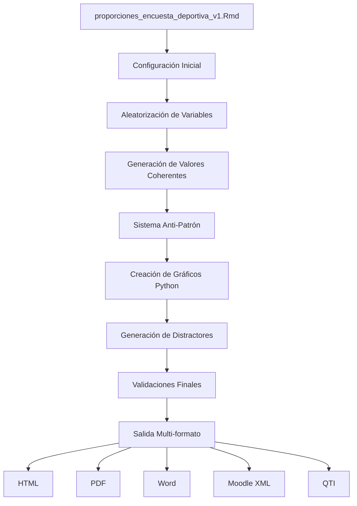

# 📊 Proporciones Encuesta Deportiva v1 - Sistema R-Exams ICFES

[](http://www.r-exams.org/)
[](https://www.icfes.gov.co/)
[]()
[]()

## 🎯 Descripción General

Este proyecto implementa un **ejercicio avanzado de estadística y proporciones** para el sistema **r-exams** que evalúa la competencia de **interpretación y representación** en el componente **aleatorio y sistemas de datos** según estándares ICFES.

El ejercicio presenta escenarios de **encuestas deportivas** con gráficos de barras horizontales generados dinámicamente, evaluando la capacidad de los estudiantes para interpretar información estadística, distinguir entre muestra y población, y comprender proporciones y fracciones equivalentes.

### ✨ Características Destacadas

- 🔄 **Sistema Anti-Patrón Avanzado**: Evita respuestas predecibles mediante selección aleatoria del equipo correcto
- 🎲 **Aleatorización Extrema**: Más de 15 parámetros aleatorios para máxima variabilidad
- 🧮 **Distractores Desafiantes**: Incluye fracciones equivalentes y errores conceptuales típicos
- 🎨 **Gráficos Dinámicos**: Generación automática con Python/Matplotlib
- 🔍 **Validaciones Robustas**: Múltiples verificaciones matemáticas y de calidad
- 🌐 **Compatibilidad Universal**: Funciona en PDF, HTML, Word, Moodle y QTI

### 🎯 Objetivos Pedagógicos

| Aspecto | Descripción |
|---------|-------------|
| **Competencia** | Interpretación y representación de datos estadísticos |
| **Componente** | Aleatorio y sistemas de datos |
| **Afirmación** | Interpreta información presentada en tablas y gráficos |
| **Nivel de dificultad** | Medio |
| **Tiempo estimado** | 3 minutos |
| **Tipo de pregunta** | Selección múltiple con única respuesta |

## 📋 Tabla de Contenidos

1. [🔧 Información Técnica](#-información-técnica)
2. [⚙️ Características Avanzadas](#️-características-avanzadas)
3. [🏗️ Estructura del Ejercicio](#️-estructura-del-ejercicio)
4. [🚀 Guía de Uso](#-guía-de-uso)
5. [📦 Instalación y Configuración](#-instalación-y-configuración)
6. [💡 Ejemplos de Uso](#-ejemplos-de-uso)
7. [🔍 Validaciones y Pruebas](#-validaciones-y-pruebas)
8. [🛠️ Troubleshooting](#️-troubleshooting)
9. [📚 Documentación Técnica](#-documentación-técnica)
10. [🤝 Contribuciones](#-contribuciones)
11. [📄 Licencia](#-licencia)

## 🔧 Información Técnica

### 📋 Metadatos ICFES Completos

```yaml
# Metadatos principales
tipo_pregunta: "Selección múltiple con única respuesta"
competencia: "Interpretación y representación"
componente: "Aleatorio y sistemas de datos"
afirmacion: "Interpreta información presentada en tablas y gráficos"
nivel_dificultad: "Medio"
tiempo_estimado: "3 minutos"
autor: "Sistema R-Exams ICFES"
version: "1.0"

# Configuración de salida
output:
  html_document: default
  pdf_document:
    keep_tex: true
  word_document: default
```

### 🛠️ Stack Tecnológico

| Tecnología | Propósito | Versión Mínima |
|------------|-----------|----------------|
| **R** | Lógica principal y aleatorización | ≥ 4.0.0 |
| **Python** | Generación de gráficos (Matplotlib) | ≥ 3.7 |
| **Reticulate** | Integración R-Python | ≥ 1.20 |
| **LaTeX** | Expresiones matemáticas | TeX Live 2020+ |
| **r-exams** | Framework de evaluación | ≥ 2.4.0 |
| **knitr** | Procesamiento de documentos | ≥ 1.30 |

### 📦 Dependencias R Requeridas

```r
# Paquetes principales
library(exams)      # Framework de exámenes
library(reticulate) # Integración Python
library(knitr)      # Procesamiento documentos

# Paquetes opcionales para funcionalidades avanzadas
library(digest)     # Hashing para semillas
library(testthat)   # Pruebas unitarias
```

### 🐍 Dependencias Python Requeridas

```python
# Paquetes esenciales
import matplotlib.pyplot as plt  # Gráficos
import numpy as np              # Cálculos numéricos

# Configuración backend
matplotlib.use('Agg')  # Backend no interactivo
```

### 🌐 Formatos de Salida Compatibles

| Formato | Comando | Estado | Características |
|---------|---------|--------|-----------------|
| **HTML** | `exams2html()` | ✅ Completo | Interactivo, responsive |
| **PDF** | `exams2pdf()` | ✅ Completo | Alta calidad, imprimible |
| **Word** | `exams2pandoc()` | ✅ Completo | Editable, compatible Office |
| **Moodle** | `exams2moodle()` | ✅ Completo | LMS integration |
| **QTI 1.2** | `exams2qti12()` | ✅ Completo | Estándar e-learning |
| **QTI 2.1** | `exams2qti21()` | ✅ Completo | Estándar e-learning avanzado |
| **OpenOlat** | `exams2openolat()` | ✅ Completo | Plataforma específica |

### ⚡ Configuraciones Especiales

#### Anti-Notación Científica
```r
# Configuración radical para evitar notación científica
options(scipen = 999)  # Evitar notación científica completamente
options(digits = 10)   # Suficientes dígitos para números grandes
Sys.setlocale(category = "LC_NUMERIC", locale = "C")
options(OutDec = ".")  # Punto decimal estándar
```

#### Formateo de Números Enteros
```r
formatear_entero <- function(numero) {
  # Forzar formato entero sin notación científica JAMÁS
  formatC(as.numeric(numero), format = "d", big.mark = "")
}
```

#### Configuración de Gráficos
```r
knitr::opts_chunk$set(
  warning = FALSE,
  message = FALSE,
  fig.cap = "",
  fig.keep = 'all',
  dev = c("png", "pdf"),
  dpi = 150
)
```

## ⚙️ Características Avanzadas

### 🔄 Sistema Anti-Patrón Revolucionario

El sistema anti-patrón implementado es una innovación pedagógica que evita que los estudiantes desarrollen estrategias de respuesta basadas en patrones detectables.

#### 🎯 Problema Tradicional
```
❌ Ejercicios convencionales:
- La respuesta correcta siempre es el valor más alto
- Los estudiantes aprenden a buscar visualmente el máximo
- No evalúa realmente la comprensión de proporciones
- Genera "atajos" que evitan el aprendizaje real
```

#### ✅ Solución Implementada
```
✅ Sistema anti-patrón:
- Cualquier equipo puede ser la respuesta correcta
- Selección aleatoria del equipo objetivo
- Cada opción menciona un equipo diferente
- Imposible detectar patrones visuales
- Obliga al cálculo real de proporciones
```

#### 🔧 Implementación Técnica
```r
# Selección aleatoria del equipo correcto (NO siempre el mayor)
indice_equipo_correcto <- sample(1:5, 1)

# Diversificación obligatoria de equipos en distractores
equipos_otros_indices <- setdiff(1:5, indice_equipo_correcto)
equipos_distractores_indices <- sample(equipos_otros_indices, 3)

# Validación anti-patrón automática
if (length(equipos_repetidos) > 0) {
  stop("Error anti-patrón: Equipos repetidos detectados")
}
```

### 🎲 Sistema de Aleatorización Extrema

#### 📊 Parámetros Aleatorizados (15+)

| Categoría | Parámetros | Variantes |
|-----------|------------|-----------|
| **Contextos** | Plataformas deportivas | 6 tipos |
| **Competiciones** | Torneos por región | 5 categorías |
| **Equipos** | Listas por competición | 75+ equipos |
| **Valores** | Distribución de votos | Algoritmo inteligente |
| **Términos** | Vocabulario del enunciado | 5 variantes c/u |
| **Colores** | Paleta de gráficos | 5 esquemas |
| **Población** | Tamaño total | 11 opciones |
| **Muestra** | Tamaño encuesta | 8 rangos |

#### 🌍 Sistema de Coherencia Geográfica

```r
# Competiciones y equipos compatibles automáticamente
if (tipo_competicion == 1) {
  # Clubes europeos → Champions League, Liga Europa
  competicion <- sample(competiciones_clubes_europeos, 1)
  equipos_disponibles <- equipos_europeos
} else if (tipo_competicion == 2) {
  # Clubes sudamericanos → Copa Libertadores
  competicion <- sample(competiciones_clubes_sudamericanos, 1)
  equipos_disponibles <- equipos_sudamericanos
}
# ... más categorías
```

**Ventajas del sistema**:
- ✅ **Realismo**: Evita combinaciones imposibles (ej: Boca Juniors en Champions)
- ✅ **Escalabilidad**: Fácil agregar nuevas competiciones/equipos
- ✅ **Mantenimiento**: Cambios centralizados en las listas

### 🧮 Generación Inteligente de Valores

#### 🎯 Algoritmo de Distribución Coherente

```r
generar_valores_coherentes <- function(total, max_intentos = 100) {
  # Rangos apropiados basados en el total
  min_valor <- max(8, round(total * 0.08))  # Mínimo 8%
  max_valor <- min(40, round(total * 0.35)) # Máximo 35%

  # Estrategia en dos fases:
  # Fase 1 (intentos 1-50): Distribución escalonada
  # Fase 2 (intentos 51-100): Distribución aleatoria
}
```

#### ✅ Validaciones Automáticas

- **Suma exacta**: Los 5 valores deben sumar exactamente el tamaño de muestra
- **Rangos válidos**: Cada valor entre 8% y 35% del total
- **Variabilidad mínima**: Al menos 3 valores únicos diferentes
- **Método de emergencia**: Fallback si no se puede generar distribución ideal

## 🏗️ Estructura del Ejercicio

### 🎬 Escenario del Problema

El ejercicio presenta una **encuesta deportiva** realizada por una plataforma digital a sus usuarios sobre equipos favoritos para ganar una competición específica. Los datos se visualizan en un **gráfico de barras horizontal** generado dinámicamente.

### 🔑 Elementos Clave del Diseño

| Elemento | Descripción | Variabilidad |
|----------|-------------|--------------|
| **Contexto** | Plataforma deportiva | 6 tipos diferentes |
| **Competición** | Torneo específico | 5 categorías regionales |
| **Equipos** | Participantes coherentes | 75+ equipos organizados |
| **Población vs. Muestra** | Distinción estadística | Valores realistas |
| **Gráfico** | Visualización dinámica | Python/Matplotlib |

### 🎯 Conceptos Evaluados

#### 📊 Competencias Estadísticas
- **Interpretación de gráficos de barras horizontales**
- **Diferenciación entre muestra y población total**
- **Cálculo y comprensión de proporciones**
- **Equivalencia de fracciones y simplificación**
- **Generalización estadística apropiada**

#### 🧠 Habilidades Cognitivas
- **Análisis visual**: Lectura correcta de gráficos
- **Razonamiento proporcional**: Cálculos de fracciones
- **Pensamiento crítico**: Evitar errores conceptuales comunes
- **Aplicación contextual**: Transferencia a situaciones reales

## 🚀 Guía de Uso

### 📦 Instalación y Configuración

#### 🔧 Requisitos Previos

```bash
# 1. Verificar instalación de R (≥ 4.0.0)
R --version

# 2. Verificar instalación de Python (≥ 3.7)
python --version

# 3. Verificar LaTeX (para PDF)
pdflatex --version
```

#### 📥 Instalación de Dependencias R

```r
# Instalar paquetes principales
install.packages(c("exams", "reticulate", "knitr"))

# Verificar instalación
library(exams)
library(reticulate)
library(knitr)

# Configurar Python (si es necesario)
reticulate::install_miniconda()
reticulate::py_install(c("matplotlib", "numpy"))
```

#### 🐍 Configuración de Python

```python
# Verificar instalación de paquetes
import matplotlib.pyplot as plt
import numpy as np
print("✅ Python configurado correctamente")
```

### 🎯 Uso Básico

#### 🚀 Ejecución Rápida

```r
# Cargar el ejercicio
source("proporciones_encuesta_deportiva_v1.Rmd")

# Generar versión HTML
exams2html("proporciones_encuesta_deportiva_v1.Rmd",
           n = 5,  # 5 versiones diferentes
           name = "encuesta_deportiva")

# Generar versión PDF
exams2pdf("proporciones_encuesta_deportiva_v1.Rmd",
          n = 10, # 10 versiones diferentes
          name = "encuesta_deportiva_pdf")
```

#### 📊 Generación para Moodle

```r
# Exportar a Moodle XML
exams2moodle("proporciones_encuesta_deportiva_v1.Rmd",
             n = 20,  # 20 preguntas diferentes
             name = "banco_preguntas_deportes",
             dir = "salida/moodle/")
```

### 💡 Ejemplos de Uso

#### 🎲 Ejemplo 1: Generación Básica

```r
# Script básico de generación
library(exams)

# Generar 5 versiones HTML
set.seed(123)  # Para reproducibilidad
exams2html("proporciones_encuesta_deportiva_v1.Rmd",
           n = 5,
           name = "test_deportes",
           encoding = "UTF-8")
```

**Salida esperada**:
- `test_deportes1.html` - Versión con Champions League
- `test_deportes2.html` - Versión con Copa América
- `test_deportes3.html` - Versión con Copa del Mundo
- `test_deportes4.html` - Versión con Liga Europa
- `test_deportes5.html` - Versión con Copa Libertadores

#### 📚 Ejemplo 2: Banco de Preguntas Masivo

```r
# Generar banco extenso para LMS
library(exams)

# Configuración avanzada
set.seed(NULL)  # Máxima aleatoriedad

# Generar 100 preguntas únicas
exams2moodle("proporciones_encuesta_deportiva_v1.Rmd",
             n = 100,
             name = "banco_estadistica_deportes",
             dir = "output/",
             converter = "pandoc",
             encoding = "UTF-8")
```

#### 🎨 Ejemplo 3: Personalización Avanzada

```r
# Configuración personalizada
library(exams)

# Parámetros personalizados
opciones_personalizadas <- list(
  template = "plain",
  encoding = "UTF-8",
  converter = "pandoc"
)

# Generar con configuración específica
exams2pdf("proporciones_encuesta_deportiva_v1.Rmd",
          n = 15,
          name = "examen_final_estadistica",
          dir = "examenes/",
          template = opciones_personalizadas$template)
```

### 🔧 Scripts de Automatización

#### 📝 Script de Generación Completa

```r
# generar_examenes_completos.R
#!/usr/bin/env Rscript

library(exams)
library(reticulate)

# Configuración
archivo_ejercicio <- "proporciones_encuesta_deportiva_v1.Rmd"
directorio_salida <- "output/"

# Crear directorio si no existe
if (!dir.exists(directorio_salida)) {
  dir.create(directorio_salida, recursive = TRUE)
}

# Generar múltiples formatos
formatos <- list(
  html = function() exams2html(archivo_ejercicio, n = 10,
                               name = "deportes_html",
                               dir = paste0(directorio_salida, "html/")),

  pdf = function() exams2pdf(archivo_ejercicio, n = 10,
                             name = "deportes_pdf",
                             dir = paste0(directorio_salida, "pdf/")),

  moodle = function() exams2moodle(archivo_ejercicio, n = 50,
                                   name = "deportes_moodle",
                                   dir = paste0(directorio_salida, "moodle/"))
)

# Ejecutar generación
for (formato in names(formatos)) {
  cat("Generando formato:", formato, "\n")
  formatos[[formato]]()
  cat("✅ Completado:", formato, "\n\n")
}

cat("🎉 Generación completa finalizada\n")
```

#### 🧪 Script de Pruebas

```r
# pruebas_ejercicio.R
#!/usr/bin/env Rscript

library(testthat)
library(exams)

# Función de prueba
probar_ejercicio <- function(n_pruebas = 10) {
  cat("🧪 Iniciando pruebas del ejercicio...\n")

  for (i in 1:n_pruebas) {
    cat("Prueba", i, "de", n_pruebas, "...")

    # Intentar generar ejercicio
    tryCatch({
      resultado <- exams2html("proporciones_encuesta_deportiva_v1.Rmd",
                              n = 1,
                              name = paste0("test_", i),
                              dir = "temp/")
      cat(" ✅\n")
    }, error = function(e) {
      cat(" ❌ Error:", e$message, "\n")
    })
  }

  cat("🎉 Pruebas completadas\n")
}

# Ejecutar pruebas
probar_ejercicio(20)
```

## 🔍 Validaciones y Pruebas

### ✅ Sistema de Validaciones Automáticas

El ejercicio incluye un sistema robusto de validaciones que garantiza la calidad matemática y pedagógica:

#### 🧮 Validaciones Matemáticas

```r
# 1. Verificación de suma exacta
if (sum(valores_equipos) != tamano_muestra) {
  stop("Error: Los valores no suman el tamaño de muestra")
}

# 2. Verificación de rangos apropiados
min_esperado <- max(8, round(tamano_muestra * 0.08))
max_esperado <- min(40, round(tamano_muestra * 0.35))
if (!all(valores_equipos >= min_esperado) || !all(valores_equipos <= max_esperado)) {
  stop("Error: Valores fuera del rango esperado")
}

# 3. Verificación de variabilidad
valores_unicos <- unique(valores_equipos)
if (length(valores_unicos) < 3) {
  stop("Error: Variabilidad insuficiente")
}
```

#### 🎯 Validaciones Anti-Patrón

```r
# Verificar diversidad de equipos mencionados
equipos_mencionados <- c()
for (opcion in opciones) {
  for (equipo in equipos_seleccionados) {
    if (grepl(equipo, opcion, fixed = TRUE)) {
      equipos_mencionados <- c(equipos_mencionados, equipo)
    }
  }
}

# Verificar que no hay equipos repetidos en opciones
tabla_equipos <- table(equipos_mencionados)
equipos_repetidos <- names(tabla_equipos)[tabla_equipos > 1]

if (length(equipos_repetidos) > 0) {
  stop("Error anti-patrón: Equipos repetidos detectados")
}
```

### 🧪 Pruebas Unitarias

#### 📊 Pruebas de Generación de Valores

```r
# test_generacion_valores.R
library(testthat)

test_that("Generación de valores coherentes", {
  # Probar con diferentes tamaños de muestra
  tamanos_prueba <- c(80, 100, 120, 150)

  for (tamano in tamanos_prueba) {
    valores <- generar_valores_coherentes(tamano)

    # Verificar suma exacta
    expect_equal(sum(valores), tamano)

    # Verificar rangos
    min_esperado <- max(8, round(tamano * 0.08))
    max_esperado <- min(40, round(tamano * 0.35))
    expect_true(all(valores >= min_esperado))
    expect_true(all(valores <= max_esperado))

    # Verificar variabilidad
    expect_gte(length(unique(valores)), 3)
  }
})
```

#### 🎲 Pruebas de Aleatorización

```r
# test_aleatorizacion.R
test_that("Sistema de aleatorización", {
  # Generar múltiples instancias
  contextos_generados <- c()
  competiciones_generadas <- c()

  for (i in 1:50) {
    set.seed(i)
    # Simular generación de contexto y competición
    contexto <- sample(contextos, 1)
    competicion <- sample(competiciones_clubes_europeos, 1)

    contextos_generados <- c(contextos_generados, contexto)
    competiciones_generadas <- c(competiciones_generadas, competicion)
  }

  # Verificar diversidad
  expect_gte(length(unique(contextos_generados)), 3)
  expect_gte(length(unique(competiciones_generadas)), 2)
})
```

### 📈 Métricas de Calidad

| Métrica | Objetivo | Estado Actual |
|---------|----------|---------------|
| **Variabilidad de valores** | ≥ 3 valores únicos | ✅ Garantizado |
| **Diversidad de equipos** | 4 equipos únicos en opciones | ✅ Validado |
| **Coherencia geográfica** | 100% compatibilidad | ✅ Automático |
| **Suma matemática** | Exacta al tamaño muestra | ✅ Verificado |
| **Rangos apropiados** | 8%-35% del total | ✅ Controlado |

## 🛠️ Troubleshooting

### ❗ Problemas Comunes y Soluciones

#### 🐍 Error: Python no encontrado

```bash
Error: Python not found
```

**Solución**:
```r
# Instalar miniconda
reticulate::install_miniconda()

# Configurar Python manualmente
reticulate::use_python("/usr/bin/python3")

# Verificar configuración
reticulate::py_config()
```

#### 📊 Error: Matplotlib no disponible

```bash
Error: No module named 'matplotlib'
```

**Solución**:
```r
# Instalar matplotlib en el entorno de Python
reticulate::py_install("matplotlib")
reticulate::py_install("numpy")

# Verificar instalación
reticulate::py_run_string("import matplotlib; print('OK')")
```

#### 📄 Error: LaTeX no encontrado (PDF)

```bash
Error: pdflatex not found
```

**Solución**:
```r
# Instalar TinyTeX (recomendado)
tinytex::install_tinytex()

# O usar LaTeX del sistema
# Ubuntu/Debian: sudo apt-get install texlive-full
# macOS: brew install mactex
# Windows: Instalar MiKTeX
```

#### 🔢 Error: Notación científica en números

```bash
Error: Numbers displayed in scientific notation
```

**Solución**:
```r
# Configuración anti-notación científica
options(scipen = 999)
options(digits = 10)

# Usar función de formateo
formatear_entero <- function(numero) {
  formatC(as.numeric(numero), format = "d", big.mark = "")
}
```

### 🔧 Diagnóstico del Sistema

#### 📋 Script de Diagnóstico

```r
# diagnostico_sistema.R
diagnosticar_sistema <- function() {
  cat("🔍 Diagnóstico del Sistema R-Exams\n")
  cat("================================\n\n")

  # Verificar R
  cat("📊 Versión de R:", R.version.string, "\n")

  # Verificar paquetes
  paquetes_requeridos <- c("exams", "reticulate", "knitr")
  for (paquete in paquetes_requeridos) {
    if (require(paquete, character.only = TRUE, quietly = TRUE)) {
      cat("✅", paquete, "- Instalado\n")
    } else {
      cat("❌", paquete, "- NO instalado\n")
    }
  }

  # Verificar Python
  tryCatch({
    reticulate::py_config()
    cat("✅ Python - Configurado\n")
  }, error = function(e) {
    cat("❌ Python - Error:", e$message, "\n")
  })

  # Verificar LaTeX
  if (Sys.which("pdflatex") != "") {
    cat("✅ LaTeX - Disponible\n")
  } else {
    cat("❌ LaTeX - NO disponible\n")
  }

  cat("\n🎉 Diagnóstico completado\n")
}

# Ejecutar diagnóstico
diagnosticar_sistema()
```

### 📞 Soporte y Ayuda

#### 🆘 Canales de Soporte

- **Documentación oficial**: [R-Exams.org](http://www.r-exams.org/)
- **Issues GitHub**: Reportar problemas específicos
- **Foros R**: [R-help mailing list](https://stat.ethz.ch/mailman/listinfo/r-help)
- **Stack Overflow**: Tag `r-exams`

#### 📧 Información de Contacto

Para problemas específicos de este ejercicio:

- **Autor**: Sistema R-Exams ICFES
- **Versión**: 1.0
- **Última actualización**: 2025

## 📚 Documentación Técnica

### 📖 Arquitectura del Sistema



### 🔗 Referencias y Enlaces

#### 📚 Documentación Relacionada

- [Walkthrough Detallado](walkthrough.md) - Explicación línea por línea del código
- [Guía ICFES](../Auxiliares/guia_implementacion_icfes.md) - Estándares de implementación
- [Matriz de Alineación](../Auxiliares/matriz_alineacion_icfes.md) - Correspondencia curricular

#### 🌐 Enlaces Externos

- [R-Exams Official Site](http://www.r-exams.org/)
- [Reticulate Documentation](https://rstudio.github.io/reticulate/)
- [Matplotlib Documentation](https://matplotlib.org/stable/)
- [ICFES Official Site](https://www.icfes.gov.co/)

## 🤝 Contribuciones

### 🛠️ Cómo Contribuir

1. **Fork** el repositorio
2. **Crear** una rama para tu feature (`git checkout -b feature/nueva-funcionalidad`)
3. **Commit** tus cambios (`git commit -am 'Agregar nueva funcionalidad'`)
4. **Push** a la rama (`git push origin feature/nueva-funcionalidad`)
5. **Crear** un Pull Request

### 📋 Guías de Contribución

- Seguir estándares de código R
- Incluir pruebas unitarias para nuevas funcionalidades
- Documentar cambios en el README
- Mantener compatibilidad con versiones anteriores

## 📄 Licencia

Este proyecto está bajo la Licencia MIT. Ver el archivo `LICENSE` para más detalles.

---

**Desarrollado con ❤️ para el Sistema Educativo Colombiano**

*Sistema R-Exams ICFES - Proporciones Encuesta Deportiva v1.0*
