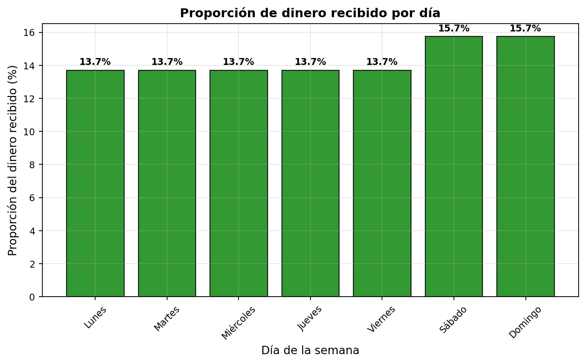
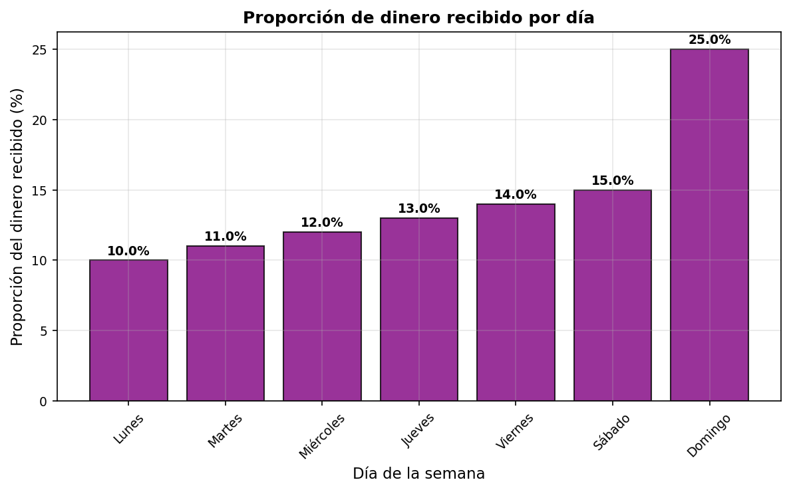

---
output:
  pdf_document: 
    latex_engine: xelatex
    keep_tex: true
  html_document:
    df_print: paged
    mathjax: true
  word_document: default
header-includes:
- \usepackage[spanish]{babel}
- \usepackage{amsmath}
- \usepackage{fontspec}
- \usepackage{unicode-math}
- \usepackage{graphicx}
- \usepackage{adjustbox}
- \usepackage{tikz}
- \usepackage{pgfplots}
- \usetikzlibrary{3d,babel}
icfes:
  competencia: interpretacion_representacion
  nivel_dificultad: 2
  contenido:
    categoria: numerico_variacional
    tipo: generico
  contexto: laboral
  eje_axial: eje2
  componente: numerico_variacional
---

Question
========

En una empresa manufacturera, los empleados pueden trabajar cada semana en dos turnos: diurno y nocturno. Existen dos clasificaciones para los días de trabajo normales (de lunes a sábado) y dominicales. En el turno diurno del domingo se paga un 30% más que en el turno diurno de días normales. En el turno nocturno de un día cualquiera, la hora de trabajo se paga un 60% más que en el turno diurno de ese mismo día.

Un técnico laboró durante una semana 10 horas diurnas cada día. ¿Cuál es la gráfica que representa correctamente la proporción de dinero recibido cada día de la semana?

Answerlist
----------

- 

- 

- 

- 

Solution
========

Para resolver este problema, debemos calcular la proporción de dinero que recibe el trabajador cada día de la semana.

### Análisis del problema

**Condiciones de pago:**
- Turno diurno días normales (lunes a sábado): pago base
- Turno diurno domingo: pago base + 30%
- Turno nocturno cualquier día: pago diurno del día + 60%

**Datos del trabajador:**
- Trabajó 10 horas diurnas cada día
- Solo trabajó turnos diurnos (no nocturnos)

### Cálculo de proporciones

Si consideramos el pago base del turno diurno de días normales como 1 unidad:

**Pago por día:**
- Lunes a Sábado: 1 unidad cada día = 6 unidades
- Domingo: 1 + 30% = 1,3 unidades

**Total semanal:** 7,3 unidades

**Proporciones por día:**
- Lunes: 13,7%
- Martes: 13,7%
- Miércoles: 13,7%
- Jueves: 13,7%
- Viernes: 13,7%
- Sábado: 13,7%
- Domingo: 17,8%

### Gráfica correcta

La gráfica correcta debe mostrar:
- Lunes a Sábado: barras de igual altura (misma proporción ≈ 13,7%)
- Domingo: barra más alta (proporción ≈ 17,8%)

Answerlist
----------
- Verdadero. Esta gráfica representa correctamente las proporciones calculadas.
- Falso. Esta gráfica muestra todos los días con la misma proporción, ignorando el pago extra del domingo.
- Falso. Esta gráfica incorrectamente asigna pago extra también al sábado.
- Falso. Esta gráfica muestra un patrón creciente que no corresponde a las condiciones del problema.

Meta-information
================
exname: turnos_trabajo_proporciones_pago
extype: schoice
exsolution: 1000
exshuffle: TRUE
exsection: Interpretación de gráficas - Proporciones laborales
