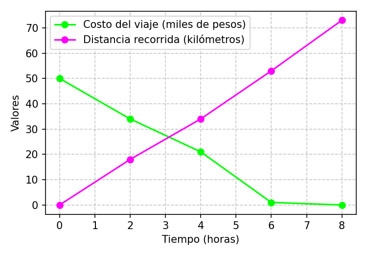

---
output:
  word_document: default
  html_document: default
  pdf_document: default
---
```{r setup, include=FALSE}
library(exams)
library(reticulate)
library(knitr)

# Configuración general
set.seed(sample(1:1000, 1))
options(scipen = 999)

# Configurar salida para distintos formatos
knitr::opts_chunk$set(
  fig.keep = 'all',
  dev = c("png", "pdf"),
  dpi = 150
)
```

```{r generar_datos, echo=FALSE}
# Aleatorizar contexto del problema
conductores <- c("un conductor", "una conductora", "un taxista", "un mensajero", "un repartidor")
conductor <- sample(conductores, 1)

# Generar datos con una relación coherente entre variables
# Creamos primeros los tiempos
tiempos <- c(0, 2, 4, 6, 8)

# Generar patrones para combustible (decreciente) y distancia (creciente)
# con cierta aleatoriedad para hacer más interesante el problema

# Costo del viaje (aumenta con el tiempo de forma aproximadamente lineal)
base_costo <- sample(15:25, 1)
incremento_costo <- sample(8:15, 1)
costo_viaje <- c(0, base_costo, base_costo*2, base_costo*3, base_costo*4) +
              round(rnorm(5, 0, incremento_costo/3))
costo_viaje[1] <- 0  # El costo inicial siempre es cero
costo_viaje <- pmax(0, costo_viaje)  # Asegurar que no hay valores negativos

# Combustible disponible (disminuye con el tiempo)
combustible_inicial <- sample(45:65, 1)
tasa_consumo <- sample(4:8, 1)
combustible <- combustible_inicial - tiempos * tasa_consumo + round(rnorm(5, 0, 3))
combustible[1] <- combustible_inicial  # El combustible inicial es el valor máximo
combustible <- pmax(0, combustible)  # Asegurar que no hay valores negativos

# Distancia recorrida (aumenta con el tiempo)
velocidad_media <- sample(8:12, 1)
distancia <- tiempos * velocidad_media + round(rnorm(5, 0, 4))
distancia[1] <- 0  # La distancia inicial siempre es cero
distancia <- pmax(0, distancia)  # Asegurar que no hay valores negativos

# Crear tabla de datos
datos <- data.frame(
  Tiempo = tiempos,
  Costo = costo_viaje,
  Combustible = combustible,
  Distancia = distancia
)
```

```{python generar_graficos, echo=FALSE}
import matplotlib.pyplot as plt
import numpy as np
import io
import base64
import random
from matplotlib.colors import to_rgba

# Recibir datos desde R
r_tiempos = r.tiempos
r_combustible = r.combustible
r_distancia = r.distancia

# Lista de colores para aleatorizar
colores_disponibles = [
    'blue', 'green', 'red', 'purple', 'orange', 'brown', 'pink', 'gray',
    'cyan', 'magenta', 'olive', 'teal', 'navy', 'maroon', 'lime', 'coral',
    'darkblue', 'darkgreen', 'darkred', 'darkmagenta', 'darkorange', 'darkgray',
    'lightblue', 'lightgreen', 'salmon', 'violet', 'gold', 'indigo', 'crimson'
]

# Función para obtener dos colores aleatorios diferentes
def obtener_dos_colores():
    colores = random.sample(colores_disponibles, 2)
    return colores[0], colores[1]

# Colores aleatorios para cada gráfica
color_combustible_A, color_distancia_A = obtener_dos_colores()
color_combustible_B, color_distancia_B = obtener_dos_colores()
color_combustible_C, color_distancia_C = obtener_dos_colores()
color_combustible_D, color_distancia_D = obtener_dos_colores()

# Guardar los colores de la gráfica correcta para usarlos en la solución
color_combustible = color_combustible_A
color_distancia = color_distancia_A

# Crear la gráfica correcta (opción A)
plt.figure(figsize=(5, 3.5))
plt.plot(r_tiempos, r_combustible, 'o-', color=color_combustible_A, label='Combustible disponible (litros)')
plt.plot(r_tiempos, r_distancia, 'o-', color=color_distancia_A, label='Distancia recorrida (kilómetros)')
plt.xlabel('Tiempo (horas)')
plt.ylabel('Valores')
plt.grid(True, linestyle='--', alpha=0.7)
plt.legend(loc='best', frameon=True)
plt.tight_layout()
plt.savefig('grafica_A.png', dpi=150)
plt.close()

# Crear distractores

# Opción B: Invertir los datos (combustible creciente, distancia decreciente)
plt.figure(figsize=(5, 3.5))
plt.plot(r_tiempos, r_distancia, 'o-', color=color_combustible_B, label='Combustible disponible (litros)')
plt.plot(r_tiempos, r_combustible, 'o-', color=color_distancia_B, label='Distancia recorrida (kilómetros)')
plt.xlabel('Tiempo (horas)')
plt.ylabel('Valores')
plt.grid(True, linestyle='--', alpha=0.7)
plt.legend(loc='best', frameon=True)
plt.tight_layout()
plt.savefig('grafica_B.png', dpi=150)
plt.close()

# Opción C: Cruzar las líneas (intercambiando valores intermedios)
combustible_alt = r_combustible.copy()
distancia_alt = r_distancia.copy()

# Invertir valores medios para crear un cruce
for i in range(1, len(r_tiempos)-1):
    if r_combustible[i] > r_distancia[i]:
        combustible_alt[i] = r_distancia[i] - np.random.randint(2, 8)
        distancia_alt[i] = r_combustible[i] + np.random.randint(2, 8)
    else:
        combustible_alt[i] = r_distancia[i] + np.random.randint(2, 8)
        distancia_alt[i] = r_combustible[i] - np.random.randint(2, 8)

plt.figure(figsize=(5, 3.5))
plt.plot(r_tiempos, combustible_alt, 'o-', color=color_combustible_C, label='Combustible disponible (litros)')
plt.plot(r_tiempos, distancia_alt, 'o-', color=color_distancia_C, label='Distancia recorrida (kilómetros)')
plt.xlabel('Tiempo (horas)')
plt.ylabel('Valores')
plt.grid(True, linestyle='--', alpha=0.7)
plt.legend(loc='best', frameon=True)
plt.tight_layout()
plt.savefig('grafica_C.png', dpi=150)
plt.close()

# Opción D: Ambas líneas crecientes
distancia_alt2 = r_distancia.copy()
combustible_alt2 = np.array([r_combustible[0],
                            r_combustible[0] + np.random.randint(5, 10),
                            r_combustible[0] + np.random.randint(15, 25),
                            r_combustible[0] + np.random.randint(30, 40),
                            r_combustible[0] + np.random.randint(45, 55)])

plt.figure(figsize=(5, 3.5))
plt.plot(r_tiempos, combustible_alt2, 'o-', color=color_combustible_D, label='Combustible disponible (litros)')
plt.plot(r_tiempos, distancia_alt2, 'o-', color=color_distancia_D, label='Distancia recorrida (kilómetros)')
plt.xlabel('Tiempo (horas)')
plt.ylabel('Valores')
plt.grid(True, linestyle='--', alpha=0.7)
plt.legend(loc='best', frameon=True)
plt.tight_layout()
plt.savefig('grafica_D.png', dpi=150)
plt.close()
```

```{r opciones, echo=FALSE, results="asis"}
# Aleatorizar el orden de las opciones
opciones <- sample(LETTERS[1:4])
solucion <- match("A", opciones)

# Vector de solución para exams
sol_vector <- rep(0, 4)
sol_vector[solucion] <- 1
sol_string <- paste(sol_vector, collapse = "")
```

Question
========
Al momento de realizar un viaje por carretera, `r conductor` de empresa registró los siguientes parámetros durante su recorrido en la siguiente tabla:

```{r tabla_datos, echo=FALSE, results="asis"}
knitr::kable(datos,
             col.names = c("Tiempo (horas)",
                           "Costo del viaje (miles de pesos)",
                           "Combustible disponible (litros)",
                           "Distancia recorrida (kilómetros)"),
             align = "c")
```

De acuerdo con la tabla, la gráfica que representa CORRECTAMENTE el comportamiento de la distancia recorrida y el combustible disponible en función del tiempo es:

Answerlist
----------
```{r mostrar_opciones, echo=FALSE, results="asis"}
# Mostrar las gráficas en el orden aleatorizado
for (i in 1:4) {
  cat(paste0("- \n\n"))
}
```

Solution
========

```{python grafica_solucion, echo=FALSE}
# Dibujar nuevamente la gráfica correcta para la solución
import matplotlib.pyplot as plt

# Usar los mismos datos y colores que en la gráfica correcta (opción A)
plt.figure(figsize=(5, 3.5))
plt.plot(r_tiempos, r_combustible, 'o-', color=color_combustible, label='Combustible disponible (litros)')
plt.plot(r_tiempos, r_distancia, 'o-', color=color_distancia, label='Distancia recorrida (kilómetros)')
plt.xlabel('Tiempo (horas)')
plt.ylabel('Valores')
plt.grid(True, linestyle='--', alpha=0.7)
plt.legend(loc='best', frameon=True)
plt.tight_layout()
plt.savefig('grafica_solucion.png', dpi=150)
plt.close()
```



La gráfica correcta debe mostrar:

1. El combustible disponible disminuyendo con el tiempo, empezando en `r combustible[1]` litros y terminando en `r combustible[5]` litros.
2. La distancia recorrida aumentando con el tiempo, empezando en `r distancia[1]` km y llegando a `r distancia[5]` km.

Analizando los datos de la tabla, vemos que mientras el tiempo aumenta:
- El combustible disponible disminuye constantemente
- La distancia recorrida aumenta constantemente


Answerlist
----------
```{r solucion_lista, echo=FALSE, results="asis"}
# Generar lista de respuestas verdadero/falso
for (i in 1:4) {
  if (opciones[i] == "A") {
    cat("- Verdadero\n")
  } else {
    cat("- Falso\n")
  }
}
```

Meta-information
================
exname: Interpretación de gráficas de combustible y distancia
extype: schoice
exsolution: `r sol_string`
exshuffle: TRUE
exsection: Interpretación de gráficas
