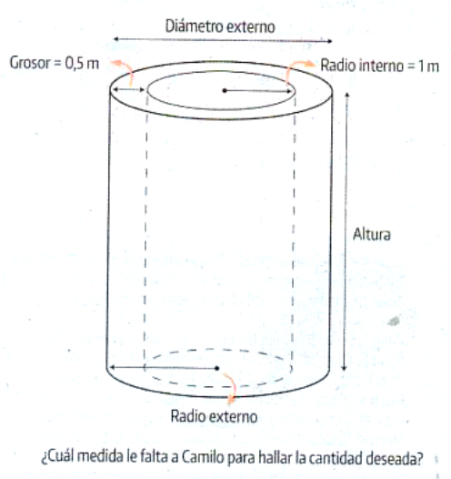

---
output:
  pdf_document:
    latex_engine: xelatex
  word_document: default
  html_document:
    df_print: paged
header-includes:
   - \usepackage[spanish]{babel}
   - \usepackage{amsmath}
---

# Pregunta

Camilo desea saber cuánta agua se necesita para llenar el cilindro interno, pero solamente cuenta con las medidas de las dimensiones que muestra la figura.

Para calcular cuánta agua se necesita para llenar el cilindro interno, necesitamos conocer el volumen del espacio interior del cilindro, el cual se calcula con la fórmula del volumen de un cilindro \( V = \pi r^2 h \), donde \( r \) es el radio y \( h \) la altura del cilindro.

1. **Determinación del radio interno**: En el problema, se indica que el radio interno es de 1 metro.

2. **Determinación de la altura del cilindro**: No se especifica directamente la altura del cilindro, pero asumiremos que es conocida para el cálculo.

3. **Cálculo del volumen**: Usando el radio interno de 1 metro, y una altura \( h \) (que asumimos conocida), el volumen del cilindro se calcula como:
 \[
V = \pi \times (1 \, \text{m})^2 \times h = \pi \times h \, \text{m}^3
\]

Este volumen representa la cantidad de agua necesaria para llenar el cilindro hasta su altura \( h \).
\
\

### **Solución Completa**

#### **Paso 1: Identificar las dimensiones conocidas del cilindro**

Conocemos el radio interno del cilindro, que es de 1 metro.

#### **Paso 2: Aplicar la fórmula del volumen de un cilindro**

Utilizamos la fórmula del volumen \( V = \pi r^2 h \), sustituyendo \( r = 1 \text{ m} \) y \( h \) (conocida).

#### **Respuesta Final**

El volumen de agua necesaria para llenar el cilindro es \( \pi h \text{ m}^3 \), donde \( h \) es la altura del cilindro.

### **Concepto Clave**

**Volumen del cilindro**: El volumen \( V \) de un cilindro se calcula como el producto del área de la base circular (que es \( \pi r^2 \)) por la altura \( h \) del cilindro.

### **Conceptos y ejemplos relacionados**

1. **Área de la base de un cilindro**: Área = \( \pi r^2 \).
2. **Perímetro de la base de un cilindro**: Perímetro = \( 2\pi r \).
3. **Ejemplo relacionado**: Si un cilindro tiene un radio de 3 metros y una altura de 5 metros, ¿cuál es su volumen? \( V = \pi \times 3^2 \times 5 = 45\pi \text{ m}^3 \).

### **¿Cuál es la opción correcta?**

Para determinar cuál es la opción correcta, necesitamos analizar cuál de las opciones dadas es la más relevante para calcular el volumen del cilindro interno con la información disponible en el problema. Las opciones son:

A. Radio externo.
B. Diámetro externo.
C. Altura del cilindro.
D. Perímetro del cilindro.

El cálculo del volumen de un cilindro se realiza mediante la fórmula \( V = \pi r^2 h \), donde \( r \) es el radio y \( h \) es la altura. Para el cilindro interno, el radio interno es conocido (1 metro), pero necesitamos la altura del cilindro para completar el cálculo del volumen.

**La opción correcta es:**
C. Altura del cilindro.

Esta es la medida crucial faltante que necesitamos para calcular el volumen de agua que el cilindro puede contener, dado que el radio interno ya es conocido.

## **Retroalimentación Saber ICFES**

### Análisis del Problema

Para resolver este problema, debemos determinar qué medidas son necesarias para calcular la cantidad de agua que se necesita para llenar el cilindro interno.

El volumen del cilindro interno se puede calcular utilizando la fórmula del volumen de un cilindro:

\[ V = \pi r^2 h \]

donde \( r \) es el radio del cilindro y \( h \) es la altura del cilindro.

### Información Proporcionada

De la figura y la descripción:

- El radio interno del cilindro es \( 1 \, 	\text{m} \).
- El grosor del cilindro es \( 0.5 \, 	\text{m} \).
- No se proporciona directamente la altura del cilindro.

### Determinación de las Opciones

Vamos a analizar cada opción para determinar cuál es la necesaria para calcular el volumen del cilindro interno.

1. **Opción A: Radio externo.**
   - El radio externo se puede calcular sumando el grosor al radio interno: \( r_{externo} = r_{interno} + 	\text{grosor} \).
   - En este caso, \( r_{externo} = 1 \, 	\text{m} + 0.5 \, 	\text{m} = 1.5 \, 	\text{m} \).
   - **No es necesaria esta medida para calcular el volumen del cilindro interno.**

2. **Opción B: Diámetro externo.**
   - El diámetro externo se puede calcular multiplicando el radio externo por 2: \( d_{externo} = 2 	\times r_{externo} \).
   - **No es necesaria esta medida para calcular el volumen del cilindro interno.**

3. **Opción C: Altura del cilindro.**
   - La altura del cilindro es un componente crucial en la fórmula del volumen: \( V = \pi r^2 h \).
   - **Esta medida es necesaria para calcular el volumen del cilindro interno.**

4. **Opción D: Perímetro del cilindro.**
   - El perímetro de la base del cilindro (circunferencia) se calcula con la fórmula \( P = 2 \pi r \).
   - **No es necesaria esta medida para calcular el volumen del cilindro interno.**

### Retroalimentación

**Nivel de Desempeño:** Nivel 2
- **Justificación:** El problema requiere la identificación de las medidas necesarias para calcular el volumen del cilindro, lo cual implica comprensión básica de fórmulas geométricas.

**Competencia:** Formulación y ejecución
- **Justificación:** El problema implica identificar las dimensiones correctas para aplicar una fórmula matemática.

**Componente:** Geometría
- **Justificación:** Se relaciona con el cálculo de volúmenes de figuras geométricas.

**Tipo de Pensamiento:** Espacial-métrico
- **Justificación:** Implica entender las dimensiones y relaciones métricas del cilindro.

**Estándar Asociado y Categoría:**
- **Estándar Asociado:** Utiliza propiedades y fórmulas geométricas para resolver problemas.
- **Categoría:** Contenido no genérico
- **Justificación:** Aplica conocimientos específicos de geometría.

**Situaciones o Contexto:** Contexto cotidiano
- **Justificación:** Se enmarca en una situación práctica de uso de un cilindro.

**Problema Analizado:**
- **Habilidad o Conocimiento Evaluado:** Cálculo de volúmenes utilizando fórmulas geométricas.
- **Justificación:** Evalúa la capacidad de identificar las dimensiones necesarias para aplicar una fórmula geométrica.

**Eje Axial Disciplinar:** Geometría
- **Justificación:** Se centra en la comprensión y manipulación de figuras geométricas tridimensionales.

### ¿Qué Evalúa?
El problema evalúa la habilidad para identificar las dimensiones necesarias y aplicar fórmulas geométricas para calcular volúmenes.

### Respuesta Correcta
**La respuesta correcta es:** C. Altura del cilindro.

### Justificación de la Respuesta Correcta
Para calcular el volumen del cilindro interno, necesitamos la altura del cilindro. El radio interno ya se proporciona, pero la altura es la medida crucial faltante.

### Motivos que Llevan a Escoger Cada Una de las Opciones Incorrectas
- **Opción A (Radio externo):** No es necesario para calcular el volumen interno.
- **Opción B (Diámetro externo):** No es necesario para el volumen del cilindro interno.
- **Opción D (Perímetro del cilindro):** No es útil para calcular el volumen del cilindro interno.

### Desde Qué Nivel (Grado) de Enseñanza se Puede Aplicar Este Ejercicio
**Nivel Educativo:** Grado 9 o 10
- **Justificación:** A este nivel, los estudiantes deberían tener conocimientos suficientes de geometría y volúmenes de cuerpos sólidos.

-----------

Muy bien, aquí tengo un problema. Camilo quiere saber cuánta agua se necesita para llenar el cilindro interno, pero sólo tiene algunas medidas de la figura proporcionada. Veamos lo que tiene y lo que le falta. Primero, el problema menciona "Diámetro externo" que es el diámetro externo, y se da como... espera, en realidad, en el contenido, dice "Diámetro externo" pero no da un valor para él directamente. En su lugar, da el "Grosor", que es de 0,5 metros, y el "Radio interno", que es de 1 metro. También menciona "Altura" y "Radio externo", pero no proporciona sus valores. Entonces, Camilo quiere averiguar el volumen de agua necesario para llenar el cilindro interno. Para hallar el volumen de un cilindro, la fórmula es V = πr²h, donde r es el radio y h es la altura. En este caso, como se trata de un cilindro interior, tiene el radio interior, que es 1 metro. Pero también necesita la altura del cilindro para calcular el volumen. Mirando las opciones proporcionadas: 1. Radio externo (radio exterior) Radio externo 2. Diámetro externo (external diameter) 3. Altura del cilindro 4. Perímetro del cilindro Camilo ya tiene el radio interno y tiene el espesor, que es de 0,5 metros. Si conoce el radio interno y el grosor, podría hallar el radio externo sumando el grosor al radio interno (R_externo = R_interno + grosor = 1m + 0,5m = 1,5m). Del mismo modo, podría hallar el diámetro exterior duplicando el radio exterior (D_exterior = 2 * R_exterior = 3 m). El perímetro del cilindro, o la circunferencia, no se necesita directamente para calcular el volumen, pero está relacionado con el radio o diámetro mediante C = 2πr. Lo único que no tiene es la altura del cilindro. Sin la altura, no puede calcular el volumen, aunque conozca el radio o el diámetro. Así que, entre las opciones, la que falta y es necesaria para calcular el volumen es la "Altura del cilindro". Permíteme que vuelva a comprobarlo para asegurarme de que no se me escapa nada. Si tuviera el diámetro exterior, podría encontrar el radio exterior, pero ya tiene el radio interior y el grosor, así que es redundante. El perímetro no es necesario para calcular el volumen. Por lo tanto, sí, la altura es lo que falta.
