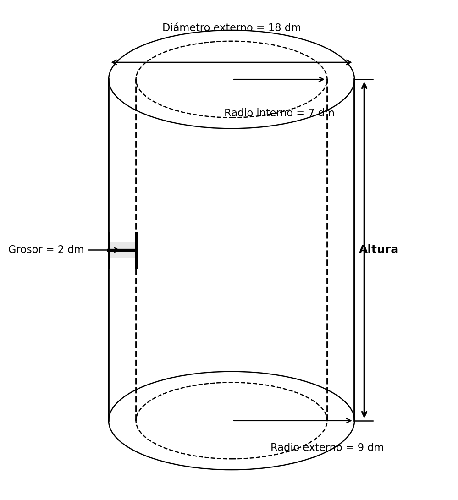

---
output:
  html_document: default
  pdf_document: default
  word_document: default
---
```{r setup, include=FALSE}
# Configuración para todos los formatos de salida
Sys.setlocale(category = "LC_NUMERIC", locale = "C")
options(OutDec = ".")

# Configurar el motor LaTeX globalmente
options(tikzLatex = "pdflatex")
options(tikzXelatex = FALSE)
options(tikzLatexPackages = c(
  "\\usepackage{tikz}",
  "\\usepackage[utf8]{inputenc}",
  "\\usepackage[T1]{fontenc}",
  "\\usepackage{amsmath,amssymb}"
))

library(exams)
library(reticulate)
library(digest)
library(testthat)

typ <- match_exams_device()
options(scipen = 999)
knitr::opts_chunk$set(
  warning = FALSE,
  message = FALSE,
  fig.showtext = FALSE,
  fig.cap = "",
  fig.keep = 'all',
  dev = c("png", "pdf"),
  dpi = 150
)

# Configuración para chunks de Python
knitr::knit_engines$set(python = function(options) {
  knitr::engine_output(options, options$code, '')
})

# Asegurar que Python esté correctamente configurado
use_python(Sys.which("python"), required = TRUE)
```

```{r DefinicionDeVariables, message=FALSE, warning=FALSE, results='asis'}
options(OutDec = ".")  # Asegurar punto decimal en este chunk

# Establecer semilla aleatoria
set.seed(sample(1:10000, 1))

# Aleatorizamos los nombres para contextualizar el problema
nombres <- c("Camilo", "Andrés", "Sofía", "Manuel", "Laura", "Carlos",
             "Daniela", "Miguel", "Valentina", "Eduardo", "Natalia",
             "José", "Isabella", "Gabriel", "Mariana")
nombre <- sample(nombres, 1)

# Aleatorizamos los tipos de recipientes
recipientes <- c("cilindro", "tubo", "conducto", "tanque cilíndrico",
                 "recipiente cilíndrico", "contenedor cilíndrico")
recipiente <- sample(recipientes, 1)

# Aleatorizar adjetivos para el cilindro interno
adjetivos_interno <- c("interno", "hueco", "vacío", "interior")
adjetivo_interno <- sample(adjetivos_interno, 1)

# Aleatorizar líquidos
liquidos <- c("aceite", "combustible", "líquido", "fluido")
liquido <- sample(liquidos, 1)

# Aleatorizar lo que se desea calcular
calculos <- c("la cantidad de", "el volumen de", "cuánto", "qué cantidad de")
calculo <- sample(calculos, 1)

# Aleatorizar medidas del cilindro (manteniendo consistencia matemática)
# Diámetro externo (entre 0.3 y 0.8 metros)
d_ext <- round(runif(1, 0.3, 0.8), 1)

# Radio interno (entre 0.5 y 1.5 metros)
r_int <- round(runif(1, 0.5, 1.5), 1)

# Altura del cilindro (entre 1 y 3 metros)
altura <- round(runif(1, 1, 3), 1)

# Asegurar que las dimensiones tengan sentido (radio interno < radio externo)
while (r_int >= d_ext/2) {
  d_ext <- round(runif(1, max(r_int * 2.1, 0.3), max(r_int * 3, 0.8)), 1)
}

# Calcular radio externo
r_ext <- d_ext / 2

# Calcular el volumen necesario (es el volumen del cilindro interior)
volumen <- pi * (r_int^2) * altura

# Verificar dimensiones para coherencia física
# El diámetro externo debe ser mayor que dos veces el radio interno
if (d_ext <= 2 * r_int) {
  d_ext <- 2 * r_int + round(runif(1, 0.1, 0.5), 1)
  r_ext <- d_ext / 2
}

# Aleatorizar unidades de medida
unidades_longitud <- c("m", "cm", "dm")
unidad <- sample(unidades_longitud, 1)

# Ajustar valores según la unidad
factor_conversion <- 1
if (unidad == "cm") {
  factor_conversion <- 100
  d_ext <- d_ext * factor_conversion
  r_int <- r_int * factor_conversion
  altura <- altura * factor_conversion
  volumen <- volumen * (factor_conversion^3)
  r_ext <- r_ext * factor_conversion
} else if (unidad == "dm") {
  factor_conversion <- 10
  d_ext <- d_ext * factor_conversion
  r_int <- r_int * factor_conversion
  altura <- altura * factor_conversion
  volumen <- volumen * (factor_conversion^3)
  r_ext <- r_ext * factor_conversion
}

# Redondear todos los valores para mayor claridad
d_ext <- round(d_ext, 1)
r_int <- round(r_int, 1)
altura <- round(altura, 1)
r_ext <- round(r_ext, 1)
volumen <- round(volumen, 1)

# La respuesta correcta es "C) Altura del cilindro"
# Ya que para calcular el volumen necesitaríamos conocer la altura
opcion_correcta <- 3 # Índice de "Altura del cilindro" en el vector de opciones

# Vector de solución para r-exams (1 para la correcta, 0 para las incorrectas)
solucion <- c(0, 0, 1, 0)
```

```{r generar_cilindro_python, message=FALSE, warning=FALSE}
options(OutDec = ".")  # Asegurar punto decimal en este chunk

# Código Python para generar el cilindro
codigo_python <- paste0("
import matplotlib.pyplot as plt
import numpy as np
from matplotlib.patches import Ellipse, Rectangle, Arrow, FancyArrowPatch

# Parámetros del cilindro
radio_interno = ", r_int, "  # ", unidad, "
grosor = ", r_ext - r_int, "  # ", unidad, "
radio_externo = radio_interno + grosor  # ", r_ext, " ", unidad, "
altura = ", altura, "  # ", unidad, "
diametro_externo = 2 * radio_externo  # ", d_ext, " ", unidad, "
unidad = '", unidad, "'

# Crear figura y ejes - optimizada para ocupar menos espacio
fig, ax = plt.subplots(figsize=(5.5, 6))  # Reducido para optimizar espacio

# Ajustar límites del gráfico - más compactos
ax.set_xlim(-radio_externo*1.3, radio_externo*1.3)
ax.set_ylim(-altura*0.15, altura*1.2)
ax.axis('equal')
ax.axis('off')

# Factor de compresión para la perspectiva
factor_compresion = 0.4

# Dibujar el cilindro externo
# Base inferior
ax.add_patch(Ellipse((0, 0), width=2*radio_externo, height=2*radio_externo*factor_compresion,
                     fill=False, edgecolor='black', linestyle='-'))

# Base superior
ax.add_patch(Ellipse((0, altura), width=2*radio_externo, height=2*radio_externo*factor_compresion,
                     fill=False, edgecolor='black', linestyle='-'))

# Laterales externos
ax.plot([-radio_externo, -radio_externo], [0, altura], 'k-')
ax.plot([radio_externo, radio_externo], [0, altura], 'k-')

# Dibujar el cilindro interno
# Base inferior interna (línea punteada)
ax.add_patch(Ellipse((0, 0), width=2*radio_interno, height=2*radio_interno*factor_compresion,
                     fill=False, edgecolor='black', linestyle='--'))

# Base superior interna (línea punteada)
ax.add_patch(Ellipse((0, altura), width=2*radio_interno, height=2*radio_interno*factor_compresion,
                     fill=False, edgecolor='black', linestyle='--'))

# Laterales internos (líneas punteadas)
ax.plot([-radio_interno, -radio_interno], [0, altura], 'k--')
ax.plot([radio_interno, radio_interno], [0, altura], 'k--')

# Añadir etiquetas con flechas - optimizadas para ocupar menos espacio
# Diámetro externo en la parte superior
ax.annotate(f'Diámetro externo = {diametro_externo} {unidad}',
            xy=(0, altura + 0.15*altura),
            xytext=(0, altura + 0.15*altura),
            ha='center', va='center', fontsize=9)

# Usar annotate con arrowprops para flechas precisas del diámetro externo
ax.annotate('',
            xy=(-radio_externo, altura + 0.05*altura),  # Punto exacto donde termina la flecha
            xytext=(radio_externo, altura + 0.05*altura),  # Punto de inicio
            arrowprops=dict(arrowstyle='<->', color='black', lw=1))

# Radio interno - flecha precisa (ahora con etiqueta debajo)
# Primero dibujamos la flecha
ax.annotate('',
            xy=(radio_interno, altura),  # Punto exacto donde termina la flecha
            xytext=(0, altura),  # Punto de inicio
            arrowprops=dict(arrowstyle='->', color='black', lw=1))
# Luego colocamos la etiqueta debajo de la flecha
ax.annotate(f'Radio interno = {radio_interno} {unidad}',
            xy=(radio_interno/2, altura - 0.1*altura),  # Posición debajo de la flecha
            xytext=(radio_interno/2, altura - 0.1*altura),
            ha='center', va='center', fontsize=9)

# Grosor - Reposicionado para mejor visibilidad
ax.annotate(f'Grosor = {grosor} {unidad}',
            xy=(-(radio_interno + grosor/2), altura/2),  # Punto medio entre radio interno y externo
            xytext=(-radio_externo - 0.2*radio_externo, altura/2),
            ha='right', va='center', fontsize=9,
            arrowprops=dict(arrowstyle='->', color='black', lw=1))

# Línea horizontal para mostrar el grosor - engrosada para mayor visibilidad
ax.plot([-radio_externo, -radio_interno], [altura/2, altura/2], 'k-', lw=2.5)  # Línea más gruesa
# Marcas verticales más visibles
ax.plot([-radio_externo, -radio_externo], [altura/2-0.05*altura, altura/2+0.05*altura], 'k-', lw=2.0)
ax.plot([-radio_interno, -radio_interno], [altura/2-0.05*altura, altura/2+0.05*altura], 'k-', lw=2.0)

# Añadir sombreado para destacar el grosor
import matplotlib.patches as patches
rect = patches.Rectangle(
    (-radio_externo, altura/2-0.025*altura),  # Posición (x,y) de la esquina inferior izquierda
    grosor,  # Ancho
    0.05*altura,  # Alto
    linewidth=0,
    color='lightgray',
    alpha=0.5
)
ax.add_patch(rect)

# Altura - flecha precisa con etiqueta mejorada
# Texto de altura separado y más visible
ax.text(radio_externo + 0.2*radio_externo, altura/2, 'Altura',
        ha='center', va='center', fontsize=10, fontweight='bold')

# Flecha bidireccional para la altura
ax.annotate('',
            xy=(radio_externo + 0.08*radio_externo, altura),  # Punto exacto donde termina la flecha arriba
            xytext=(radio_externo + 0.08*radio_externo, 0),  # Punto exacto donde termina la flecha abajo
            arrowprops=dict(arrowstyle='<->', color='black', lw=1.5))

# Líneas horizontales para marcar los límites de la altura
ax.plot([radio_externo, radio_externo + 0.15*radio_externo], [0, 0], 'k-', lw=1)
ax.plot([radio_externo, radio_externo + 0.15*radio_externo], [altura, altura], 'k-', lw=1)

# Radio externo - flecha precisa
ax.annotate(f'Radio externo = {radio_externo} {unidad}',
            xy=(radio_interno, -0.08*altura),
            xytext=(radio_interno, -0.08*altura),
            ha='center', va='center', fontsize=9)
ax.annotate('',
            xy=(radio_externo, 0),  # Punto exacto donde termina la flecha
            xytext=(0, 0),  # Punto de inicio
            arrowprops=dict(arrowstyle='->', color='black', lw=1))

# Optimizar el layout para eliminar espacios vacíos
plt.tight_layout(pad=0.5)  # Reducir el padding
# Guardar con recorte ajustado y mayor resolución para mantener calidad
plt.savefig('cilindro_hueco.png', dpi=180, bbox_inches='tight', pad_inches=0.1)
plt.close()
")

# Ejecutar código Python para generar la figura
py_run_string(codigo_python)
```

Question
========

`r nombre` desea saber cuánto `r liquido` se necesita para llenar el `r recipiente` interno, pero solamente cuenta con las medidas de las dimensiones que muestra la figura.

```{r mostrar_cilindro_python, echo=FALSE, results='asis', fig.align='center'}
# Mostrar la imagen del cilindro generada con Python
cat("")
```

¿Cuál medida le falta a `r nombre` para hallar la cantidad deseada?

Answerlist
----------
- Radio externo.
- Diámetro externo.
- Altura del cilindro.
- Perímetro del cilindro.

Solution
========

La respuesta correcta es: **Altura del cilindro**.

Para calcular el volumen de `r liquido` necesario para llenar el `r recipiente` `r adjetivo_interno`, necesitamos calcular el volumen de un cilindro, cuya fórmula es:

$V = \pi \cdot r^2 \cdot h$

Donde:
- $r$ es el radio (en este caso, el radio interno = `r r_int` `r unidad`)
- $h$ es la altura del cilindro

En el problema se nos proporciona:
- Diámetro externo = `r d_ext` `r unidad`
- Radio interno = `r r_int` `r unidad`

Sin embargo, no se nos proporciona la altura del cilindro, que es esencial para calcular el volumen. Por lo tanto, a `r nombre` le falta conocer la altura del cilindro para poder calcular la cantidad de `r liquido` necesaria.

Si tuviéramos la altura, el volumen se calcularía así:
$V = \pi \cdot (`r r_int`)^2 \cdot h = `r round(pi * (r_int^2), 2)` \cdot h$ `r unidad`³

Answerlist
----------
- Falso
- Falso
- Verdadero
- Falso

Meta-information
================
exname: volumen_cilindro_hueco
extype: schoice
exsolution: 0010
exshuffle: TRUE
exsection: Geometría|Volumen|Cilindro

# Metadatos ICFES
exextra[Tópico]: Geometría
exextra[Competencia]: Razonamiento
exextra[Dificultad]: Media
exextra[Estandar]: Utilizo técnicas y herramientas para la construcción de figuras planas y cuerpos con medidas dadas.
exextra[Aprendizaje]: Establecer y utilizar diferentes procedimientos de cálculo para hallar medidas de superficies y volúmenes.
exextra[Evidencia]: Resolver problemas que involucran el cálculo de volúmenes de cilindros.
exextra[Componente]: Espacial-Métrico
exextra[Proceso]: Resolución de problemas
exextra[Contexto]: Científico
exextra[Estrategia]: Identificar los datos faltantes para resolver un problema de volumen de un cilindro hueco.
exextra[Tiempo]: 3 minutos
exextra[Pregunta]: 1
exextra[Aleatorización]: Si
exextra[Esquema]: Selección múltiple con única respuesta
exextra[Formato]: Imagen
