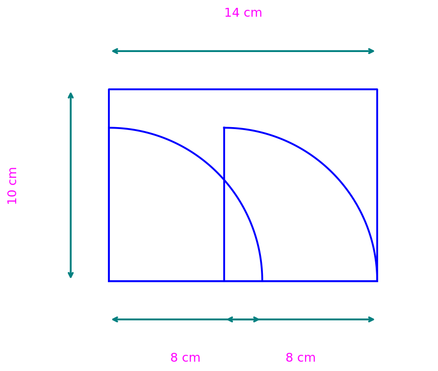
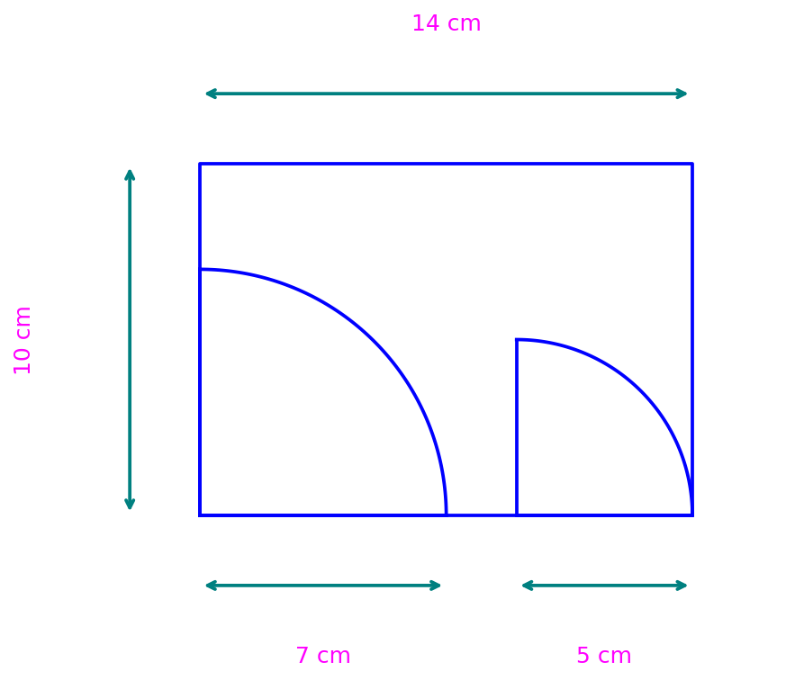
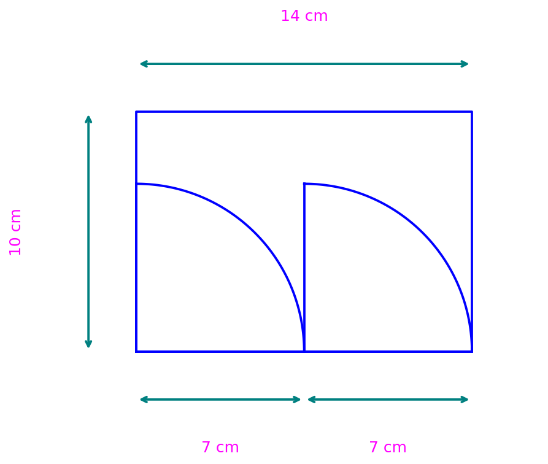

---
output:
  html_document: default
  word_document: default
  pdf_document: default
---
```{r setup, include=FALSE}
# Configuración para todos los formatos de salida
Sys.setlocale(category = "LC_NUMERIC", locale = "C")
options(OutDec = ".")

# Configurar el motor LaTeX globalmente
options(tikzLatex = "pdflatex")
options(tikzXelatex = FALSE)
options(tikzLatexPackages = c(
  "\\usepackage{tikz}",
  "\\usepackage{colortbl}"
))

library(exams)
library(reticulate)
library(digest)
library(testthat)

typ <- match_exams_device()
options(scipen = 999)
knitr::opts_chunk$set(
  warning = FALSE,
  message = FALSE,
  fig.showtext = FALSE,
  fig.cap = "",
  fig.keep = 'all',
  dev = c("png", "pdf"),
  dpi = 150
)

# Configuración para chunks de Python
knitr::knit_engines$set(python = function(options) {
  knitr::engine_output(options, options$code, '')
})

# Asegurar que Python esté correctamente configurado
use_python(Sys.which("python"), required = TRUE)
```

```{r DefinicionDeVariables, message=FALSE, warning=FALSE, results='asis'}
options(OutDec = ".")  # Asegurar punto decimal en este chunk

# Establecer semilla aleatoria
set.seed(sample(1:10000, 1))

# Aleatorizar dimensiones del parabrisa (original: 13 cm x 8 cm)
# Mantener proporcionalidad similar a la imagen original
largo_bases <- c(13, 14, 15, 16, 12)  # Opciones para largo
largo_base <- sample(largo_bases, 1)  # Seleccionar uno aleatoriamente

ancho_bases <- c(8, 7, 9, 10, 6)  # Opciones para ancho
ancho_base <- sample(ancho_bases, 1)  # Seleccionar uno aleatoriamente

# Aseguramos que el largo sea mayor que el ancho
if (largo_base <= ancho_base) {
  largo_base <- ancho_base + sample(2:6, 1)
}

# Aleatorizar longitud de plumillas (original: 6 cm)
longitud_plumilla_opciones <- c(6, 5, 7, 8, 4)
longitud_plumilla_base <- sample(longitud_plumilla_opciones, 1)

# Verificar que la longitud de plumilla sea coherente con el tamaño del parabrisa
if (longitud_plumilla_base > ancho_base * 0.9) {
  longitud_plumilla_base <- round(ancho_base * 0.75)
}

# Aleatorizar ángulo de apertura (original: 90°)
angulo_apertura <- 90  # Mantenemos 90° para que coincida con la imagen original

# Aleatorizar tipos de vehículos/juguetes
tipos_vehiculos <- c(
  "carro", "auto", "coche", "vehículo", "automóvil", 
  "camión", "tractor", "excavadora", "volqueta", "grúa"
)
tipo_vehiculo <- sample(tipos_vehiculos, 1)

# Aleatorizar tipos de juguetes
tipos_juguetes <- c(
  "juguete", "juego", "modelo a escala", "réplica", 
  "miniatura", "maqueta", "prototipo", "juego didáctico"
)
tipo_juguete <- sample(tipos_juguetes, 1)

# Aleatorizar términos para el parabrisa
terminos_parabrisa <- c(
  "parabrisa", "parabrisas", "vidrio frontal", "cristal delantero", 
  "ventana frontal", "escudo frontal"
)
termino_parabrisa <- sample(terminos_parabrisa, 1)

# Aleatorizar términos para plumilla
terminos_plumilla <- c(
  "plumilla", "limpiador", "limpiaparabrisas", "escobilla", 
  "limpia", "barredor"
)
termino_plumilla <- sample(terminos_plumilla, 1)

# Aleatorizar términos para carrito
terminos_carrito <- c(
  "carrito", "vehículo", "auto", "carro", "automóvil", 
  "coche", "juguete", "modelo"
)
termino_carrito <- sample(terminos_carrito, 1)

# Aleatorizar materiales del parabrisa
materiales_parabrisa <- c(
  "plano", "transparente", "acrílico", "plástico", 
  "de policarbonato", "liso", "curvo"
)
material_parabrisa <- sample(materiales_parabrisa, 1)

# Aleatorizar formas geométricas
formas_geometricas <- c(
  "rectangular", "rectángular", "de forma rectangular", 
  "con forma de rectángulo", "con geometría rectangular"
)
forma_geometrica <- sample(formas_geometricas, 1)

# Configuraciones para las opciones
# Estas configuraciones definen la ubicación de las plumillas para cada opción

# Opción A (similar a la opción 1 en la imagen original)
config_A <- list(
  pos_plumilla1 = c(longitud_plumilla_base, 0), 
  pos_plumilla2 = c(largo_base - longitud_plumilla_base, 0),
  radio1 = longitud_plumilla_base,
  radio2 = longitud_plumilla_base
)

# Opción B (similar a la opción 2 en la imagen original)
config_B <- list(
  pos_plumilla1 = c(longitud_plumilla_base, 0),
  pos_plumilla2 = c(largo_base - longitud_plumilla_base, 0),
  radio1 = longitud_plumilla_base,
  radio2 = longitud_plumilla_base + 2
)

# Opción C (similar a la opción 3 en la imagen original)
config_C <- list(
  pos_plumilla1 = c(longitud_plumilla_base, 0),
  pos_plumilla2 = c(largo_base - longitud_plumilla_base, 0),
  radio1 = longitud_plumilla_base,
  radio2 = longitud_plumilla_base
)

# Opción D (similar a la opción 4 en la imagen original)
config_D <- list(
  pos_plumilla1 = c(largo_base - 2*longitud_plumilla_base, 0),
  pos_plumilla2 = c(largo_base - longitud_plumilla_base, 0),
  radio1 = longitud_plumilla_base,
  radio2 = longitud_plumilla_base
)

# Crear un identificador para cada opción
opciones_letras <- c("A", "B", "C", "D")

# Seleccionar aleatoriamente la opción correcta
opcion_correcta <- sample(opciones_letras, 1)

# Vector de solución para r-exams (1 para la correcta, 0 para las incorrectas)
solucion <- integer(4)
solucion[which(opciones_letras == opcion_correcta)] <- 1

# Definir mensajes de explicación para cada opción
explicacion_A <- paste0("La opción A muestra el parabrisa de ", largo_base, " cm por ", ancho_base, " cm con dos plumillas de ", longitud_plumilla_base, " cm cada una, ubicadas en las esquinas inferiores del parabrisa.")
explicacion_B <- paste0("La opción B muestra el parabrisa de ", largo_base, " cm por ", ancho_base, " cm, pero la plumilla derecha tiene un radio diferente de ", longitud_plumilla_base + 2, " cm.")
explicacion_C <- paste0("La opción C presenta un parabrisa con dimensiones de ", largo_base, " cm por ", ancho_base, " cm y plumillas de ", longitud_plumilla_base, " cm.")
explicacion_D <- paste0("La opción D muestra un parabrisa de ", largo_base, " cm por ", ancho_base, " cm con plumillas de ", longitud_plumilla_base, " cm, pero ubicadas demasiado a la derecha.")

# Asignar la explicación correcta según la opción seleccionada
if (opcion_correcta == "A") {
  explicacion_correcta <- explicacion_A
} else if (opcion_correcta == "B") {
  explicacion_correcta <- explicacion_B
} else if (opcion_correcta == "C") {
  explicacion_correcta <- explicacion_C
} else {
  explicacion_correcta <- explicacion_D
}
```

```{r generar_graficas_python}
options(OutDec = ".")  # Asegurar punto decimal en este chunk

# Definir el código Python base para generar todas las gráficas
codigo_base_python <- "
import matplotlib.pyplot as plt
import numpy as np
import matplotlib.patches as patches
from matplotlib.path import Path
import math

# Configuración común para todas las figuras
plt.rcParams['font.size'] = 9
plt.rcParams['font.family'] = 'serif'

# Parámetros generales
largo = %d
ancho = %d
longitud_plumilla = %d
angulo_apertura = %d
"

# Reemplazar valores en el código Python base
codigo_python_base <- sprintf(codigo_base_python, 
                             largo_base, 
                             ancho_base, 
                             longitud_plumilla_base, 
                             angulo_apertura)

# Código para generar el diagrama principal (esquema explicativo)
codigo_python_diagrama_principal <- paste0(codigo_python_base, "
fig, ax = plt.subplots(figsize=(6, 4))

# Crear rectángulo punteado para el parabrisa
rect_x = [0, largo, largo, 0, 0]
rect_y = [0, 0, ancho, ancho, 0]
ax.plot(rect_x, rect_y, linestyle='dashed', color='black', dashes=(4, 4))

def dibujar_abanico(x_origin, y_origin, radius, lines_count=5):
    # Arco punteado
    theta = np.linspace(0, np.pi/2, 100)
    ax.plot(x_origin + radius * np.cos(theta), y_origin + radius * np.sin(theta),
            color='black', linestyle='dashed', dashes=(4,4))
    
    # Líneas radiales (cuarta sólida, resto punteadas)
    for i in range(lines_count):
        angle = (np.pi/2) * i / (lines_count - 1)
        x_end = x_origin + radius * np.cos(angle)
        y_end = y_origin + radius * np.sin(angle)
        
        if i == 3:
            ax.plot([x_origin, x_end], [y_origin, y_end], color='black', linewidth=1.5)
        else:
            ax.plot([x_origin, x_end], [y_origin, y_end],
                    color='black', linestyle='dashed', dashes=(4,4), linewidth=1)

# Posición de las plumillas en la parte inferior
pos_plumilla1 = (largo/3, 0)
pos_plumilla2 = (2*largo/3, 0)

# Dibujar abanicos para representar plumillas
dibujar_abanico(pos_plumilla1[0], pos_plumilla1[1], longitud_plumilla, lines_count=5)
dibujar_abanico(pos_plumilla2[0], pos_plumilla2[1], longitud_plumilla, lines_count=5)

# Etiquetar 'Plumilla' con flecha
ax.annotate('Plumilla', xy=(pos_plumilla1[0] + longitud_plumilla/2, longitud_plumilla/2), 
            xytext=(pos_plumilla1[0] - longitud_plumilla/2, longitud_plumilla + ancho/6),
            arrowprops=dict(facecolor='black', arrowstyle='->', linewidth=1),
            fontsize=10, ha='center', va='center')

# Mostrar texto explicativo
ax.text(largo/2, -ancho/6, 'El esquema que representa los datos de las dimensiones del\\n parabrisa es:', 
        fontsize=10, ha='center')

# Configuraciones finales
ax.set_aspect('equal')
ax.axis('off')
plt.xlim(-largo*0.2, largo*1.2)
plt.ylim(-ancho*0.3, ancho*1.3)

plt.tight_layout()
plt.savefig('diagrama_principal.png', dpi=150, bbox_inches='tight')
plt.close()
")

# Función para generar código de cada opción con el estilo visual de referencia
generar_codigo_opcion <- function(id_opcion, config) {
  codigo <- paste0(codigo_python_base, "
# Crear figura para la opción ", id_opcion, "
fig, ax = plt.subplots(figsize=(5, 3.5))

# Crear rectángulo punteado para el parabrisa
rect_x = [0, largo, largo, 0, 0]
rect_y = [0, 0, ancho, ancho, 0]
ax.plot(rect_x, rect_y, linestyle='dashed', color='black', dashes=(4, 4))

# Definir posiciones de las plumillas para esta opción
pos_plumilla1 = ", paste0("(", config$pos_plumilla1[1], ", ", config$pos_plumilla1[2], ")"), "
pos_plumilla2 = ", paste0("(", config$pos_plumilla2[1], ", ", config$pos_plumilla2[2], ")"), "
radio1 = ", config$radio1, "
radio2 = ", config$radio2, "

def dibujar_abanico(x_origin, y_origin, radius, lines_count=5):
    # Arco punteado
    theta = np.linspace(0, np.pi/2, 100)
    ax.plot(x_origin + radius * np.cos(theta), y_origin + radius * np.sin(theta),
            color='black', linestyle='dashed', dashes=(4,4))
    
    # Líneas radiales (cuarta sólida, resto punteadas)
    for i in range(lines_count):
        angle = (np.pi/2) * i / (lines_count - 1)
        x_end = x_origin + radius * np.cos(angle)
        y_end = y_origin + radius * np.sin(angle)
        
        if i == 3:
            ax.plot([x_origin, x_end], [y_origin, y_end], color='black', linewidth=1.5)
        else:
            ax.plot([x_origin, x_end], [y_origin, y_end],
                    color='black', linestyle='dashed', dashes=(4,4), linewidth=1)

# Dibujar abanicos para representar plumillas
dibujar_abanico(pos_plumilla1[0], pos_plumilla1[1], radio1, lines_count=5)
dibujar_abanico(pos_plumilla2[0], pos_plumilla2[1], radio2, lines_count=5)

# Añadir etiquetas de dimensiones (en rojo)
ax.text(largo/2, -ancho*0.15, str(largo) + ' cm', color='red', ha='center', fontsize=10)
ax.text(-largo*0.12, ancho/2, str(ancho) + ' cm', color='red', ha='center', va='center', rotation=90, fontsize=10)

# Mostrar dimensiones de las plumillas
if radio1 == radio2:
    # Si ambas plumillas tienen el mismo radio, mostrar solo una vez
    ax.text(largo/2, -ancho*0.25, str(radio1) + ' cm', color='blue', ha='center', fontsize=8)
else:
    # Si son diferentes, mostrar ambos valores
    ax.text(pos_plumilla1[0], -ancho*0.25, str(radio1) + ' cm', color='blue', ha='center', fontsize=8)
    ax.text(pos_plumilla2[0], -ancho*0.25, str(radio2) + ' cm', color='blue', ha='center', fontsize=8)

# Configuraciones finales
ax.set_aspect('equal')
ax.axis('off')
plt.xlim(-largo*0.2, largo*1.2)
plt.ylim(-ancho*0.4, ancho*1.2)

plt.tight_layout()
plt.savefig('opcion_", id_opcion, ".png', dpi=150, bbox_inches='tight')
plt.close()
")
  
  return(codigo)
}

# Generar código para cada opción
codigo_python_opcion_A <- generar_codigo_opcion("A", config_A)
codigo_python_opcion_B <- generar_codigo_opcion("B", config_B)
codigo_python_opcion_C <- generar_codigo_opcion("C", config_C)
codigo_python_opcion_D <- generar_codigo_opcion("D", config_D)

# Ejecutar código Python para generar todas las gráficas
py_run_string(codigo_python_diagrama_principal)
py_run_string(codigo_python_opcion_A)
py_run_string(codigo_python_opcion_B)
py_run_string(codigo_python_opcion_C)
py_run_string(codigo_python_opcion_D)
```

Question
========

Las dimensiones de un `r termino_parabrisa` son `r largo_base` cm de largo y `r ancho_base` cm de ancho. Este es un `r termino_parabrisa` `r material_parabrisa` y de forma `r forma_geometrica`, correspondiente a un `r termino_carrito` de `r tipo_juguete`.

El `r termino_carrito` cuenta con 2 `r termino_plumilla`s de `r longitud_plumilla_base` cm de longitud cada una para limpiar el `r termino_parabrisa`. Estas tienen un ángulo de apertura de `r angulo_apertura`°, tal como se muestra a continuación:

```{r diagrama_principal, echo=FALSE, results='asis', fig.align='center'}
# Mostrar el diagrama principal
cat("")
```

El esquema que representa los datos de las dimensiones del `r termino_parabrisa` es:

Answerlist
----------

```{r opciones, echo=FALSE, results='asis'}
# Mostrar las opciones gráficas
cat("- \n\n")
cat("- \n\n")
cat("- \n\n")
cat("- \n\n")
```

Solution
========

La respuesta correcta es la opción `r opcion_correcta`.

`r explicacion_correcta`

Para resolver este problema, debemos analizar las dimensiones proporcionadas y la disposición de las plumillas:

1. El `r termino_parabrisa` tiene dimensiones de `r largo_base` cm × `r ancho_base` cm.
2. Las `r termino_plumilla`s tienen `r longitud_plumilla_base` cm de longitud cada una.
3. El ángulo de apertura es de `r angulo_apertura`°.

La opción `r opcion_correcta` muestra correctamente:
- El `r termino_parabrisa` con las dimensiones indicadas
- Las `r termino_plumilla`s ubicadas en las posiciones adecuadas
- Los arcos que describen el movimiento de las `r termino_plumilla`s con el ángulo de apertura especificado

Las demás opciones presentan configuraciones que no corresponden con las especificaciones dadas en el problema.

Answerlist
----------
- `r if(solucion[1] == 1) "Verdadero" else "Falso"`
- `r if(solucion[2] == 1) "Verdadero" else "Falso"`
- `r if(solucion[3] == 1) "Verdadero" else "Falso"`
- `r if(solucion[4] == 1) "Verdadero" else "Falso"`

Meta-information
================
exname: parabrisa_plumillas_geometria_v1
extype: schoice
exsolution: `r paste(as.integer(solucion), collapse="")`
exshuffle: TRUE
exsection: Geometría|Representación espacial|Figuras planas
